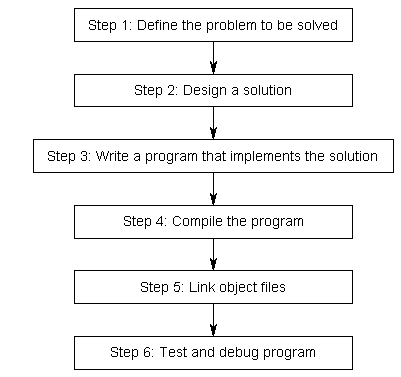
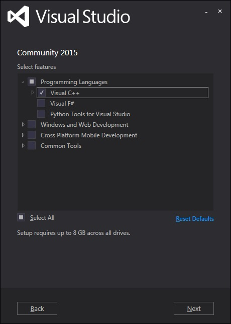

Chào các bạn!

Ở bài trước, chúng ta tìm hiểu về quy trình phát triển một chương trình bằng ngôn ngữ C++

(Nguồn: www.learncpp.com)

gồm có 6 bước cơ bản như hình trên. Trong đó, 3 bước đầu tiên phụ thuộc khá nhiều vào kĩ năng phân tích, đánh giá vấn đề của lập trình viên, đồng thời cũng cần đến những kĩ năng trong việc sử dụng ngôn ngữ lập trình. Đối với 3 bước còn lại, ở một số trình biên dịch như GNU compiler, lập trình viên phải kiêm luôn những công đoạn này thông qua việc biên dịch và liên kết các file đối tượng bằng mã lệnh mà GNU compiler đưa ra. Nhưng trong khóa học này, mình sử dụng trình biên dịch được tích hợp sẵn trong visual studio 2015 nên các bạn hiện giờ không cần phải để tâm đến bước 4 (biên dịch mã nguồn) và bước 5 (liên kết các files object). Visual studio 2015 được gọi là một IDE (intergrated development environment), nó chứa tất cả những gì cần để phát triển, biên dịch, liên kết files object, và bắt lỗi cho chương trình của bạn. 

Bên cạnh IDE visual studio 2015, chúng ta còn có các loại IDE khác như Code::blocks (cho hệ điều hành Windows hay Linux) cũng sử dụng tương tự Visual studio 2015 nhưng thích hợp với các dự án nhỏ hơn. Bạn có quyền thử qua nhiều loại IDE lập trình C++ khác nhau để biết được IDE nào thích hợp với bạn. 
Nếu dung lượng trống trong ổ cứng của bạn còn nhiều, mình khuyên các bạn cài đặt Visual studio 2015. Các bạn tải về tại đây: 
https://www.visualstudio.com/en-us/products/visual-studio-express-vs.aspx
Trong quá trình cài đặt, các bạn nên chọn cấu hình phù hợp là Visual C++. 

để IDE hổ trợ tối đa cho quá trình phát triển của bạn.

Chúng ta cùng xem qua về những đặc trưng mà IDE Visual studio 2015 Community mang lại:

- Môi trường phát triển cho các ứng dụng sử dụng ngôn ngữ C++, C#, Web application, tương thích với Unity Engine (dùng trong phát triển game)... hướng đến đa nền tảng.
https://www.visualstudio.com/features/cplusplus
- Tích hợp Android Native Activity App - dùng cho việc phát triển chương trình C- chạy trên hệ điều hành Android và iOS. https://www.visualstudio.com/features/mobile-app-development-vs.

Trong bài sau mình sẽ cùng các bạn cài đặt Visual studio 2015. Hẹn gặp lại các bạn!
