Chào các bạn! Chúng ta tiếp tục gặp nhau trong khóa học lập trình trực tuyến ngôn ngữ C++. Trong bài học ngày hôm nay, chúng ta cùng tìm hiểu về độ ưu tiên của các toán tử đã được định nghĩa C++ (C++ operator precedence). 

####Thế nào là độ ưu tiên của toán tử?

Để đánh giá đúng một biểu thức chứa nhiều toán tử, ví dụ ```5 + 2 * 4 / 2```, chúng ta phải biết mỗi toán tử trong biểu thức đó thực hiện công việc gì, và thứ tự mà chúng thực hiện. Thứ tự thực hiện các phép tính của một biểu thức kết hợp nhiều toán tử gọi là **độ ưu tiên của toán tử** (operator precedence).

Áp dụng độ ưu tiên của các toán tử toán học vào biểu thức ```5 + 2 * 4 / 2```, ta có thể đánh giá lại biểu thức này dưới dạng ```5 + ((2 * 4) / 2)``` và kết quả là **9**.

Khi có 2 toán tử có cùng độ ưu tiên được đặt cạnh nhau trong 1 biểu thức, chúng ta sử dụng nguyên tắc kết hợp (**associativity rules**) để biết được toán tử nào sẽ được thực hiện trước. 

Ví dụ các toán tử toán học có được đánh giá từ trái qua phải, nên khi gặp biểu thức ```3 * 2 * 6```, chúng ta hiểu được rằng biểu thức sẽ được tính là ```(3 * 2) * 6```.

Để biết được ngôn ngữ C++ định nghĩa độ ưu tiên các toán tử (operators precedence) như thế nào, chúng ta không có cách nào khác ngoài việc tra trong bảng độ ưu tiên toán tử bên dưới. 

***Trong bảng này, các toán tử được chia thành nhiều nhóm khác nhau, độ ưu tiên được sắp xếp giảm dần từ trên xuống dưới.***

####C++ Operator Precedence and Associativity

- **Group 1 (no associativity)**:

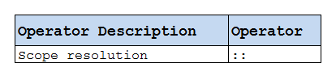

- **Group 2 (left to right associativity)**:

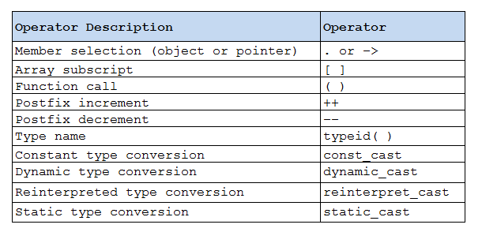

- **Group 3 (right to left associativity)**:

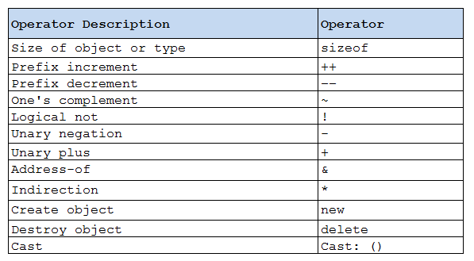

- **Group 4 (left to right associativity)**:

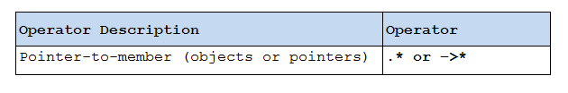

- **Group 5 (left to right associativity)**:

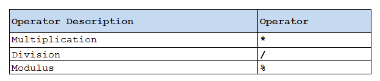

- **Group 6 (left to right associativity)**:

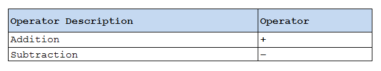

- **Group 7 (left to right associativity)**:

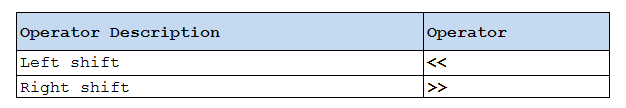

- **Group 8 (left to right associativity)**:

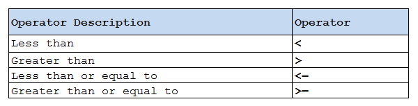

- **Group 9 (left to right associativity)**:

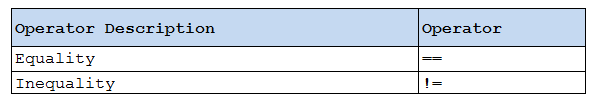

- **Group 10 (left to right associativity)**:


- **Group 11 (left to right associativity)**:

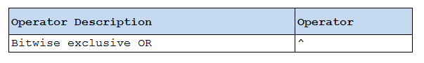

- **Group 12 (left to right associativity)**:

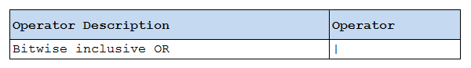

- **Group 13 (left to right associativity)**:

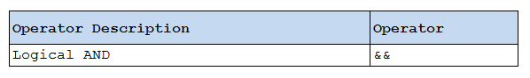

- **Group 14 (left to right associativity)**:

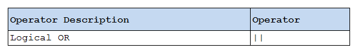

- **Group 15 (right to left associativity)**:

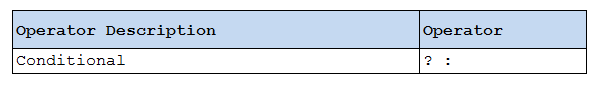

- **Group 16 (right to left associativity)**:

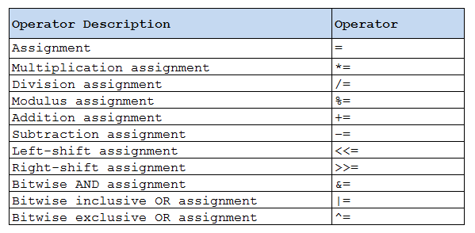

- **Group 17 (right to left associativity)**:

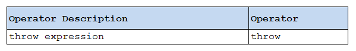

- **Group 18 (left to right associativity)**:

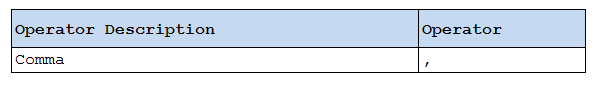