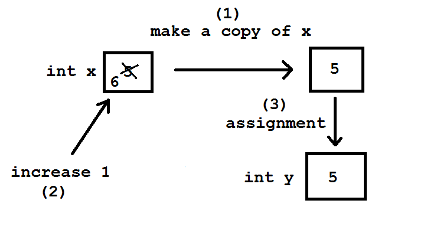

Chào các bạn! Tiếp tục với khóa học lập trình C++ trực tuyến, trong bài học hôm nay, chúng ta tìm hiểu thêm 2 toán tử rất quan trọng thường xuyên được sử dụng trong ngôn ngữ lập trình C++.

##
###Toán tử tăng (increment operator)

Toán tử tăng (kí hiệu: **++**) có thể đứng trước hoặc sau một biến (variable). Ví dụ: 

	int value = 5;
	++value;
	value++;

Cả hai vị trí đứng của toán tử tăng đều có chung một mục đích: **Tăng giá trị của biến lên 1 đơn vị**. 

*Nhưng chúng hoàn toàn khác nhau về mặt ngữ nghĩa.*

Toán tử tăng khi làm tiền tố cho một biến rất dễ hiểu. Giá trị của x sẽ được tăng lên 1 đơn vị, sau đó giá trị mới sẽ được định cho biến x.

Ví dụ:

	int x = 5;
	int y = ++x; //giá trị của x bây giờ là 6, giá trị 6 sẽ được gán vào biến y

Toán tử tăng làm hậu tố của một biến có vẻ khó hiểu hơn một chút. Compiler sẽ tạo ra một bản sao của biến x hiện tại, tăng giá trị của biến x ban đầu lên 1 đơn vị, và sau đó định giá trị bằng bản sao của biến x. Ngay sau đó, bản sao của biến x sẽ bị loại bỏ.

Ví dụ:

	int x = 5;
	int y = x++; //giá trị của x bây giờ là 6, giá trị 5 ban đầu của x sẽ được gán cho y

Mình trình bày lại cách hoạt động của đoạn code trên thêm 1 lần nữa.

Đầu tiên, biến x được khai báo và khởi tạo giá trị ban đầu là 5. Tiếp theo, biến y được khai báo và gán cho giá trị là x++. Khi gặp toán tử tăng (++) làm hậu tố của biến x, compiler tạo ra một bản sao của biến x mang theo giá trị 5 ban đầu. Bây giờ, biến x gốc được tăng giá trị lên 1 đơn vị (x sẽ bằng 6), nhưng giá trị được gán cho biến y không phải là biến x ban đầu mà là bản sao của biến x (bản sao mang giá trị 5). Sau khi gán giá trị xong, bản sao của biến x bị xóa bỏ.

##
###Toán tử giảm

Toán tử giảm (kí hiệu: **--**) có thể làm tiền tố (đứng trước) hoặc hậu tố (đứng sau) một biến (variable). Ví dụ:

	int value = 10;
	--value;
	value--;

Mục đích khi sử dụng toán tử này là để **giảm giá trị của biến đi 1 đơn vị**, nhưng có sự khác nhau giữa cách sử dụng tiền tố và hậu tố (tương tự toán tử tăng).

Cũng tương tự như mình đã trình bày cho toán tử tăng (++), toán tử giảm (--) khi làm tiền tố cho biến cũng khá đơn giản. Giá trị biến x sẽ bị trừ đi 1 đơn vị, mọi thao tác với biến x sẽ có hiệu lực trên giá trị mới ngay lập tức.

Ví dụ:

	int x = 5;
	int y = --x; //Giá trị của x bây giờ là 4, giá trị 4 được gán cho biến y

Đối với toán tử giảm (--) làm hậu tố cho biến, compiler cũng tạo ra một bản sao của biến x, giảm giá trị biến x đi 1 đơn vị, gán giá trị của bản sao biến x vào biến y, sau đó loại bỏ bản sao của biến x ra khỏi chương trình.

	int x = 5;
	int y = 5--; //Giá trị của biến x bây giờ là 4, giá trị 5 được gán cho biến y

##
###Tổng kết

Toán tử tăng, giảm là những toán tử được sử dụng khá thường xuyên trong thực tế. Các bạn cần nắm rõ bài học hôm nay trước khi đi tiếp những bài học tiếp theo.

##
###Bài tập cơ bản

Các bạn nhìn vào đoạn code ví dụ bên dưới, không chạy thử chương trình trên máy tính mà hãy đoán kết quả của biểu thức.

		int x = 0;
		x = (x++) + (++x);
		cout << "Value of x is: << x << endl; 

Đoạn code tiếp theo:

		int x = 2;
		x = pow(x++, --x);
		cout << "Value of x is: " << x << endl;

Sau khi đoán giá trị xong, viết lại những đoạn code trên vào IDE để chạy thử xem kết quả bạn đoán có chính xác không.

**Hẹn gặp lại các bạn trong các bài học tiếp theo của khóa học lập trình C++ hướng thực hành.**

Mọi thắc mắc cần giải đáp trong khóa học này có thể được giải đáp bằng cách đặt câu hỏi tại forum diễn đàn.

**[www.daynhauhoc.com](http://www.daynhauhoc.com)**