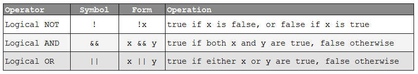
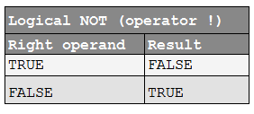
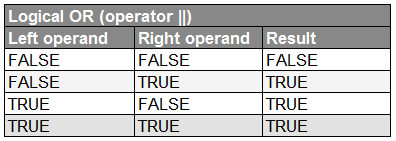
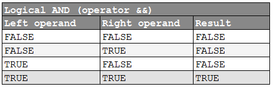

###Rất vui được gặp lại các bạn trong khóa học lập trình trực tuyến ngôn ngữ c++ hướng thực hành.

Trong bài học này, chúng ta cùng tìm hiểu về một kiểu dữ liệu được dùng rất thường xuyên trong ngôn ngữ lập trình C++. Đó là kiểu dữ liệu **bool**.

Nhìn lại bảng các kiểu dữ liệu cơ bản trong các bài trước, chúng ta thấy kiểu **bool** có kích thước nhỏ nhất.

Kiểu dữ liệu **bool** được dùng để lưu trữ kết quả của một mệnh đề toán học trong máy tính.

###Mệnh đề toán học là gì?

Mệnh đề toán học (hay còn gọi là mệnh đề logic) là một phát biểu mà nó chỉ có thể xảy ra một trong hai trường hợp: **đúng hoặc sai**.

Ví dụ:

- Mệnh đề A = "Chúng ta đang học lập trình C++". Mình có thể nói A là một mệnh đề đúng.

- Mệnh đề B = "5 là số chẵn". Đây hiển nhiên là một mệnh đề sai.

Vậy thì, kết quả đúng hoặc sai của một mệnh đề là một sự hiển nhiên, có thể thấy được ngay.

Tính đúng sai của một mệnh đề cũng có thể thay đổi theo thời gian.

Ví dụ:

- Mệnh đề C = "Hôm nay là thứ ba". Mệnh đề này có thể đúng hoặc sai tùy vào thời điểm mình phát biểu nó.

***Những câu mệnh lệnh, cảm thán hay câu hỏi ... đều không thể đóng vai trò là một mệnh đề vì chúng không phản ánh được sự đúng hoặc sai.***

###Mệnh đề khẳng định và mệnh đề phủ định

Thử xét lại mệnh đề B ở ví dụ trên.

**B = "5 là số chẵn".** Đây chính là một mệnh đề khẳng định, nó khẳng định rằng 5 là số chẵn. Và nó cho chúng ta kết quả sai.

Vậy thì nếu chúng ta phủ định lại mệnh đề B, chúng ta sẽ được một mệnh đề có kết quả đúng.

**X = "5 không phải là số chẵn".**

Để phủ định một mệnh đề, chúng ta thường thêm vào từ **không** hoặc **không phải**. Nếu chúng ta phủ định mệnh đề B 2 lần, chúng ta được mệnh đề B ban đầu. Đây được gọi là quy luật phủ định của phủ định.

###Mệnh đề trong ngôn ngữ lập trình C++

Ngôn ngữ C++ có hổ trợ cho chúng ta việc biểu diễn các mệnh đề toán học. Mình lấy một số ví dụ như sau:

	1 < 2; //đúng
	5 > 10; //sai
	1 + 1 == 2; //đúng
	
	int a = 2, b = 4;
	a * 3 != b; //đúng

Trên đây là một vài ví dụ về cách biểu diễn mệnh đề trong ngôn ngữ C++. Như các bạn thấy, máy tính không thể hiểu được các phát biểu bằng lời như "Đây là ngôn ngữ C++" hay là "Học lập trình không khó", chúng chỉ có thể hiểu được các mệnh đề dưới dạng các con số, các biểu thức so sánh...

###Khai báo và khởi tạo biến kiểu bool

Kiểu **bool** là kiểu dữ liệu chỉ nhận một trong hai giá trị **true** (đúng) hoặc **false** (sai) tương ứng với kết quả của mệnh đề toán học trong C++.

Chúng ta khai báo (và khởi tạo) biến kiểu bool tương tự như cách khai báo biến có các kiểu dữ liệu mà các bạn đã được làm quen.

	bool b;

Trong đó, **bool** là kiểu dữ liệu và **b** là tên biến.

Chúng ta có thể gán trực tiếp giá trị **true** hoặc **false** cho biến kiểu **bool**.

	bool b1 = true;
	bool b2(false);
	bool b3 { true };
	
Giá trị của biến kiểu **bool** có thể bị đảo từ **true** sang **false** hoặc ngược lại nếu sử dụng toán tử **not (!)**.

	bool b1 = !true; //not true => false
	bool b2(!false); //not false => true

Khi biểu diễn giá trị của biến kiểu bool trên máy tính, nó hoàn toàn không phải là **true** hoặc **false** mà được định dạng kiểu **integer**. Giá trị **true** ứng với số **1**, giá trị **false** ứng với số **0**. Cùng thử chạy đoạn code mẫu dưới đây để kiểm chứng:

	#include <iostream>
	using namespace std;
 
	int main()
	{
	    bool b(true);
	    cout << b << endl; //1
	    cout << !b << endl; //0
	 
	    bool b2(false);
	    cout << b2 << endl; //0
	    cout << !b2 << endl; //1
		
		system("pause");
	    return 0;
	}

Sau khi chạy đoạn chương trình trên, kết quả chúng ta nhận được là:

	1
	0
	0
	1

Nếu các bạn muốn đối tượng **cout** in ra giá trị **true** hoặc **false** thay vì chỉ in ra các giá trị **0** hoặc **1**, các bạn có thể sử dụng **std::boolalpha**.

	#include <iostream>
	using namespace std;

	int main()
	{
		cout << true << endl;
		cout << false << endl;
		
		cout << boolalpha << endl;
		cout << true << endl;
		cout << false << endl;

		system("pause");
		return 0;
	}

Kết quả:

	1
	0
	true
	false

Kiểu **bool** chỉ có thể lưu trữ một trong hai giá trị **true** hoặc **false** tương ứng với giá trị 1 và 0 trong số nguyên, điều gì xảy ra nếu chúng ta gán cho biến kiểu bool những giá trị khác? Cùng thử chạy đoạn chương trình bên dưới để tìm kết quả:

	#include <iostream>
	using namespace std;

	int main()
	{
		bool b;
		cout << boolalpha;

		b = 0; cout << b << endl;
		b = 1; cout << b << endl;
		b = 100; cout << b << endl;
		b = -999; cout << b << endl;		

		system("pause");
		return 0;
	}

Kết quả chúng ta được:

	false
	true
	true
	true

Khi gán những giá trị số nguyên cho biến kiểu **bool**, ngoài giá trị 0 ra, những giá trị khác đều được quy đổi về giá trị **true**.

###Gán các mệnh đề toán học cho biến kiểu bool

Mình sẽ lấy lại một số ví dụ về các biểu thức biểu diễn mệnh đề toán học trong ngôn ngữ C++ như bên dưới.

	1 < 2; //đúng
	5 > 10; //sai
	1 + 1 == 2; //đúng
	
	int a = 2, b = 4;
	a * 3 != b; //đúng

Những biểu thức này sẽ cho ra kết quả là giá trị đúng hoặc sai. Do đó, chúng ta có thể gán các biểu thức này cho biến kiểu **bool**. Ví dụ:

	bool b1 = 1 < 2;
	bool b2 = 5 > 10;
	bool b3 = (1 + 1 == 2);
	
	int a = 2, b = 4;
	bool b4 = (a * 3 != b);

	cout << b1 << " " << b2 << " " << b3 << " " << b4 << endl;

Kết quả đoạn lệnh trên sẽ cho ra kết quả

	1 0 1 1

**b1** có giá trị đúng vì mệnh đề **(1 < 2)** là đúng. **b2** có giá trị sai vì **(5 > 10)** là sai. Tương tự cho **b3** và **b4**.

Các mệnh đề toán học trong C++ được tạo nên từ những biểu thức chứa những toán tử quan hệ (relational operators). Các phép so sánh sẽ trả về giá trị **đúng** hoặc **sai**.

###Các toán tử quan hệ (Comparisons)

Ngôn ngữ C++ đã định nghĩa 6 toán tử quan hệ dùng để so sánh các kiểu dữ liệu cơ bản.

Các bạn lưu ý phân biệt toán tử gán (=) và toán tử so sánh tương đương (==). Khi muốn thực hiện phép so sánh bằng, chúng ta sử dụng 2 dấu bằng liên tiếp nhau. Ngược lại với toán tử so sánh tương đương (==) là toán tử so sánh không tương đương (!=), toán tử này trả về giá trị đúng nếu 2 giá trị không bằng nhau.

Chúng ta lấy ví dụ sau để hiểu rõ hơn cách hoạt động của các toán tử quan hệ:

Tuổi của A là 15, tuổi của B là 20. Sử dụng các toán tử quan hệ cho tuổi của 2 người này, ta được bảng kết quả như sau:

###So sánh số thực

Sử dụng các toán tử so sánh để thực hiện so sánh số thực có thể cho ra kết quả không mong muốn. Ví dụ:

	#include <iostream>
	 
	int main()
	{
	    double d1(100 - 99.99); // should equal 0.01
	    double d2(10 - 9.99); // should equal 0.01
	 
		bool b1 = (d1 == d2);
		bool b2 = (d1 > d2);
		bool b3 = (d1 < d2);

		cout << b1 << endl;
		cout << b2 << endl;
		cout << b3 << endl;

		system("pause");
	    return 0;
	}

Đoạn chương trình trên cho ra kết quả là

	0
	1
	0

Có nghĩa là biểu thức so sánh **(d1 > d2)** là đúng. Trong chương trình trên, d1 = 0.0100000000000005116 và d2 = 0.0099999999999997868. Cả 2 giá trị này đều gần bằng 0.1, nhưng d1 lớn hơn d2 nên đã cho ra kết quả sai. Do đó, chúng nên tránh thực hiện so sánh số thực nếu không cần thiết.

###Toán tử logic (logical operators)

Chúng ta sử dụng các toán tử quan hệ (relational operators) để kiểm tra một biểu thức mệnh đề cụ thể đúng hay sai, nhưng chúng chỉ có thể kiểm tra 1 mệnh đề tại 1 thời điểm. Đôi khi chúng ta cần kiểm tra cùng lúc nhiều mệnh đề trong cùng thời điểm.

Ví dụ: Khi chúng ta muốn kiểm tra thử có trúng vé số hay không, chúng ta cần so khớp nhiều chữ số khác nhau. Nếu tờ vé số có 5 chữ số, chúng ta cần 5 lần so sánh. Điều kiện trúng giải là tất cả các cặp chữ số đều phải khớp với nhau.

Một trường hợp khác, chúng ta cần kiểm tra rằng có ít nhất một mệnh đề trong số các mệnh đề đưa ra là đúng hay không.

Ví dụ: Nếu chúng ta muốn nghỉ làm việc trong hôm nay, phải có ít nhất 1 trong 2 mệnh đề sau đây là đúng. Thứ nhất là "chúng ta bị ốm", thứ hai là "chúng ta đã hoàn thành công việc". Hoặc mệnh đề "chúng ta bị ốm" đúng, hoặc mệnh đề "chúng ta đã hoàn thành công việc" đúng thì chúng ta có thể nghỉ làm việc hôm nay. Nếu chỉ sử dụng các toán tử so sánh, chúng ta phải thực hiện so sánh 2 lần.

***Toán tử logic (logical operators) hổ trợ cho chúng ta kiểm tra nhiều mệnh đề cùng một lúc.***

Ngôn ngữ C++ cung cấp cho chúng ta 3 toán tử logic:

#####Toán tử NOT

Toán tử NOT kí hiệu là (!) là toán tử một ngôi có chức năng đảo ngược giá trị của biến kiểu **bool**. Khi sử dụng, chúng ta đặt toán tử NOT đứng trước giá trị kiểu **bool** hoặc biến kiểu **bool**.

Ví dụ:

	!true;
	!false;
	bool b = false;
	bool b1 = !b;

Dưới đây là bảng chân trị của toán tử NOT:

Nếu toán tử NOT tác động đến giá trị True, nó sẽ chuyển thành giá trị False và ngược lại.

#####Toán tử OR

Toán tử OR là một toán tử hai ngôi dùng để kiểm tra một trong hai mệnh đề có đúng hay không. Ví dụ: "Tôi thích chơi game" OR "Tôi thích học lập trình C++". Nếu mệnh đề "Tôi thích chơi game" đúng, hoặc mệnh đề "Tôi thích học lập trình C++" đúng thì toán tử OR trả về kết quả đúng.

Ví dụ:

	int value = 1;
	value == 0 || value == 1; // true
	value == 0 || value == 2; // false

#####Toán tử AND

Toán tử AND là một toán tử hai ngôi dùng để kiểm tra cả hai mệnh đề có đều đúng hay không. Dưới đây là bảng chân trị của toán tử AND:

Ví dụ:

	int value = 1;
	value != 0 && value != 2; //true
	value == 1 && value == 2; //false

##
###Tổng kết

Kiểu bool và các biểu thức mệnh đề toán học được sử dụng rất nhiều trong các cấu trúc điều khiển và cấu trúc vòng lặp trong ngôn ngữ C++ mà các bạn sẽ được học trong các bài học sau.

--------------------------------------

P/s: **Hẹn gặp lại các bạn trong bài học tiếp theo trong khóa học lập trình C++ hướng thực hành.**

Mọi ý kiến đóng góp hoặc thắc mắc có thể đặt câu hỏi trực tiếp tại diễn đàn 

**www.daynhauhoc.com**

