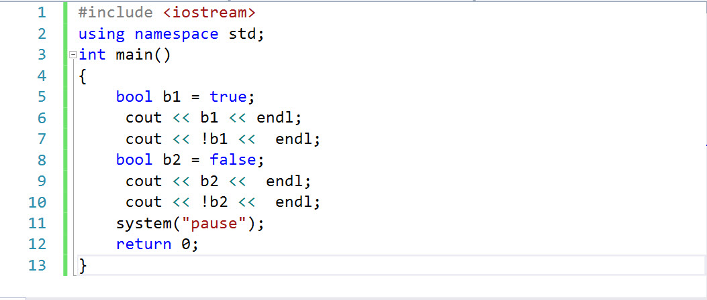
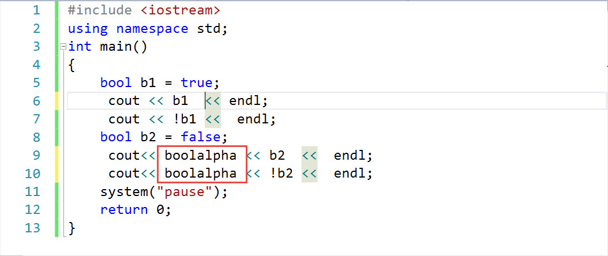
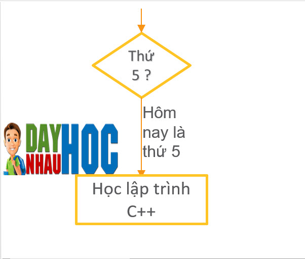
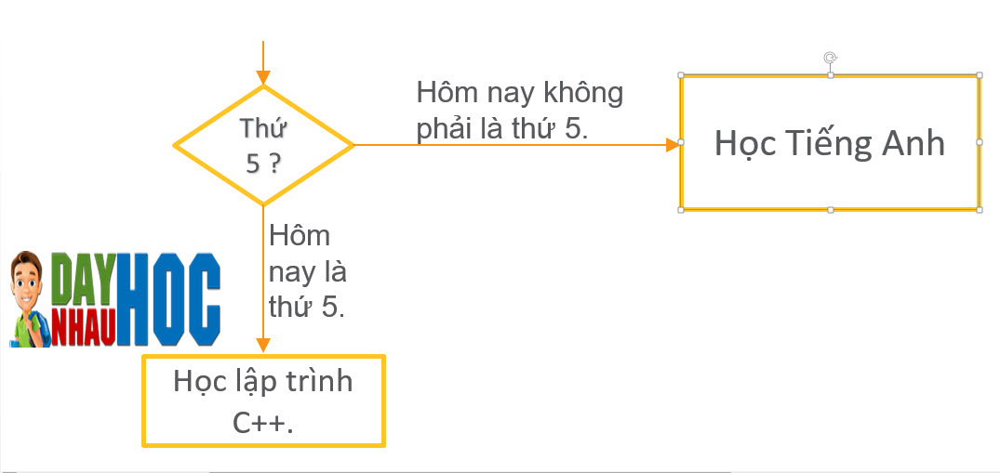
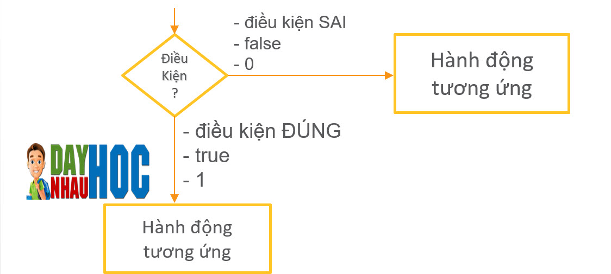

###Rất vui được gặp lại các bạn trong khóa học c++ hướng thực hành.

#**Cấu trúc rẽ nhánh (Conditional statement)**

###Trước khi nói về cấu trúc rẽ nhánh chúng ta cùng tìm hiểu một chút về kiểu dữ liệu **Boolean** trong ngôn ngữ C++.

* **Kiểu dữ liệu Boolean** chỉ nhận hai giá trị : **true**(tương ứng với **1**) và **false**(tương ứng với **0**)

* **Khai báo** kiểu dữ liệu **Boolean** chúng ta chỉ việc sử dụng từ khóa `bool`. Điều này tương tự như với các từ khóa khác `int`,`float`,`double` ...

Ví dụ  :

	bool bl ;           // khởi tạo biến Boolean.
	bool b1 = false;   // khởi tạo theo phương thức sao chép.
	bool b2(true);    //  khởi tạo theo phương thức mặc định. 

* Toán tử logic **NOT(!)** có thể làm thay đổi ngược lại giá trị của biến kiểu Boolean.

Ví dụ :

    bool bl1 = !true; // Lúc này biến bl1 không nhận giá trị true mà nhận giá trị ngược lại của true. Tức là nhận giá trị false
    bool bl2(!false); // Điều tương tự xảy ra với biến bl2. Lúc này bl2 có giá trị true

* Chúng ta sẽ cùng thử làm một ví dụ sau 

**Các bạn thử gõ rồi run thử xem màn hình in ra như thế nào ?**

**Kết quả : **

 	    1
    	0
    	0
    	1
**Tại sao lại như vậy ?**

Như đã nói ở trên  
>**Kiểu dữ liệu Boolean** chỉ nhận hai giá trị : **true**(tương ứng với **1**) và **false**(tương ứng với **0**)

Chính vì lý do đó khi ta dùng `cout` để in ra màn hình thì nó sẽ báo kết quả tương đương với **1** là **true**, **0** là **false**.

**Nếu ta muốn in ra "true" và "false" thì có được không ?**

Tất nhiên là được. Khi ra sử dụng `boolalpha` trong thư viện `std`.

 

**Kết quả :**

	1
	0
	false
	true

----------

###Đó là kiểu dữ kiệu Boolean. 

Còn bây giờ chúng ta sẽ vào vấn đề chính là **Cấu trúc rẽ nhánh (Conditional statement)**

* Biến dữ liệu kiểu **Boolean** được áp dụng vào trong việc **điều khiển luồng**(cấu trúc rẽ nhánh)

Trước hết, cùng thử xem một ví dụ :

 Nếu **hôm nay** là **thứ 5** tôi sẽ **học** lập trình c++.

Chúng ta cùng xem sơ đồ khối sau :

> Máy tính **không giống** con người nên chúng không thể tự trả lời câu hỏi của chúng ta được. Vì vậy chúng ta phải đặt ra một điều kiện có **giới hạn** trường hợp. Như vậy máy tính mới có thể xử lý thông tin được.
> 
> Việc đặt ra một điều kiện **Làm như thế nào để học giỏi lập trình?** với máy tính thì máy tính sẽ không thể nào mà trả lời giúp bạn được phải không?

Như trong sơ đồ trên. Điều kiện **Thứ 5?**(Hôm này có phải là thứ 5?) chỉ có hai phương án trả lời cho câu hỏi đó là **ĐÚNG là thứ 5** hoặc **KHÔNG là thứ 5**.

Ứng với hai phương án trả lời là hai hành động tương ứng 

 * **ĐÚNG là thứ 5** --> Học lập trình C++.

 * **Hoặc**
 
 * **KHÔNG là thứ 5**. --> Học Tiếng Anh.

----------

Như chúng ta đã thấy việc giới hạn trường hợp xử lý điều kiện là **Đúng** hoặc **Sai**.
Cùng liên kết với kiến thức về kiểu Boolean mình vừa giới thiệu.

> Kiểu Boolean có hai giá trị **True** và **False** tương ứng với điều đó là **1** và **0**

> Máy tính mà chúng ta sử dụng cũng chỉ xử lý được trên hai giá trị **0** và **1**

Như vậy, cùng nhìn lại sơ đồ khối một lần nữa dựa trên sự biểu diễn của khối điều khiển và kiểu dữ liệu Boolean

----------

Nội dung kiến thức của bài này các bạn cần ghi nhớ :

 * Kiểu dữ liệu Boolean
 * Sơ đồ khối miêu tả cấu trúc rẽ nhánh bằng khối điều khiển.
 

P/s: **Hẹn gặp lại các bạn trong bài học tiếp theo trong khóa học lập trình C++ hướng thực hành.**

Mọi ý kiến đóng góp hoặc thắc mắc có thể đặt câu hỏi trực tiếp tại diễn đàn 

**www.daynhauhoc.com**

