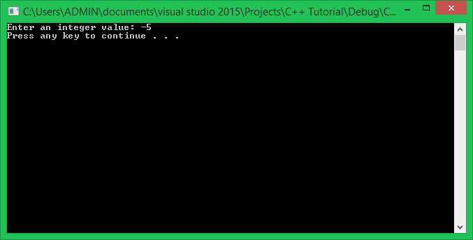

Rất vui khi gặp lại các bạn trong khóa học lập trình trực tuyến ngôn ngữ C++.

Trong bài học trước, mình đã giới thiệu đến các bạn một số cấu trúc điều khiển thường thấy trong chương trình C++, các cấu trúc điều khiển có khả năng quyết định phần code nào sẽ được thực thi tại thời điểm chương trình đang chạy. Và cấu trúc đầu tiên mình muốn giúp các bạn tìm hiểu là **cấu trúc rẽ nhánh có điều kiện (conditional branch)** với **câu lệnh if (if statement)**.

##
###If statement

**If statement** cho phép chúng ta điều khiển chương trình thực hiện một đoạn lệnh nào đó dựa trên biểu thức điều kiện có giá trị **true** hoặc **false**. Quan trọng hơn là **if statement** cho phép chúng ta làm điều này dựa trên input của người dùng. Ví dụ: sử dụng if statement để kiểm tra username và password, và chương trình sẽ quyết định người dùng có được phép truy cập vào hệ thống hay không.

Về mặt ngữ nghĩa, if statement cũng giống như luật nhân - quả. Ví dụ: Nếu tôi hết tiền trong tài khoản thì tôi không thể rút tiền từ máy ATM. Vậy biểu thức điều kiện ở đây là số tiền trong tài khoản vẫn còn, nếu đúng thì máy ATM cho phép rút tiền và ngược lại.

#####Cấu trúc cơ bản của if statement

Dưới đây là cấu trúc cơ bản nhất của một **if statement**:

	if (expression)
		execute the next statement;

Câu lệnh tiếp theo thuộc **if statement** chỉ được thực hiện nếu biểu thức điều kiện **expression** có giá trị **true**.

>Biểu thức điều kiện được tạo ra từ một hoặc nhiều mệnh đề toán học.

Ví dụ:

	int main()
	{
		if (5 < 10)
			cout << "(5 < 10) is true" << endl;

		system("pause");
		return 0;
	}

Trong đoạn chương trình trên, chúng ta đánh giá mệnh đề (5 < 10) để xem nó có đúng hay không. Điều này hiển nhiên đúng, do đó, câu lệnh đứng ngay sau **if statement** sẽ được thực hiện.

#####If with multiple statments

Để thực hiện nhiều hơn 1 câu lệnh khi biểu thức điều kiện trong if statement đúng, chúng ta đặt thêm cặp dấu ngoặc nhọn phía sau để tạo thành một khối lệnh. Ví dụ:

	int main()
	{
		if (5 < 10)
		{
			cout << "(5 < 10) is true" << endl;
			cout << "This line will be printed" << endl;
			cout << "Because they are inside the block of if statement" << endl;
		}

		system("pause");
		return 0;
	}

Mình khuyến nghị các bạn nên có thói quen sử dụng cặp dấu ngoặc nhọn đứng sau **if statement** cho dù phía sau nó chỉ có 1 lệnh cần xử lý.

#####Else

Chúng ta thử lấy thêm 1 ví dụ về **if statement** cơ bản:

	int value;
	cout << "Enter an integer value: "; cin >> value;

	if(value >= 0)
	{
		cout << "Positive number" << endl;
	}

Với đoạn code trên, điều gì sẽ xảy ra nếu chúng ta nhập giá trị -5 cho biến value?

Kết quả sau khi nhập giá trị xong thì chương trình không làm gì cả. Vì giá trị -5 làm sai biểu thức điều kiện **(value >= 0)**, do đó, chương trình bỏ qua dòng lệnh **cout** bên dưới.

Trong một số trường hợp, chúng ta muốn thực thi một số lệnh khi biểu thức điều kiện sai, thay thế cho trường hợp biểu thức điều kiện đúng. Lúc này, từ khóa "**else**" sẽ giúp chúng ta làm điều đó.

	int value;
	cout << "Enter an integer value: "; cin >> value;

	if (value >= 0)
	{
		cout << "Positive number" << endl;
	}
	else
	{
		cout << "Negative number" << endl;
	}

Bây giờ khi nhập lại giá trị -5, chúng ta được kết quả như sau:

Từ khóa "**else**" có nghĩa là trường hợp ngược lại với biểu thức điều kiện trong **if statement**. Khi biểu thức điều kiện trong **if statement** có giá trị **false**, khối lệnh đứng sau **else statement** sẽ được thực thi.

#####Chaining if statements

Với cách dùng cấu trúc **if ... else** như trên, chúng ta chỉ có thể kiểm tra 2 trường hợp phủ định của nhau. Một cách dùng khác của **if statement** là khi cần kiểm tra nhiều trường hợp khác nhau có thể xảy ra. Chúng ta có thể dùng "**else if**" statement để đưa vào những trường hợp cần kiểm tra khác.

Cấu trúc khi sử dụng **"else if" statement**:

	if (expression)
	{
		// do A
	}
	else if (another_expression)
	{
		// do B
	}
	else if (one_more_expression)
	{
		// do C
	}
	else
	{
		// do D
	}

Bằng cách nối chuỗi các **if statement**, chúng sẽ được lần lượt kiểm tra các điều kiện từ trên xuống dưới, nếu tìm thấy biểu thức điều kiện có kết quả **true**, khối lệnh tương ứng sẽ được thực thi, những khối lệnh còn lại sẽ bị bỏ qua.

Ví dụ:

	int score;
	cout << "Enter your average score: "; cin >> score;

	if (score <= 5)
		cout << "You need to try more" << endl;
	else if (score <= 7)
		cout << "Not bad" << endl;
	else if (score <= 9)
		cout << "Good job" << endl;
	else
		cout << "Incredible" << endl;

Với đoạn chương trình như trên, ban đầu biến score được nhập giá trị từ bàn phím và bắt đầu kiểm tra với mệnh đề **(score <= 5)**, nếu sai, **if statement** sẽ đi đến mệnh đề tiếp theo và cứ thế cho đến khi nào tìm được mệnh đề có giá trị đúng. Nếu toàn bộ các mệnh đề đưa ra đều sai, chương trình không thực hiện **if statement**.

#####Nesting if statements

Ngôn ngữ C++ cho phép chúng ta viết những **if statements** lồng vào nhau, ví dụ:

	float a, b;
	cin >> a >> b;

	if (b != 0) 
	{
		if (a <= 0)
			cout << "a = 0 is not accepted" << endl;
		else
			cout << "a / b = " << a / b << endl;
	}
	else
	{
		cout << "Divided by zero" << endl;
	}

Đối với các trường hợp sử dụng if statements lồng vào nhau, chúng ta nên sử dụng thêm các cặp dấu ngoặc nhọn để giúp chương trình rõ ràng hơn.

Với đoạn chương trình trên, phép toán **a / b** chỉ được thực hiện khi cả điều kiện **b != 0** đúng và **a <= 0** sai.

#####Sử dụng các toán tử logic với if statement

Sử dụng các toán tử logic (AND, OR, NOT, ...) có thể giúp chúng ta kiểm tra nhiều trường hợp khác nhau chỉ cần dùng 1 mệnh đề ghép. Lấy ví dụ trong phần **Nesting if statements**, chúng ta sẽ thực hiện phép toán **a / b** khi cùng lúc thỏa mãn cả 2 điều kiện **(b != 0) AND (a > 0)**, chúng ta có thể sửa lại cấu trúc đoạn chương trình trên thành như sau:

	if (b != 0 && a > 0)
	{
		cout << "a / b = " << a / b << endl;
	}
	else
	{
		if (b == 0)
			cout << "Divided by zero" << endl;
		if (a <= 0)
			cout << "a <= 0 is not accepted" << endl;
	}

>Các bạn cần dựa vào bảng chân trị của từng toán tử logic để sử dụng vào mệnh đề cho hợp lý.

--------------------------------------
###Tổng kết

Trên đây mình vừa giới thiệu cho các bạn về một trong số các cấu trúc rẽ nhánh có điều kiện được sử dụng phổ biến, và một số cách sử dụng **if statement** khác nhau tùy vào tình huống cụ thể. 

###Bài tập cơ bản

1/ Viết chương trình sinh ra một số ngẫu nhiên trong khoảng từ 0 đến 100 nhưng không in ra màn hình. Yêu cầu người dùng đoán xem số ngẫu nhiên vừa sinh ra lớn hơn 50 hay bé hơn 50, nếu chọn trường hợp bé hơn 50 nhập giá trị 0, ngược lại nhập giá trị 1. In kết quả thông báo người dùng đã đoán đúng hay sai ra màn hình.

Ví dụ:

	A random number was generated
	Guess: 1
	
	Wrong! The random number is 26 (26 < 50)

2/ Viết chương trình giải phương trình bậc 2: ax2 + bx + c = 0 với a, b và c nhập từ bàn phím.

Hướng dẫn:

- Nhập vào 3 biến a, b, c.
- Tính delta = b*b - 4*a*c
- Nếu delta < 0 thì kết luận phương trình vô nghiệm.
- Ngược lại, nếu delta = 0 thì kết luận nghiệm x1 = x2 = -b/(2*a)
- Ngược lại, nếu delta > 0 thì kết luận x1 = (-b + sqrt(delta)) / (2*a) và x2 = (-b - sqrt(delta)) / (2*a).

--------------------------------------

P/s: **Hẹn gặp lại các bạn trong bài học tiếp theo trong khóa học lập trình C++ hướng thực hành.**

Mọi ý kiến đóng góp hoặc thắc mắc có thể đặt câu hỏi trực tiếp tại diễn đàn 

**www.daynhauhoc.com**

