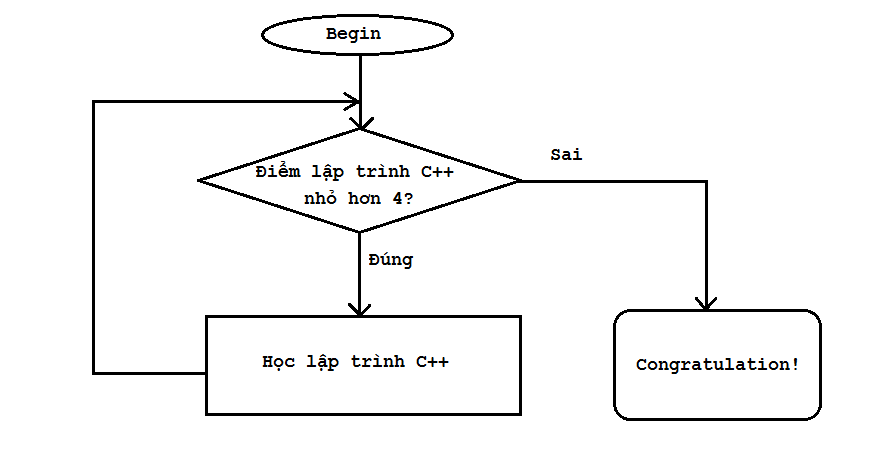
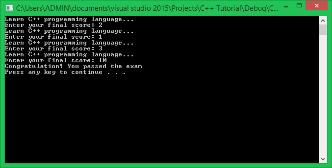

Rất vui khi được tiếp tục đồng hành cùng các bạn trong khóa học lập trình trực tuyến ngôn ngữ C++.

Trong chương trình, chúng ta sẽ cùng nhau tìm hiểu về cấu trúc vòng lặp **(Loops)** - một trong những cấu trúc điều khiển được sử dụng phổ biến trong ngôn ngữ C++.

>Cấu trúc vòng lặp khiến chương trình thực hiện lặp đi lặp lại một chuỗi các câu lệnh cho đến khi không còn thõa mãn một điều kiện nào đó.

Ví dụ:

	int main()
	{
		//do A
		//do B 0 or more times
		//do C
	}

Như vậy, chúng ta hiểu rằng có một cấu trúc vòng lặp được đặt tại B, nó có thể bắt buộc chương trình thực hiện công việc B 1 lần, hoặc cũng có thể thực hiện công việc B vô số lần mà không thể chuyển sang thực hiện công việc C sau đó. Số lần thực hiện công việc B nó sẽ phụ thuộc vào biểu thức điều kiện được đặt trong cấu trúc vòng lặp.

Mình lấy một ví dụ trong đời sống hằng ngày. *Sinh viên A đăng kí học môn lập trình C++ tại trường đại học, nếu sinh viên A không đủ điểm để qua môn học này thì sinh viên A sẽ phải học lại. Trong trường hợp sinh viên A phải học lại lần thứ 2, chúng ta lại nói rằng nếu sinh viên A không đủ điểm qua môn học này thì sinh viên A phải học lại... Vậy việc sinh viên A học lại là công việc sẽ được lặp đi lặp lại nhiều lần trong khi điều kiện sinh viên A đủ điểm để qua môn vẫn còn sai.*

###While statements

While statement là cấu trúc vòng lặp đơn giản nhất trong số các kiểu vòng lặp cơ bản mà ngôn ngữ C++ cung cấp.

	while (expression)
	{
		statements;
	}

Vòng lặp **while** được định nghĩa bởi từ khóa **while**. Một khi vòng lặp while được thực thi, biểu thức điều kiện trong **while** sẽ được đánh giá. Nếu biểu thức điều kiện cho giá trị đúng, các câu lệnh trong khối lệnh của vòng lặp **while** sẽ được thực thi.

Trong trường hợp chúng ta chỉ thực hiện 1 câu lệnh khi biểu thức điều kiện đúng, chúng ta có thể bỏ cặp dấu ngoặc nhọn đi.

	while (expression)
		statement;

Nhưng mình không khuyến khích điều này.

Khác với **if statement**, một khi kết thúc 1 lần lặp của vòng lặp **while**, chương trình sẽ quay lên lại vị trí bắt đầu vòng lặp **while** để đánh giá lại biểu thức điều kiện, nếu biểu thức điều kiện vẫn còn cho giá trị đúng, các câu lệnh trong khối lệnh của vòng lặp **while** được thực hiện lại.

Ví dụ:

	int main()
	{
		int score = 0;
		while (score < 4)
		{
			cout << "Learn C++ programming language..." << endl;
			cout << "Enter your final score: ";
			cin >> score; //new score
		}		

		cout << "Congratulation! You passed the exam" << endl;

		system("pause");
		return 0;
	}

Trong ví dụ trên, đến khi nào biến score không còn thõa mãn điều kiện (score < 4) thì vòng lặp while mới kết thúc. Chúng ta cùng xem kết quả chương trình:

Khi số điểm được nhập vào là 10, ngay lập tức mệnh đề (score < 4) được đánh giá là false, vòng lặp ngừng thực thi ngay sau đó.

>Với vòng lặp **while**, chúng ta không thể biết trước số lần lặp lại khối công việc. Chúng ta chỉ biết rằng, vòng lặp **while** sẽ ngừng thực thi khi nào biểu thức điều kiện cho giá trị **false**.

Chúng ta có thể sử dụng thêm một biến để đếm số lần thực hiện khối lệnh của vòng lặp while:

	int score = 0;
	int count = 0;

	while (score < 4)
	{
		count++;
		cout << "Learn C++ programming language..." << endl;
		cout << "Enter your final score: ";
		cin >> score; //new score
	}		

	cout << "Congratulation! You passed the exam after " << count << " times" << endl;

#####Infinite loops

Vòng lặp vô tận xảy ra trong trường hợp không có sự tác động đến biểu thức điều kiện của vòng lặp **while** và nó luôn luôn đúng. Ví dụ:

	int count = 0;
	while (count < 10)
	{
		cout << count << " ";
	}

Biến count trong trường hợp này không bị ai tác động đến giá trị, nên nó vẫn là 0 và luôn bé hơn 10. Dó đó, điều kiện luôn luôn đúng và vòng lặp không thể kết thúc được.

Chúng ta có thể cố ý khai báo vòng lặp vô hạn bằng cách sau:

	while (true)
	{
		//This loop will be executed forever
	}

Cách duy nhất để thoát ra khỏi vòng lặp vô tận là sử dụng từ khóa break, return, goto,...

#####Loop variables

Thông thường, chúng ta muốn vòng lặp thực hiện công việc trong một số lần có giới hạn. Để làm điều này, chúng ta thường sử dụng thêm các biến vòng lặp (loop variable), những biến này thường được sử dụng cho mục đích đếm số lần thực hiện khối lệnh của vòng lặp.

Mình lấy ví dụ chương trình đếm ngược từ 10 về 0 như sau:

	int count = 10;
	while (count >= 0)
	{
		_sleep(1000); //stop 1000 miliseconds
		if (count == 0)
			cout << "Finished" << endl;
		else
			cout << count << " ";

		count--;
	}

Kết quả:

	10 9 8 7 6 5 4 3 2 1 Finished

Tại cuối vòng lặp, mình thực hiện trừ giá trị của biến count đi 1, điều này sẽ dẫn đến mệnh đề (count >= 0) sẽ sai trong tương lai. Như vậy, vòng lặp while này có điểm dừng.

#####Nest while loops

Cũng tương tự như **if statement** hay **switch case statement**, chúng ta có thể đặt vòng lặp while bên trong khối lệnh của vòng lặp while khác. 

	int outer = 1;
	while (outer <= 5)
	{
		int inner = 1;
		while (inner <= 5)
		{
			cout << inner << " ";
			inner++;
		}
		cout << endl; // print a newline at the end of each row
		
		outer++;
	}

Cứ mỗi lần lặp của vòng lặp while ngoài, chương trình lại thực hiện toàn bộ vòng lặp while trong, sau đó thực hiện tăng biến outer lên 1 giá trị. Kết quả chương trình sẽ là:

	1 2 3 4 5
	1 2 3 4 5
	1 2 3 4 5
	1 2 3 4 5
	1 2 3 4 5

------------------------------

##
###Tổng kết

Tìm hiểu về vòng lặp while giúp chúng ta định hình tư duy về cấu trúc vòng lặp trong ngôn ngữ C/C++. Cấu trúc vòng lặp while khá ngắn gọn, dễ hiểu. Chúng ta thường sử dụng vòng lặp while cho các trường hợp số lần lặp lại công việc là chưa biết trước.

###Bài tập cơ bản

1/ Viết chương trình tính tổng các số nguyên được nhập từ bàn phím cho đến khi nhập số 0 thì dừng.

2/ Viết chương trình in ra tất cả ký tự thuộc bảng mã ASCII từ 0 đến 127.

3/ Viết chương trình sử dụng vòng lặp while để chương trình in ra như sau:

	1
	1 2
	1 2 3
	1 2 3 4
	1 2 3 4 5

--------------------------------------

P/s: **Hẹn gặp lại các bạn trong bài học tiếp theo trong khóa học lập trình C++ hướng thực hành.**

Mọi ý kiến đóng góp hoặc thắc mắc có thể đặt câu hỏi trực tiếp tại diễn đàn 

**www.daynhauhoc.com**