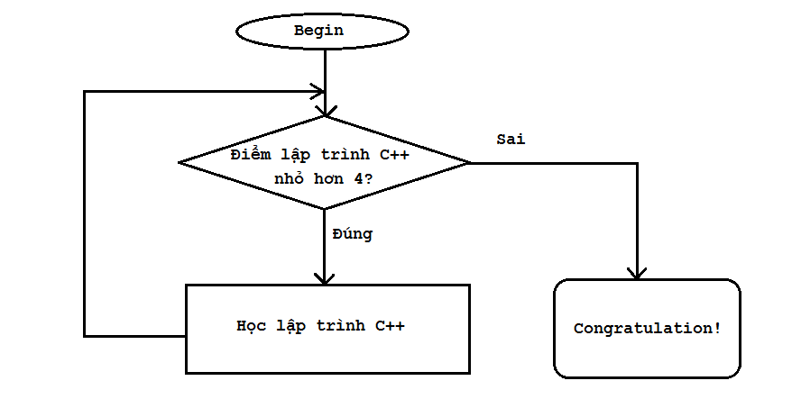
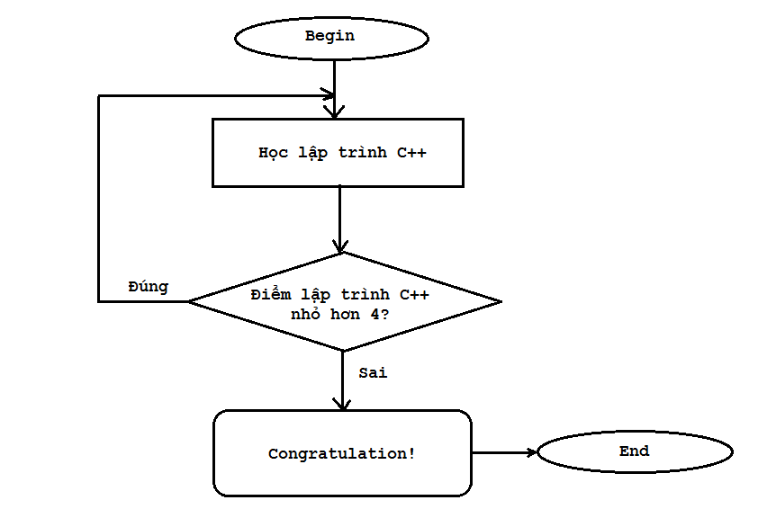

Trong bài học trước, chúng ta đã tìm hiểu về cấu trúc và cách hoạt động của vòng lặp **while**. Bây giờ mình sẽ giới thiệu đến các bạn vòng lặp **do-while**, và so sánh sự giống và khác nhau giữa 2 cấu trúc vòng lặp này để các bạn có thể chọn cấu trúc lặp cho phù hợp với những vấn đề khác nhau.

Mình lấy lại ví dụ trong bài trước: *Sinh viên A đăng kí học môn lập trình C++ tại trường đại học, nếu sinh viên A không đủ điểm để qua môn học này thì sinh viên A sẽ phải học lại. Trong trường hợp sinh viên A phải học lại lần thứ 2, chúng ta lại nói rằng nếu sinh viên A không đủ điểm qua môn học này thì sinh viên A phải học lại... Vậy việc sinh viên A học lại là công việc sẽ được lặp đi lặp lại nhiều lần trong khi điều kiện sinh viên A đủ điểm để qua môn vẫn còn sai.*

Khi sử dụng vòng lặp while để áp dụng cho trường hợp sinh viên A này, luồng thực hiện của chương trình sẽ diễn ra như sơ đồ khối sau:

Nhưng trong thực tế, có thể sinh viên A mới đăng kí học môn lập trình C++ lần đầu, lúc này sinh viên A chưa có điểm thi nhưng vẫn được đưa vào biểu thức điều kiện trong vòng lặp **while** để kiểm tra, như vậy vẫn giải quyết được bài toán nhưng chưa phù hợp lắm. Điều chúng ta mong muốn là sinh viên A phải thực hiện công việc "học lập trình C++" trước, sau đó chúng ta mới lấy điểm của sinh viên A để đánh giá và ra quyết định sinh viên A có phải học lại hay không.

***Với cấu trúc thực hiện công việc trước và kiểm tra điều kiện sau, chúng ta nên sử dụng cấu trúc vòng lặp do-while.***

Vậy sơ đồ khối của vòng lặp do-while dùng để biểu diễn bài toán của sinh viên A sẽ là:

Nhìn vào sơ đồ, chúng ta thấy sinh viên A phải học lập trình C++ ít nhất 1 lần, sau đó đưa điểm số của sinh viên A vào biểu thức điều kiện để đánh giá và quyết định sinh viên A có bị học lại hay không. Cấu trúc vòng lặp **do-while** áp dụng vào bài toán này phù hợp hơn cấu trúc vòng lặp **while**.

----------------------

###do-while statements

**do-while statement** là cấu trúc vòng lặp thứ 2 mình muốn giới thiệu đến các bạn:

	do
	{
		statements;
	} while (expression);

Các câu lệnh bên trong khối lệnh của cấu trúc **do-while** sẽ được thực thi ít nhất 1 lần. Sau khi thực thi các câu lệnh, vòng lặp **do-while** sẽ đánh giá biểu thức điều kiện. Nếu biểu thức điều kiện đúng, chương trình quay trở lại thực hiện khối công việc của vòng lặp **do-while**, ngược lại, nếu biểu thức điều kiện sai, chương trình thoát khỏi vòng lặp **do-while**.

***Lưu ý: vòng lặp do-while kết thúc bằng dấu chấm phẩy.***

Ví dụ về vòng lặp **do-while**:

	int main()
	{
		int selection;
		do
		{
			cout << "_____Please make a selection_____" << endl;
			cout << "1/ Addition" << endl;
			cout << "2/ Subtraction" << endl;
			cout << "3/ Multiplication" << endl;
			cout << "4/ Division" << endl;

			cout << "Your selection: "; 
			cin >> selection;

			cout << "Do something with your selection here" << endl;

		}while (selection >= 1 && selection <= 4);		

		system("pause");
		return 0;
	}

>Có một điều đáng chú ý trong vòng lặp **do-while** là biến vòng lặp dùng cho biểu thức điều kiện cần được khai báo trước vòng lặp **do-while**. Vì từ khóa while được đặt bên ngoài khối lệnh của vòng lặp nên những biến khai báo bên trong khối lệnh sẽ bị hủy trước khi đến biểu thức điều kiện.

Trong chương trình trên, vòng lặp sẽ dừng lại khi các bạn lựa chọn giá trị không nằm trong khoảng **[1, 4]**. Lựa chọn giá trị nằm ngoài khoảng **[1, 4]** sẽ khiến biểu thức điều kiện sai.

------------------------

###Tổng kết

Khi sử dụng vòng lặp do-while các bạn chỉ cần lưu ý rằng các câu lệnh bên trong vòng lặp này sẽ được thực hiện trước khi kiểm tra biểu thức điều kiện, còn lại nó hoạt động hoàn toàn tương tự vòng lặp while mà mình đã trình bày ở bài học trước.

###Bài tập cơ bản

Giả sử userID và password của chương trình được định nghĩa như bên dưới

	#include <iostream>
	using namespace std;

	#define ID 123
	#define PASSWORD 123456

	int main()
	{
		//.................
	}

Viết tiếp chương trình trên sử dụng vòng lặp do-while để kiểm tra userID và password được nhập từ bàn phím. Chương trình chỉ thực hiện tiếp khi người dùng nhập đúng userID và password. Nếu nhập sai, chương trình sẽ yêu cầu người dùng nhập lại.

--------------------------------------

P/s: **Hẹn gặp lại các bạn trong bài học tiếp theo trong khóa học lập trình C++ hướng thực hành.**

Mọi ý kiến đóng góp hoặc thắc mắc có thể đặt câu hỏi trực tiếp tại diễn đàn 

**www.daynhauhoc.com**