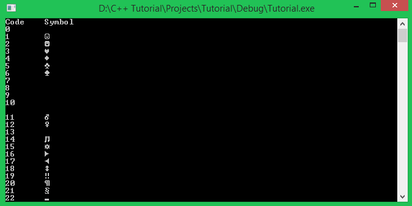

Chào mừng các bạn đến với bài học tiếp theo trong khóa học lập trình ngôn ngữ C++ hướng thực hành.

Trong hầu hết tất cả các bài học trước đây, chúng ta chỉ làm việc cùng nhau trên kiểu dữ liệu số. Chúng ta sử dụng các biến lưu trữ giá trị số (số nguyên **int**, số thực như **float** hoặc **double**, ...) để phục vụ cho việc tính toán toán học, giải quyết các bài toán đơn giản là chủ yếu. 

Trong bài học ngày hôm nay, chúng ta sẽ tìm hiểu một kiểu dữ liệu cũng là một trong những kiểu dữ liệu cơ bản trong ngôn ngữ C và C++, đó là **kiểu kí tự**.

###Kiểu kí tự là gì?

Cũng tương tự như các kiểu dữ liệu số (**int32_t**, **float**, **uint64_t**, ...), kiểu kí tự là một kiểu dữ liệu có độ lớn **1 byte (8 bits)** dùng để lưu trữ 1 kí tự trong vùng nhớ máy tính. Kí tự có thể là các chữ cái đơn trong bảng chữ cái (a, b, c, ... x, y z), có thể là các kí hiệu toán học (+, -, *, /, ...), hay có thể là những con số (0, 1, 2, ..., 9)...

*Một đặc điểm của kiểu kí tự là có thể hiển thị được lên màn hình.*

Trong C/C++, kiểu kí tự có thể lưu trữ **1 kí tự** trong bảng mã **ASCII**.

Đây là bảng mã kí tự **ASCII** đầy đủ:


Bảng mã **ASCII** được chia làm 2 cột: 

- Cột **Code** là số thứ tự của kí tự trong bảng mã **ASCII**. 
- Cột **Symbol** là kí tự được chuyển đổi từ mã **Code** sang dạng có thể đọc được.

###Khai báo biến kiểu kí tự như thế nào?

Để khai báo biến kiểu kí tự trong C/C++, ta dùng từ khóa **char** như sau:

	char character; //declare a variable type char
	char ch(65); //declare a variable type char and initialze with ASCII code
	char a = 'a'; //declare a variable type char and initialize with a symbol of ASCII table

Cú pháp hoàn toàn giống việc thực hiện khai báo biến thông thường.

Biến kiểu kí tự (**char**) thực tế cũng là một kiểu số nguyên kích thước 1 byte (tương đương với **int8_t**), nó lưu trữ giá trị là mã **Code** của kí tự đó, nhưng khi hiển thị lên màn hình, nó cho ra kết quả là kí tự (**Symbol**) chứ không in ra mã ASCII của kí tự đó.

Vì thế, chúng ta có thể khởi tạo cho biến kiểu **char** bằng cách gán một kí tự đặt giữa cặp dấu nháy đơn. Ví dụ: 

	char ch = 'a';
	ch = 'b';

hoặc cũng có thể gán trực tiếp mã Code của kí tự đó trong bảng mã ASCII. Ví dụ:

	char ch = 97; //kí tự 'a' trong bảng mã ASCII có mã là 97
	ch = 98; //kí tự 'b' trong bảng mã ASCII có mã là 98

###In biến kiểu kí tự ra màn hình

Để in một kí tự ra màn hình, chúng ta có thể thực hiện bằng nhiều cách khác nhau:

- In trực tiếp một kí tự đặt trong cặp dấu nháy đơn:

		cout << 'h' << 'e' << 'l' << 'l' << 'o' << endl;

Ở câu lệnh trên, mình sử dụng đối tượng **cout** để in ra một dãy nhiều kí tự đơn nối tiếp nhau. Sau khi chạy chương trình, dòng lệnh trên sẽ in ra màn hình dãy kí tự **hello**.

- Sử dụng biến kiểu **char** để lưu trữ một kí tự:

		char h = 'h', e = 'e', l = 'l', o = 'o';
		cout << h << e << l << l << o << endl;

Chúng ta có thể sử dụng lại nhiều lần 1 biến, nên mình chỉ cần khai báo 1 lần biến **l** để lưu trữ kí tự **'l'**. Câu lệnh trên cho kết quả hoàn toàn tương tự, dòng **hello** sẽ được in ra màn hình.

- In trực tiếp mã **Code** của kí tự trong bảng mã ASCII (nhưng ép về kiểu **char**):

		cout << static_cast<char>(67) << static_cast<char>(43) << static_cast<char>(43) << endl;

Các bạn thử tra trong bảng mã **ASCII** xem thử hai số **67** và **43** đại diện cho 2 kí tự gì nhé, sau đó đoán xem kết quả in ra màn hình của dòng lệnh trên là gì.

- Chúng ta có thể in ra mã **Code** của 1 biến kí tự:

		char ch = 'V';
		cout << static_cast<int16_t>(ch) << endl;

Bằng cách ép kiểu của biến **ch** về kiểu số nguyên, chương trình sẽ in ra 1 con số là số thứ tự của kí tự đó trong bảng mã **ASCII**.

Như mình đã nói, kiểu kí tự (**char**) hoàn toàn là kiểu số nguyên (**int8_t**). Để in ra kí tự đại diện cho số nguyên đó, chúng ta cần định dạng cho nó là kiểu kí tự (**char**) thì compiler mới hiểu là chúng ta đang cần hiển thị kí tự chứ không phải con số.

**Bây giờ chúng ta thử in ra toàn bộ bảng mã *ASCII* trên màn hình dưới dạng** 

```<Code>: <Symbol>``` 

bằng cách sử dụng 1 vòng lặp **for** để in ra toàn bộ kí tự từ mã **0** đến mã **127**.

	cout << "Code" << '\t' << "Symbol" << endl;
	for(int16_t ascii_code = 0; ascii_code <= 127; ascii_code++)	{
		cout << ascii_code << '\t' << static_cast<char>(ascii_code) << endl;
	}


Và kết quả in ra màn hình:



*Chắc các bạn còn nhớ kí tự đặc biệt **'\t'** tương đương với 1 Tab trên màn hình console. Nếu không nhớ thì cũng không sao, mình sẽ nhắc lại một chút ở phần bên dưới.*

Có một số mã **Code** cho ra kí tự khoảng trắng vì đó là những kí tự đặc biệt, ví dụ mã **7** đại diện cho 1 tiếng **Beep**, nên nó không có kí tự để in ra.

###Nhập giá trị cho kiểu kí tự (char) từ bàn phím

Nhập kí tự từ bàn phím cũng tương tự việc nhập giá trị số từ bàn phím để gán cho biến. Chúng ta có thể sử dụng đối tượng **cin** như cách chúng ta sử dụng với biến số nguyên, số thực ...

	char ch;
	cout << "Enter a character from your keyboard: ";
	cin >> ch;
	cout << ch << " has ASCII code " << static_cast<int16_t>(ch) << endl;

Các bạn cùng nhìn vào phần kết quả chương trình mình đã thực thi bên dưới:


Mình không thực hiện nhập 1 kí tự từ bàn phím, thay vào đó, mình nhập nhiều kí tự liên tiếp nhau, và điều gì xảy ra? Biến **ch** (kiểu **char**) chỉ nhận vào 1 kí tự duy nhất là kí tự đầu tiên mà mình nhập vào. 

Vậy thì những kí tự còn lại sẽ đi đâu? Nó vẫn còn được lưu trữ tạm thời bên trong đối tượng file **stdin**. Để kiếm chứng điều này, mình thêm một đoạn mã nhỏ sau khi in ra kí tự của biến **ch** trên màn hình:

	char ch;
	cout << "Enter a character from your keyboard: ";
	cin >> ch;
	cout << ch << " has ASCII code " << static_cast<int16_t>(ch) << endl;

	//check if there is any character exist in stdin file object
	if (!cin.eof())	{
		cout << "There are some character more in stdin file object" << endl;
	}

Nếu **cin.eof()** trả về giá trị là đúng, điều này có nghĩa chúng ta đã lấy hết kí tự trong đối tượng file **stdin** ra và đọc được kí tự kết thúc file (**EOF** = End of file). Vì thế, nếu điều này không xảy ra, tức là **!cin.eof()** là đúng, nghĩa là vẫn còn kí tự bên trong đối tượng file **stdin**.

Mình sẽ chạy lại chương trình với đoạn mã mà mình vừa thêm vào để các bạn cùng xem kết quả:


Mình nhập vào "**Le Tran Dat**" và biến ch (kiểu **char**) nhận vào kí tự đầu tiên (kí tự **'L'**), chương trình thông báo tiếp vẫn còn kí tự tồn tại bên trong đối tượng file **stdin**.

Vì thế, khi chúng ta tiếp tục thêm vào dòng lệnh nhập kí tự khác phía sau đoạn chương trình trên, nó sẽ không dừng lại chờ người dùng nhập kí tự nữa mà nó lấy luôn kí tự tiếp theo trong đối tượng file **stdin** để đưa vào biến. Các bạn cùng chạy đoạn mã lệnh sau để kiểm chứng kết quả:

	char ch;
	cout << "Enter a character from your keyboard: ";
	cin >> ch;
	cout << ch << " has ASCII code " << static_cast<int16_t>(ch) << endl;

	//check if there is any character exist in stdin file object
	if (!cin.eof())	{
		cout << "There are some character more in stdin file object" << endl;
	}

	//Continue reading a character from stdin file object
	char next_ch;
	cin >> next_ch;
	cout << "The next character is " << next_ch << endl;

Và đây là những gì chương trình cho ra kết quả:


Biến **ch** nhận vào kí tự đầu tiên là **'L'**, biến **next_ch** lấy ngay kí tự **'e'** mà không đợi người dùng nhập thêm kí tự khác.

Sẽ có trường hợp chúng ta chỉ muốn nhận vào biến kí tự đầu tiên chúng ta nhập vào, những kí tự thừa phía sau có thể là do chúng ta nhấn nhầm phím nào đó, và chúng ta muốn loại bỏ những kí tự thừa đi để nhập lại kí tự khác cho biến char tiếp theo. Trong trường hợp này, có hai cách để thực hiện xóa toàn bộ dữ liệu đang tồn tại trong đối tượng file **stdin**:

- Sử dụng hàm ```fflush(FILE *file)```:

Đây là một hàm được định nghĩa trong ngôn ngữ C, nhưng chúng ta hoàn toàn có thể sử dụng nó trong ngôn ngữ C++. Hàm ```fflush``` nhận vào một đối tượng file mà chúng ta muốn xóa dữ liệu bên trong nó (trong trường hợp này là đối tượng file **stdin**).

	fflush(stdin); //Add this command line where you want to clear all data in stdin file object

- Sử dụng phương thức ```ignore``` của đối tượng **cin** để bỏ qua toàn bộ kí tự bên trong đối tượng file **stdin**:

Phương thức ```ignore``` này nhận vào 2 đối số là số kí tự nó sẽ bỏ qua, và kí tự khiến lệnh này dừng lại khi gặp phải trong đối tượng file **stdin**, ở đây mình sử dụng kí tự **'\n'** là kí tự được tạo ra khi nhấn phím **Enter**.

	cin.ignore( INT64_MAX, '\n');

**Sau khi sử dụng một trong hai cách trên, lần yêu cầu nhập dữ liệu từ bàn phím tiếp theo (thông qua đối tượng *cin*) sẽ phải thực hiện nhập lại từ đầu.**

###Một cách nhập dữ liệu khác cho kiểu kí tự (char)

Cũng sử dụng đối tượng **cin** thuộc thư viện **iostream**, nhưng không dùng toán tử **>>** mà sử dụng phương thức **get** của đối tượng **cin**. Có hai cách sử dụng phương thức **get** của đối tượng **cin** để nhập dữ liệu cho biến kiểu **char**, các bạn có thể nhớ 1 trong 2 cách mà bạn cảm thấy dễ hiểu nhất:

	char ch;
	ch = cin.get(); //get method return the character which you just entered
	cin.get(ch); //put a char variable into the brackets
	
Cả 2 cách trên đều cho ra kết quả tương đương nhau.

###Escape sequences

Trong C/C++ có một số kí tự có ý nghĩa đặc biệt, nó được gọi là **escape sequences**. Một **escape sequences** bắt đầu bằng một dấu **'\'** và theo sau là một kí tự hoặc con số.


Ví dụ:

	cout << "First line\nSecond line" << endl;

Dòng lệnh trên sẽ cho ra output là:

	First line
	Second line

Hay dòng lệnh dưới đây:

	cout << "First part\tSecond part" << endl;

Sẽ cho chúng ta kết quả:

	First part    Second part

Bạn chỉ có thể in ra kí tự nháy kép bằng cách thêm dấu backslash **'\'** trước kí tự nháy kép trong dãy kí tự bạn muốn in ra.

	cout << "This is \"quote\" text" << endl;

###Có một số bạn thắc mắc rằng, kí tự xuống dòng **'\n'** và đối tượng **endl** trong thư viện iostream khác nhau như thế nào?

Khi sử dụng **std::endl** (sử dụng toán tử phạm vi để truy cập vào đối tượng **endl** bên trong namespace **std**), output sẽ được đẩy vào vùng bộ nhớ đệm, đối tượng **cout** có thể không chuyển text trực tiếp đến thiết bị đầu ra ngay lập tức. 

Cả kí tự '\n' và đối tượng **endl** đều chuyển con trỏ đến vị trí đầu dòng tiếp theo, thêm vào đó, đối tượng **endl** đảm bảo thứ tự trên thiết bị đầu ra đúng với lúc nhập dữ liệu từ đầu vào.

	cout << endl;

tương đương với

	cout << '\n' << std::fflush;

Sử dụng đối tượng **std::endl** sẽ làm sạch luôn stream, trong khi đó, sử dụng kí tự **'\n'** chỉ đơn giản là đưa kí tự xuống dòng lên màn hình.

Câu trả lời ngắn gọn cho việc khi nào sử dụng **std::endl** và **'\n'** là:

- Sử dụng **std::endl** khi bạn cần đảm bảo cho ra kết quả ngay lập tức, cụ thể khi làm việc trên các thiết bị đầu ra chậm.
- Sử dụng **'\n'** cho các trường hợp còn lại.

###Sự khác nhau khi đặt kí tự bên trong cặp dấu nháy đơn và cặp dấu nháy kép là gì?

Như đã học trong bài này, một biến kí tự (**char**) chỉ được dùng để đặc tả 1 kí tự trong bảng mã **ASCII**, và chúng ta luôn đặt 1 kí tự đơn bên trong 1 cặp dấu nháy đơn.

	char ch('65');
	ch = 'a';

Những kí tự được đặt bên trong cặp dấu nháy kép được gọi là chuỗi kí tự (**string**). Một **string** là một tập hợp các kí tự nối tiếp nhau. Ví dụ:

	cout << "Hello everyone!" << endl; //Hello everyone is a string

Tất nhiên làm việc với chuỗi kí tự (**string**) sẽ phức tạp hơn, nên các bạn sẽ được học nó trong các bài học sau.

###Do stupid thing with char type

Trước khi kết thúc bài học này, mình sẽ hướng dẫn các bạn làm một cái gì đó với kiểu kí tự (char) mà các bạn đã được học.

***Mình muốn thực hiện nhập họ và tên của mình (Viết không dấu do bảng mã ASCII bị giới hạn) từ bàn phím. Xóa màn hình console đi và in ra lại họ tên mà mình vừa nhập từ bàn phím, nhưng in ra lần lượt từng kí tự, mỗi lần in kí tự sẽ tạm dừng trong một khoảng thời gian ngắn.***

Để thực hiện được yêu cầu này, mình sẽ cung cấp cho các bạn một số chức năng cần thiết:

- ```system("cls");```

Hàm này gọi đến lệnh ```cls```, thực hiện xóa dữ liệu đã in ra trên console.

- ```Sleep(DWORD miliseconds);```

Hàm này sẽ tạm dừng mọi công việc thực hiện trên console trong một khoảng thời gian **miliseconds** mà bạn truyền vào. Để sử dụng hàm này cần thêm thư viện **windows.h** tại phần khai báo thư viện.

Các bạn chưa được học cách để lưu trữ biến là một chuỗi các kí tự liên tiếp nhau, nên việc lưu trữ dãy kí tự tên của bạn bên trong biến là rất khó khăn. Chúng ta chỉ mới biết đến cách lưu trữ 1 kí tự bên trong 1 biến kiểu **char**. 

Nhưng thử nhớ lại những điều mình đã nói, khi thực hiện nhập kí tự từ bàn phím mà bạn nhập thừa kí tự thì điều gì xảy ra? Những kí tự thừa vẫn còn lưu trữ bên trong đối tượng file **stdin**, vì thế, chúng ta chỉ cần lấy những kí tự đó ra 1 lần nữa thông qua đối tượng **cin**.

Ban đầu, chúng ta yêu cầu người dùng nhập tên đầy đủ của mình vào:

	char ch;
	cout << "Enter your full name: ";
	cin >> ch;

Kí tự đầu tiên mà bạn nhập sẽ lưu vào biến **ch**, những kí tự còn lại vẫn lưu trong đối tượng file **stdin**.

Tiếp theo, chúng ta thực hiện xóa màn hình console:

	system("cls");

Công việc còn lại, chúng ta lấy lần lượt từng kí tự vẫn được lưu trong đối tượng file **stdin** cho đến khi gặp kí tự xuống dòng **'\n'** hoặc kí tự kết thúc file **EOF**. Các bạn nhớ phải in kí tự đã lưu trong biến **ch** ra trước rồi mới đọc tiếp vào nhé.

	do
	{
		Sleep(50); //Pause the program for 50 miliseconds
		cout << ch;
		ch = cin.get();
	} while (ch != '\n' && ch != EOF);

Vòng lặp trên sẽ dừng khi biến **ch** nhận được kí tự xuống dòng **'\n'** (lúc bạn nhấn Enter để kết thúc nhập) hoặc kí tự kết thúc file **EOF**.

Kết hợp những phần trên thành một chương trình hoàn chỉnh:

	#include <iostream>
	#include <Windows.h>
	using namespace std;
	
	int main()	
	{
		char ch;
		cout << "Enter your full name: ";
		cin >> ch;
	
		system("cls");
	
		do
		{
			cout << ch;
			ch = cin.get();
			Sleep(50);
		} while (ch != '\n' && ch != EOF);
		cout << endl;
	
		system("pause");
		return 0;
	}

Các bạn thử chạy chương trình, nhập full-name của các bạn vào xem điều gì xảy ra nhé!

**Hẹn gặp lại các bạn trong bài học tiếp theo trong khóa học lập trình C++ hướng thực hành.**


Mọi ý kiến đóng góp hoặc thắc mắc có thể đặt câu hỏi trực tiếp tại diễn đàn 

[www.daynhauhoc.com](www.daynhauhoc.com "DayNhauHoc")
