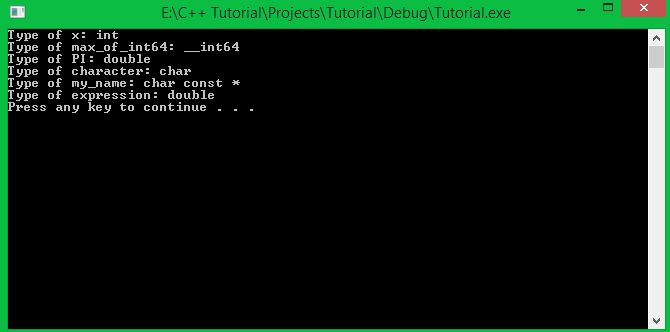

Hi everyone! Rất vui khi được gặp lại mọi người trong bài học tiếp theo của khóa học lập trình trực tuyến ngôn ngữ C++.

Trong bài học hôm nay, chúng ta làm quen với một số khái niệm mới được cung cấp bởi chuẩn C++11 khi làm việc về kiểu dữ liệu.

Nhưng trước hết, mình muốn giới thiệu với các bạn 1 thư viện trong Visual studio 2015, nó sẽ hổ trợ cho chúng ta xem thông tin về kiểu dữ liệu của một đối tượng ta đang xem xét.

###Thư viện typeinfo

Thư viện này định nghĩa 1 **class** (các bạn sẽ được học về class trong phần lập trình hướng đối tượng với C++) có tên là **type_info**, **class** này giữ thông tin về kiểu dữ liệu của đối tượng đang được xem xét. 

Sử dụng thư viện **typeinfo** chúng ta có thể thực hiện phép so sánh **==** hoặc **!=** giữa hai đối tượng để kiểm tra chúng có cùng hay khác kiểu dữ liệu.

Chúng ta còn có thể lấy ra thông tin về kiểu dữ liệu của đối tượng thông qua toán tử **typeid**. Hoặc sử dụng phương thức **name** định nghĩa bên trong class **type_info** để lấy ra tên của kiểu dữ liệu của đối tượng.

	namespace std	{
		...
		class type_info;
		class bad_cast;
		class bad_typeid;
		...
	}

Vì class **type_info** được định nghĩa trong **namespace std** nên chúng ta cũng nên khai báo **using namespace std** trước khi sử dụng.

Một ví dụ về việc sử dụng thư viện **typeinfo**:

- Sử dụng toán tử **==** và **!=** trong class **type_info**:

		int n;

		// compare the type of n with type int32_t
		if (typeid(int32_t) == typeid(n))
			cout << "n is an object of type int32_t" << endl;
	
		// compare the type of n with type float
		if (typeid(float) != typeid(n))
			cout << "n is not an object of type float" << endl;

Các bạn thử chạy lại đoạn code mẫu trên để tự mình xem kết quả.

- Lấy ra tên kiểu dữ liệu của một đối tượng cụ thể:

		int64_t i_value;
		float	f_value;
	
		cout << "Type of i_value is " << typeid(i_value).name() << endl;
		cout << "Type of f_value is " << typeid(f_value).name() << endl;

Toán tử **typeid** nhận vào một đối tượng (có thể là 1 biến), ví dụ ```typeid(i_value)```, toán tử **typeid** khi sử dụng sẽ trả về một đối tượng kiểu **type_info**. Chúng ta sử dụng dấu chấm để gọi ra phương thức **name** được định nghĩa bên trong kiểu **type_info**, phương thức **name** trả về 1 chuỗi kí tự là tên kiểu dữ liệu của đối tượng chúng ta đưa vào.

	typeid(i_value).name(); //Có thể sử dụng đối tượng cout để in tên của i_value lên màn hình

*Trong bài này, mình chỉ mới sử dụng thư viện **typeinfo** cho các kiểu dữ liệu cơ bản, một số thứ khác mình sẽ đề cập đến trong phần lập trình hướng đối tượng với C++.*

###Từ khóa auto (auto keyword)

Các bạn cùng nhìn lại cách thông thường mà chúng ta khai báo biến.

	<data_type> <name_of_variable> [= <original value>];

Dựa trên cú pháp khai báo biến này, lập trình viên phải xác định trước được kiểu dữ liệu cần sử dụng để lưu trữ giá trị.

Với chuẩn C++11 ra đời, **compiler** có thể thay bạn quyết định kiểu dữ liệu cho giá trị mà bạn muốn sử dụng bằng cách sử dụng từ khóa **auto**.

Cách sử dụng từ khóa **auto**:

	auto <variable_name> = <expression>;

Giá trị khởi tạo là thành phần bắt buộc phải có khi sử dụng từ khóa **auto**, **compiler** sẽ dựa trên giá trị khởi tạo để quyết định kiểu dữ liệu nào phù hợp với biến (có thể là 1 con số, 1 kí tự, 1 chuỗi kí tự, hoặc 1 biểu thức toán học...).

	auto x = 0;
	auto max_of_int64 = INT64_MAX;
	auto PI = 3.14;
	auto character = 'V';
	auto my_name = "Le Tran Dat";

Chúng ta cùng thử dùng thư viện **typeinfo** mà mình đã giới thiệu ở trên để xem từ khóa **auto** đã chọn kiểu dữ liệu gì cho từng biến.

	cout << "Type of x: " << typeid(x).name() << endl;
	cout << "Type of max_of_int64: " << typeid(max_of_int64).name() << endl;
	cout << "Type of PI: " << typeid(PI).name() << endl;
	cout << "Type of character: " << typeid(character).name() << endl;
	cout << "Type of my_name: " << typeid(my_name).name() << endl;

Bên dưới là kết quả chạy chương trình của mình.



**Compiler** đã chọn đúng kiểu dữ liệu cho từng biến, nhưng chưa phải là tối ưu nhất. Ví dụ với giá trị **PI = 3.14**, chúng ta hoàn toàn có thể lưu trữ với kiểu dữ liệu **float (4 bytes)** thay vì kiểu **double (8 bytes)**. Nhưng vì **compiler** muốn đảm bảo an toàn cho dữ liệu, nên nó đã chọn kiểu có kích thước lớn hơn để đề phòng giá trị biến **PI** có thể bị thay đổi.

*Trong bài học này, mình chỉ mới hướng dẫn các bạn sử dụng từ khóa **auto** để làm việc với các kiểu dữ liệu cơ bản. Từ khóa **auto** còn có thể dùng để tự nhận dạng các kiểu dữ liệu mà chúng ta tự định nghĩa, kiểu con trỏ, các iterator trong bộ thư viện STL,... Vì thế, mình sẽ còn nhắc lại từ khóa **auto** trong những bài học sau.*

###Từ khóa **decltype** (decltype keyword)

Cũng tương tự với từ khóa **auto**, từ khóa **decltype** giúp chương trình tự động xác định kiểu dữ liệu cho biến. Nhưng cách sử dụng từ khóa **decltype** có một chút khác biệt so với cách sử dụng từ khóa **auto**.

Để phân biệt:

- Từ khóa **auto** xác định kiểu dữ liệu dựa trên phần khởi tạo của biến.
- Từ khóa **decltype** xác định kiểu dữ liệu từ 1 biến hoặc 1 biểu thức khác.

Vì thế, khi sử dụng từ khóa **decltype**, chúng ta phải sử dụng kèm với 1 đối tượng cụ thể (1 biến, 1 biểu thức hoặc 1 đối tượng của class nào đó...).

Cách sử dụng từ khóa **decltype**:

	decltype(<object or expression>) <variable_name> [= <initial_value>];

Giá trị khởi tạo (phần đặt trong ngoặc vuông) là không bắt buộc vì từ khóa **decltype** đã xác định được kiểu dữ liệu bằng cách lấy kiểu dữ liệu của đối tượng (object) hoặc biểu thức (expression).

	int32_t i_value;
	decltype(i_value) what_is_this;

	cout << typeid(what_is_this).name() << endl; //int

Trong đoạn chương trình trên, mình khai báo 1 biến có tên là **i_value** với kiểu dữ liệu **int32_t**. Sau đó, mình dùng từ khóa **decltype** để lấy ra kiểu dữ liệu của biến **i_value** và dùng nó cho biến mà mình muốn sử dụng.

Thử so sánh kiểu dữ liệu của 2 biến:

	int32_t i_value;
	decltype(i_value) what_is_this;

	if (typeid(i_value) == typeid(what_is_this))
		cout << "i_value and what_is_this have the same data type" << endl;
	else
		cout << "Are you kidding me?" << endl;

Bởi vì từ khóa **decltype** lấy kiểu dữ liệu của đối tượng trước đó để khai báo cho đối tượng sau, nên hai đối tượng này luôn có cùng kiểu dữ liệu.

###Kết hợp từ khóa auto và từ khóa decltype (C++14 standard)

Khi các bạn sử dụng **Visual studio 2015** thì sẽ được tích hợp luôn chuẩn C++14. Và các bạn có thể thực hiện khai báo như sau:

	decltype(auto) <variable_name> = <initial_value>;

Từ khóa **decltype** sẽ lấy ra kiểu dữ liệu mà từ khóa **auto** đã xác định được qua giá trị khởi tạo. Vì thế, giá trị khởi tạo là thành phần bắt buộc.

	decltype(auto) my_name = "Le Tran Dat";
	cout << "Type of my_name: " << typeid(my_name).name() << endl; //char const [12]

Qua đoạn code mẫu trên, **compiler** đã xác định được kiểu dữ liệu dùng cho biến **my_name** là chuỗi kí tự gồm 12 kí tự.

***Lưu ý: cách dùng này chỉ được hổ trợ trong chuẩn C++14.***

###Tổng kết

Sử dụng từ khóa **auto** và **decltype** giúp chương trình của chúng ta dễ hiểu hơn, nhưng cũng có một số hạn chế khi để **compiler** tự động quyết định kiểu dữ liệu. Ví dụ:

	int i_value = 10;
	float f_value = 2.5f;

	auto a_value = i_value * f_value;
	cout << typeid(a_value).name() << ": " << a_value << endl;

**Compiler** xác định kiểu dữ liệu float cho biến a_value, nhưng giá trị in ra là 25 chứ không phải 25.0 như biến **float** thông thường.

Vì thế, các bạn cần cân nhắc trước khi sử dụng những từ khóa này.

**Hẹn gặp lại các bạn trong bài học tiếp theo trong khóa học lập trình C++ hướng thực hành.**


Mọi ý kiến đóng góp hoặc thắc mắc có thể đặt câu hỏi trực tiếp tại diễn đàn 

[www.daynhauhoc.com](www.daynhauhoc.com "DayNhauHoc")
