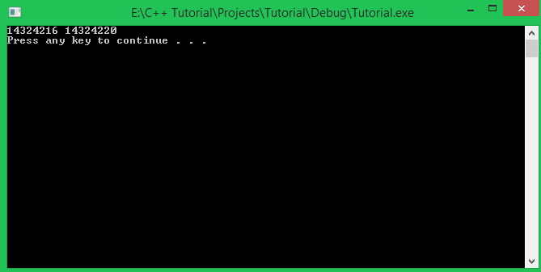

Chào tất cả các bạn học viên đang theo dõi khóa học lập trình trực tuyến ngôn ngữ C++ hướng thực hành.

Trong bài học này, mình sẽ đề cập đến vấn đề cũng khá quan trọng liên quan đến việc truy xuất biến (**variable**).

###Điều gì xảy ra sau khi khai báo biến?

Đối với các kiểu dữ liệu cơ bản mà các bạn đã học trong loạt bài trước đây, và khi các bạn khai báo biến cục bộ (**local variable**), sau khi các bạn khai báo biến, hệ điều hành sẽ tìm đến 1 vùng nhớ trống trên các thiết bị lưu trữ tạm thời (RAM hoặc các vùng nhớ khác), nếu tìm được vùng nhớ có khoảng trống đủ cho kích thước của biến, biến đó sẽ nắm giữ vùng nhớ vừa tìm được.


Giả sử chương trình của chúng ta có khai báo biến ```int32_t var```, và tạm thời mình cho rằng RAM là thiết bị lưu trữ duy nhất mà máy tính của bạn đang có, chương trình sẽ tìm đến vị trí có 4 bytes bộ nhớ trống và giao cho biến **var** quản lý.

*Với việc khai báo biến cục bộ, hoặc sử dụng các kiểu dữ liệu cơ bản mà các bạn đã học, chương trình sẽ cấp phát vùng nhớ cho các biến này trên một vùng nhớ được gọi là **call stack** (chúng ta sẽ có 1 bài học nói về vấn đề này).*

Vậy thì sau khi 1 vùng nhớ đã được giao cho biến quản lý, làm sao compiler biết được chính xác vị trí của biến đó trên vùng nhớ để thực hiện các lệnh truy xuất hoặc thay đổi giá trị trên biến đó?

Compiler sẽ biết được vị trí của biến vì mỗi biến có 1 địa chỉ vùng nhớ trên thiết bị lưu trữ mà biến đó đang nắm giữ.

###Địa chỉ của biến

RAM hay các thiết bị cung cấp bộ nhớ tạm thời khác đều được tạo nên bởi các ô nhớ liên tiếp nhau, mỗi ô nhớ đều có 1 số thứ tự đại diện cho vị trí của ô nhớ đó trong thiết bị lưu trữ. Chúng ta có thể gọi con số đó địa chỉ của ô nhớ.

Những địa chỉ của ô nhớ chỉ là những con số ảo được tạo ra do hệ điều hành, còn về bản chất bên trong việc quản lý bộ nhớ của máy tính thì máy tính của chúng ta có những thiết bị riêng để làm điều đó. 

Các bạn cứ tưởng tượng 1 ô nhớ trong thiết bị lưu trữ là một cái nhà trên con đường, để xác định được vị trí của 1 cái nhà, chúng ta cần biết địa chỉ của nhà cần tìm.


Địa chỉ ô nhớ đầu tiên được đánh số 0, và địa chỉ cuối cùng tương đương với số ô nhớ có trên thiết bị đó.


Giả sử biến **var** được khai báo bằng kiểu dữ liệu **int32_t**, và hệ điều hành tìm được vùng nhớ trống đủ 4 bytes để cung cấp cho biến **var** tại vị trí 125 đến 128, biến var sau khi được cấp phát vùng nhớ sẽ có địa chỉ 125 (là địa chỉ của ô nhớ đầu tiên mà biến nắm giữ).

*Ở hình trên chỉ là minh họa cho việc cấp phát vùng nhớ cho biến có kích thước 4 bytes. Trên thực tế, địa chỉ của ô nhớ được cấp phát cho biến trong chương trình của chúng ta sẽ có giá trị rất lớn do các chương trình đang chạy trong hệ điều hành của chúng ta đã chiếm giữ trước đó.*



Ở trên đây là kết quả của một chương trình mà mình viết. Mình đã tạo ra hai biến kiểu số nguyên **int32_t** có vùng nhớ nằm cạnh nhau, và mình thực hiện in ra địa chỉ của 2 biến đó.

Như các bạn thấy, biến đầu tiên có địa chỉ **14324216** thì biến tiếp theo sẽ có địa chỉ cách biến đầu tiên 4 bytes (là **14324220**). Ở các bài học sau, bạn sẽ biết cách cấp phát những vùng nhớ liên tiếp nhau cho biến.

###Làm thế nào để lấy được địa chỉ của biến trong ngôn ngữ C++?

Ví dụ ta khai báo biến có tên **var** với kiểu dữ liệu bất kì mà bạn đã được học. Để lấy ra địa chỉ của biến **var** này, chúng ta đặt toán tử **&** trước tên của biến.

	int32_t var;
	cout << "Address of var: " << &var << endl;

Toán tử **&** được gọi là toán tử tham chiếu (**reference operator**). Đoạn chương trình trên sẽ tìm đến chính xác địa chỉ mà biến **var** đang nắm giữ và in địa chỉ đó ra màn hình. Các bạn cùng xem kết quả bên dưới:


Thử chạy lại chương trình một lần nữa:


Chúng ta thấy qua 2 lần chạy chương trình thì địa chỉ của biến này có 2 vị trí khác nhau. Đồng nghĩa với việc chọn vị trí vùng nhớ để cấp phát cho biến hoàn toàn được thực thi tự động bởi hệ điều hành.

**Địa chỉ của biến được định dạng theo hệ cơ số 16 chứ không phải hệ thập phân như chúng ta thường thấy.**

###Tham chiếu (Reference)

Một tham chiếu (**reference**) trong ngôn ngữ C++ cũng là một kiểu dữ liệu cơ bản, nó hoạt động như một tên giả của biến nó tham chiếu đến.

- Cách khai báo 1 tham chiếu (**reference**):

	Đặt toán tử & giữa kiểu dữ liệu và tên biến trong khi khai báo biến sẽ tạo thành một tham chiếu.

		int32_t & var_reference; //use to refer to another int32_t variable

	Khi viết đến đây, compiler sẽ báo lỗi tại dòng khai báo tham chiếu, vì 1 tham chiếu cần có giá trị khởi tạo là tên biến mà nó sẽ tham chiếu đến.

	***Một biến tham chiếu chỉ có thể tham chiếu đến một biến khác có cùng kiểu dữ liệu.***

- Thực hiện tham chiếu đến biến khác:

		int32_t 	var = 10;
		int32_t & 	var_reference = var;

- Thử in ra giá trị của 2 biến **var** và **var_reference**:

		cout << "Value of var: " << var << endl;
		cout << "Value of var_reference: " << var_reference << endl;

	Kết quả cho thấy giá trị của biến **var_reference** hoàn toàn giống với biến **var** ban đầu.

	

	Điều gì đã xảy ra? Chúng ta cùng làm thêm 1 bước nữa trước khi đi vào kết luận.

- In ra địa chỉ của 2 biến **var** và **var_reference**:

		cout << "Address of var: " << &var << endl;
		cout << "Address of var_reference: " << &var_reference << endl;

	Và đây là kết quả chương trình:

	

Kết quả cho thấy giá trị của tham chiếu ```var_reference``` và địa chỉ của ```var_reference``` hoàn toàn giống với biến ```var``` ban đầu. Vậy nó có phải là một bản sao của biến ```var```? Hoàn toàn không phải nhé các bạn.

Về mặt ngữ nghĩa của dòng lệnh 

```int32_t & var_reference = var;```

Toán tử **&** không mang ý nghĩa "**địa chỉ của**", mà nó có nghĩa "**tham chiếu đến**".

Khi thực hiện tham chiếu từ biến ```var_reference``` đến biến ```var```, biến ```var_reference``` sẽ kiểm soát vùng nhớ có địa chỉ là địa chỉ của biến ```var```.


Lúc này, biến var và biến var_reference vẫn là 2 tên biến khác nhau, nhưng chúng có cùng địa chỉ.

Điều này có nghĩa khi chúng ta thực hiện thay đổi giá trị cho biến ```var_reference```, giá trị của biến ```var``` cũng thay đổi và ngược lại.

	int32_t var = 10;
	int32_t & var_reference = var;

	cout << "Value of var: " << var << endl;
	cout << "Value of var_reference: " << var_reference << endl;

	var++;				//Increase value of var
	var_reference++;	//Increase value of var_reference

	cout << endl << "========================================" << endl << endl;

	cout << "New value of var: " << var << endl;
	cout << "New value of var_reference: " << var_reference << endl;

*Lưu ý: Các bạn không thể khởi tạo tham chiếu không phải hằng số bằng một biến hằng số.*

Đoạn code sau sẽ báo lỗi:

	const int32_t var = 10;
	int32_t & ref = var;

Vì biến tham chiếu ```ref``` có thể thay đổi giá trị bên trong vùng nhớ, nhưng lúc này, ```var``` là hằng số nên giá trị vùng nhớ không được phép thay đổi. Điều này dẫn đến xung đột nên compiler ngăn chặn chúng ta biên dịch chương trình.

Nhưng chúng ta có thể tham chiếu một biến tham chiếu hằng số đến một hằng số.

	const int32_t var = 10;
	const int32_t & ref = var;

Chúng ta có thể thực hiện nhiều lần tham chiếu đến nhiều biến khác nhau chỉ với một biến tham chiếu.

	int32_t i_value1 = 10;
	int32_t i_value2 = 20;

	int32_t & ref = i_value1;
	cout << "Current value of ref: " << ref << endl; //10

	ref = i_value2;
	cout << "Current value of ref: " << ref << endl; //20

Ngay khi thực hiện tham chiếu đến ```i_value2```, mọi hành vi thay đổi giá trị trên ```ref``` sẽ không còn ảnh hưởng đến ```i_value1```.

***Lưu ý: Biến tham chiếu chỉ có thể tham chiếu một lần duy nhất ngay khi khai báo và khởi tạo. Chúng ta không thể tham chiếu đến biến có địa chỉ khác sau khi đã khởi tạo.***

##
###Tổng kết

Việc hiểu được địa chỉ của biến khá là quan trọng. Sau này khi học đến phần con trỏ trong C++, mình sẽ còn nhắc lại khái niệm này.

**Hẹn gặp lại các bạn trong bài học tiếp theo trong khóa học lập trình C++ hướng thực hành.**


Mọi ý kiến đóng góp hoặc thắc mắc có thể đặt câu hỏi trực tiếp tại diễn đàn 

[www.daynhauhoc.com](www.daynhauhoc.com "DayNhauHoc")