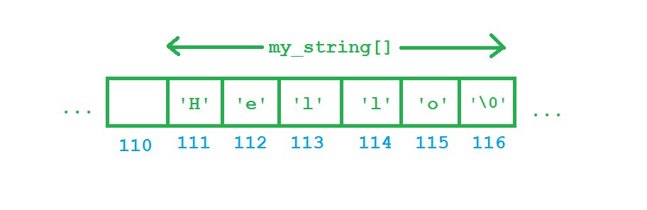

Chào tất cả các bạn đang theo dõi khóa học lập trình trực tuyến ngôn ngữ C++.

Tiếp tục với bài học ngày hôm nay, chúng ta sẽ cùng tìm hiểu về một cách tổ chức dữ liệu cơ bản trong thiết bị lưu trữ tạm thời của máy tính giúp khắc phục một số nhược điểm của việc sử dụng các biến thông thường.

#####Đặt vấn đề

Giảng viên cần tìm ra điểm số cao nhất của bài kiểm tra môn lập trình cơ sở. Giả sử lớp học có 30 sinh viên có số thứ tự 1 đến 30. 

Công việc của những lập trình viên chúng ta là giúp giảng viên này chỉ ra số thứ tự của sinh viên có điểm kiểm tra cao nhất, và điểm cao nhất đó là bao nhiêu bằng cách viết chương trình ngôn ngữ C++ trên máy tính để tiết kiệm thời gian suy nghĩ.

#####Tìm hướng giải quyết

Với yêu cầu như trên, chúng ta cần 30 biến để lưu lại điểm của 30 sinh viên.

	int32_t score_of_student1;
	int32_t score_of_student2;
	//....
	int32_t score_of_student30;

Vậy là chúng ta cần tới 30 dòng lệnh khai báo 30 biến, chưa kể mất thời gian viết thêm 30 dòng lệnh nhập dữ liệu vào là điểm của từng sinh viên, sau đó chúng ta còn phải tìm điểm cao nhất. 

Một vấn đề khác nãy sinh: Sau khi tìm ra điểm số cao nhất từ 30 biến trên, làm thế nào chúng ta biết điểm số đó là của sinh viên có số thứ tự nào trong khi 30 biến này được cấp phát hoàn toàn tách biệt nhau (không theo 1 thứ tự nhất định)?

Rất may mắn cho chúng ta khi ngôn ngữ C/C++ đưa ra cho chúng ta một khái niệm về tổ chức dữ liệu liên tiếp nhau trên thiết bị cung cấp bộ nhớ. Chúng ta có thể gọi là **Mảng một chiều (Array)**.

##
###Mảng một chiều (Array)

Mảng một chiều (**array**) là một dãy các phần tử có cùng kiểu dữ liệu được đặt liên tiếp nhau trong một vùng nhớ, chúng ta có thể ngay lập tức truy xuất đến một phần tử của dãy đó thông qua chỉ số của mỗi phần tử.


Như hình trên, giả sử mình khai báo mảng một chiều có 3 phần tử kiểu **int32_t**, mỗi phần tử sẽ có kích thước **4 bytes**. 

Mình lấy ví dụ hệ điều hành tìm thấy vùng nhớ trống đủ chổ chứa 3 phần tử của mảng tại địa chỉ **108**, thì phần tử đầu tiên a1 sẽ có địa chỉ là địa chỉ ô nhớ đầu tiên mà hệ điều hành cấp phát (là **108**). Khi đó, phần tử thứ 2 sẽ có địa chỉ là địa chỉ của phần tử thứ nhất cộng thêm 4 (4 là kích thước kiểu dữ liệu **int32_t**), tương tự cho phần tử thứ 3.

Với kiểu tổ chức dữ liệu này, chúng ta chỉ cần quan tâm đến 2 điều:

- Địa chỉ ô nhớ đầu tiên trong mảng.
- Số phần tử của mảng.

Từ đó, chúng ta có thể truy xuất đến toàn bộ phần tử trong mảng.

###Khai báo mảng một chiều

Chúng ta có nhiều cách để khai báo mảng một chiều khác nhau:

- Khai báo nhưng không khởi tạo các phần tử:

```<data_type> <name_of_array>[<number_of_elements>];```

Với cách khai báo này, chúng ta cần ghi rõ cho **compiler** biết số lượng phần tử mà bạn cần sử dụng đặt trong cặp dấu ngoặc vuông. Ví dụ:

	int32_t age_of_students[30];

Mình vừa tạo ra một mảng dữ liệu kiểu **int32_t** để lưu trữ số tuổi của 30 sinh viên trong 1 lớp học.

Vì mình chưa khởi tạo giá trị cụ thể cho 30 phần tử trong mảng, nên khi truy xuất đến giá trị của từng phần tử, chúng ta có thể nhận được giá trị khởi tạo mặc định của kiểu int32_t là 0 hoặc giá trị rác (tùy vào **compiler**).

- Khai báo và khởi tạo giá trị cho mỗi phần tử:

```<data_type> <name_of_array>[] = { <value1>, <value2>, ... <valueN> };```

Với cách khai báo này, chúng ta không cần thiết xác định trước số phần tử của mảng. Compiler sẽ xác định số phần tử thông qua số lượng giá trị mà bạn khởi tạo.

	char my_string[] = { 'H', 'e', 'l', 'l', 'o', '\n' };

Mình vừa khai báo một mảng phần tử với kiểu kí tự (Chúng ta sẽ đi sâu hơn về chuỗi kí tự trong những bài học sau), **compiler** nhìn vào số lượng kí tự mình khởi tạo và cấp phát 6 ô nhớ liên tục nhau trên vùng nhớ còn trống.



*Với kiểu kí tự, mỗi phần tử chỉ chiếm 1 byte, nên chúng ta có 6 bytes liên tiếp nhau để chứa được chuỗi kí tự trên.*

###Truy xuất đến các phần tử trong mảng một chiều

Sau khi biết cách khai báo mảng một chiều (**array**), điều tiếp theo chúng ta cần quan tâm là làm thế nào để truy xuất đến một phần tử trong mảng.

>Mỗi phần tử trong mảng sẽ đi kèm với một chỉ số cho biết vị trí của phần tử có khoảng cách bao nhiêu so với phần tử đầu tiên của mảng. Phần tử đầu tiên của mảng mang chỉ số **0**, phần tử cuối cùng của mảng có **N** phần tử sẽ có chỉ số **(N - 1)**.

Cú pháp truy xuất phần tử trong mảng một chiều:

```<name_of_array>[index];```

Trong đó, **index** là một số nguyên đại diện cho chỉ số của phần tử trong mảng một chiều.

Ví dụ với một mảng một chiều kiểu int32_t có 5 phần tử được khai báo như sau:

	int32_t values[] = { 2, 4, 6, 8, 10 };

Khi đó, các phần tử trong mảng lần lượt là:

	values[0]; //2
	values[1]; //4
	values[2]; //6
	values[3]; //8
	values[4]; //10

#####Giải thích cho việc tại sao chỉ số của mảng một chiều trong C/C++ bắt đầu từ 0:

>Mỗi phần tử trong mảng sẽ đi kèm với một chỉ số cho biết vị trí của phần tử có khoảng cách bao nhiêu so với phần tử đầu tiên của mảng.

Sau khi khai báo mảng một chiều, địa chỉ của mảng ứng với địa chỉ của phần tử đầu tiên trong mảng. Vị trí của các phần tử sẽ được tính dựa trên công thức:

```index = (address_of_current_element - address_of_the_first_element) / sizeof(data_type);```

Lấy lại ví dụ mảng có 3 phần tử kiểu int32_t như trong mục **Mảng một chiều (Array)**


Cho rằng địa chỉ của mảng **a** (cũng là địa chỉ của phần tử a1) là **108**. Vậy chỉ số của phần tử đầu tiên a1 là:

```index_of_a1 = (address_of_a1 - address_of_the_first_element) / sizeof(int32_t);```

```index_of_a1 = (108 - 108) / 4 = 0;```

Như vậy, phần tử đầu tiên của mảng có chỉ số là **0**.

Đây chỉ là phần mình làm rõ cho các bạn tại sao chỉ số của mảng một chiều trong C/C++ bắt đầu từ 0 và kết thúc tại ```(số_phần_tử - 1)```. Các bạn không cần quan tâm đến việc tính toán chỉ số của mỗi phần tử mà **compiler** sẽ làm giúp bạn.

#####In ra giá trị của tất cả phần tử trong mảng

Để quản lý mảng một chiều, chúng ta cần biết:

- Địa chỉ phần tử đầu tiên của mảng. (Có thể có được thông qua ```<array_name>[0]```)
- Số lượng phần tử của mảng.

Mình sẽ thực hiện một phương pháp tổng quát để lấy ra số lượng phần tử của mảng:

```<number_of_elements> = sizeof(<name_of_array>) / sizeof(<type_of_array>);```

Chúng ta sử dụng toán tử **sizeof**, truyền vào tên của mảng chúng ta sẽ nhận được giá trị là tổng kích thước bộ nhớ sử dụng cho mảng, chia cho kích thước của một phần tử của mảng chúng ta sẽ có được số lượng phần tử. Ví dụ:

	double d_values[] = { 2.08, 1.32, 6, 4.1, 12, 999.99 };
	int32_t num_of_elements = sizeof(d_values) / sizeof(double);
	
	//another way
	num_of_elements = sizeof(d_values) / sizeof(d_values[0]);

	cout << "Number of elements = " << num_of_elements << endl;

Kết quả chương trình sẽ cho ta thấy mảng có 6 phần tử:


Như cách thông thường, chúng ta thường định nghĩa trước số lượng phần tử tối đa mà mảng một chiều có thể chứa như sau:

	#define ARRAY_SIZE 100

	//........

	float f_values[ARRAY_SIZE];

Lúc này, chúng ta chỉ cần sử dụng ```ARRAY_SIZE``` như là số lượng phần tử của mảng. Nhưng cách này có thể là hao tốn bộ nhớ khi số lượng phần tử thực sự cần sử dụng không đạt đến con số ```ARRAY_SIZE```. Vì thế, mình thường tính số phần tử của mảng theo cách tổng quát mà mình trình bày ở trên.

#####Điều gì xảy ra nếu chúng ta truy xuất mảng bằng chỉ số lớn hơn số lượng phần tử?

Các bạn thử chạy đoạn chương trình sau:

	int32_t arr[] = { 1, 2, 3, 4, 5 }; //create an array with 5 elements
	cout << arr[100] << endl;

Ở lần chạy đầu tiên của đoạn chương trình trên, máy mình cho ra kết quả:


Thử chạy lại chương trình nhiều lần khác nhau, các bạn sẽ thấy được nhiều giá trị khác nhau. Những giá trị này ở đâu ra?

Đó chính là những giá trị thuộc vùng nhớ mà chương trình khác đang quản lý.


Có thể sau khi các chương trình khác sử dụng vùng nhớ đó và trả lại cho hệ điều hành quản lý, giá trị của ô nhớ vẫn còn giữ nguyên, nên khi truy cập mảng với chỉ số vượt quá số lượng phần tử tối đa, chúng ta nhận được những giá trị không có ý nghĩa.

Trường hợp xấu hơn có thể xảy ra là khi các chương trình khác đang sử dụng vùng nhớ mà bạn truy cập đến, Visual studio sẽ đưa ra cảnh báo về việc xung đột vùng nhớ và cho dừng chương trình của bạn.


Vì thế việc quản lý số lượng phần tử của mảng là rất quan trọng.

###Nhập dữ liệu cho mảng một chiều (Array input)

Giả sử chúng ta có mảng một chiều dùng để chứa 10 số nguyên (có chỉ số từ 0 đến 9). Để nhập dữ liệu cho từng phần tử trong mảng này, chúng ta có thể sử dụng đối tượng **cin** trong thư viện **iostream** mà các bạn đã được học.

```cin >> <name_of_array>[index];```

Trong đó, **index** là chỉ số của phần tử của mảng mà chúng ta cần nhập giá trị từ bàn phím và đưa vào phần tử.

	int32_t arr[10];
	for(int32_t index = 0; index <= 9; index++)	{
		cin >> arr[index];
	}

Mình vừa sử dụng vòng lặp **for** (vì mình biết được số lượng phần tử của mảng nên mình biết cần lặp bao nhiêu lần), trong vòng lặp **for** này, mình sử dụng biến **index** và cho nó di chuyển từ giá trị **0 đến 9** tương ứng với từng chỉ số của các phần tử trong mảng. Với mỗi giá trị **index** được gán, mình thực hiện nhập dữ liệu từ bàn phím bằng đối tượng **cin** cho phần tử **arr[index]**.

#####Một cách tổng quát hơn để nhập dữ liệu cho mảng một chiều

Ở ví dụ trên, mình cho mảng số nguyên có số lượng phần tử cố định là 10. Đối với mảng một chiều có số lượng phần tử khác nhau thì ta làm thế nào?

Việc đầu tiên chúng ta cần làm là tìm ra số lượng phần tử của mảng. Ví dụ:

	int32_t i_values[100];
	int32_t num_of_elements = sizeof(i_values) / sizeof(int32_t);

	for(int32_t index = 0; index <= (num_of_elements - 1); index++)	{
		cin >> i_values[index];	
	}

Với cách này, chúng ta có thể không cần quan tâm đến số lượng phần tử hiện tại của mảng, mà mình để **compiler** tính giúp mình.

Mình cho biến index chạy từ 0 đến (num_of_elements - 1) vì như mình đã nói ở trên, mảng một chiều có chỉ số bắt đầu từ 0 đến ```số_lượng_phần_tử``` trừ đi 1.

#####Đưa ra nhắc nhở khi nhập dữ liệu cho mảng

Chúng ta nên thông báo cho người dùng biết là chúng ta đang nhập dữ liệu cho phần tử nào trong mảng.

	int32_t i_values[100];
	int32_t num_of_elements = sizeof(i_values) / sizeof(int32_t);

	for(int32_t index = 0; index <= (num_of_elements - 1); index++)	{
		cout << "Value of element " << index << ": ";
		cin >> i_values[index];	
	}

Như vậy, người dùng sẽ tránh được việc nhập nhầm thứ tự dữ liệu cho các phần tử trong mảng.

Ngoài việc dùng đối tượng cin, chúng ta cũng có thể gán trực tiếp giá trị cho các phần tử trong mảng thông qua toán tử gán.

	int32_t i_values[100];
	int32_t num_of_elements = sizeof(i_values) / sizeof(int32_t);

	for(int32_t index = 0; index <= (num_of_elements - 1); index++)	{
		i_values[index] = index + 1;
	}

#####Nhập dữ liệu cho ô nhớ có chỉ số vượt quá số lượng phần tử

Cũng tương tự như việc bạn truy xuất đến phần tử với chỉ số vượt ngoài tầm số lượng phần tử trong mảng, Visual studio sẽ đưa ra cảnh báo xung đột vùng nhớ và dừng chương trình.

##
###Tổng kết

Cùng nhìn lại vấn đề mình đặt ra ngay từ đầu bài học, mảng một chiều đã giúp chúng ta tiết kiệm thời gian hơn khi mà chỉ với 1 dòng lệnh khai báo mảng một chiều, chúng ta có thể quản lý 30 vùng nhớ liên tiếp nhau dùng để lưu trữ điểm của cả 30 sinh viên. Chúng ta cũng có thể biết được điểm số nào là của sinh viên nào thông qua chỉ số của mảng đó.

Mảng một chiều đã khắc phục nhiều nhược điểm của việc khai báo các biến đơn lẻ. Tuy nhiên, nó cũng có một số nhược điểm riêng như việc dư thừa vùng nhớ khi không dùng hết số lượng ô nhớ đã cấp phát, hoặc số lượng phần tử được yêu cầu quá lớn nên hệ điều hành không đủ khả năng cấp phát. Chúng ta sẽ tìm cách giải quyết những vấn đề này trong những bài học sau.

###Bài tập cơ bản

Với yêu cầu đặt ra ban đầu, giảng viên cần biết điểm số cao nhất của 30 sinh viên trong lớp, đồng thời muốn biết điểm cao nhất là của sinh viên có số thứ tự bao nhiêu. Bạn hãy sử dụng mảng 1 chiều để giải quyết vấn đề này. (Điểm của sinh viên được nhập từ bàn phím)

**Hẹn gặp lại các bạn trong bài học tiếp theo trong khóa học lập trình C++ hướng thực hành.**


Mọi ý kiến đóng góp hoặc thắc mắc có thể đặt câu hỏi trực tiếp tại diễn đàn.

[www.daynhauhoc.com](www.daynhauhoc.com "DayNhauHoc")