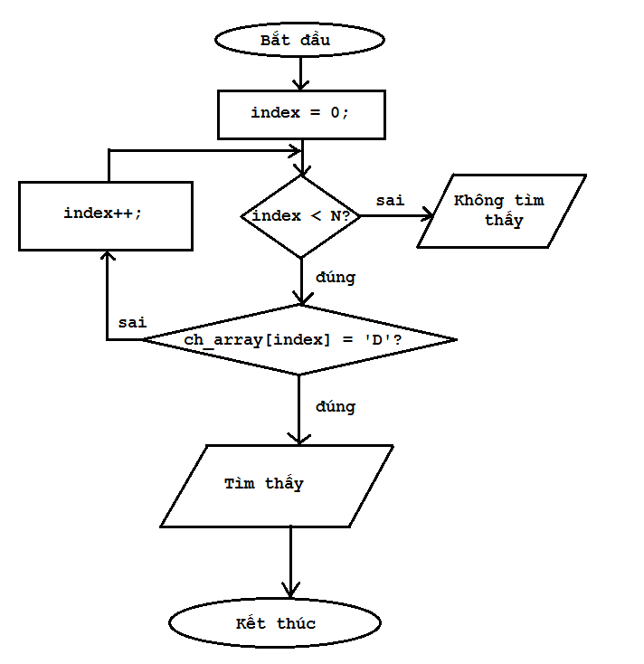
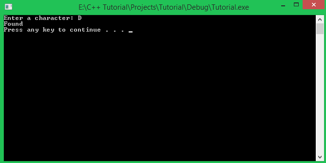
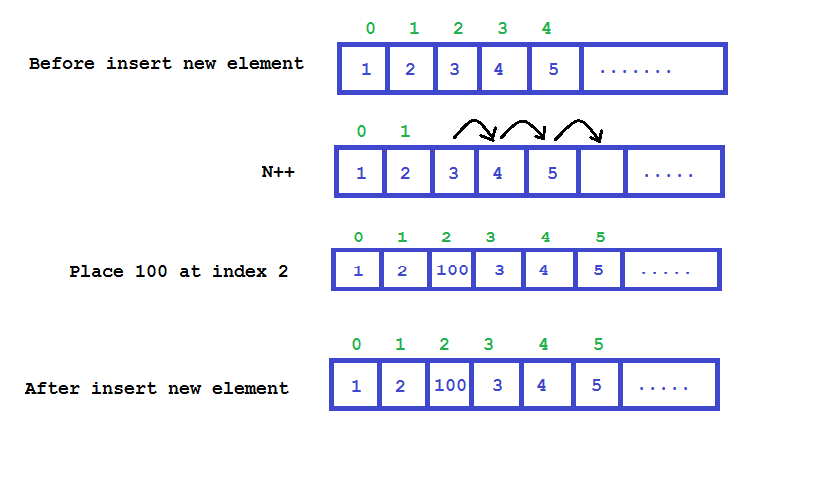
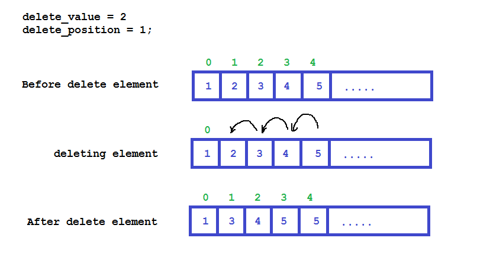
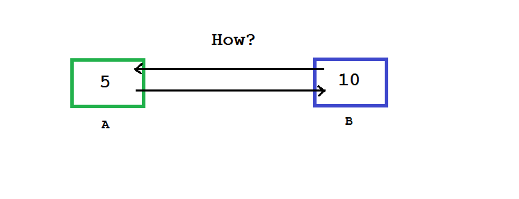
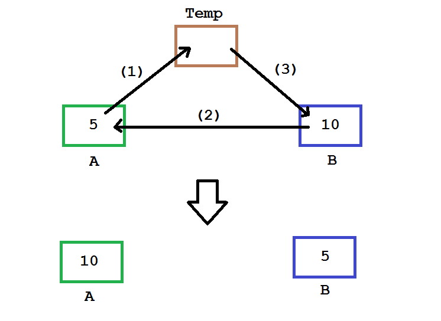
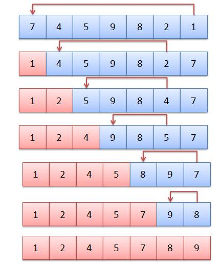
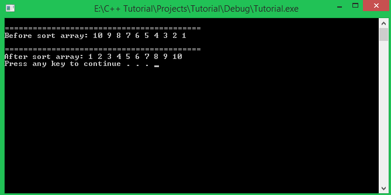

Chào các bạn! Chúng ta tiếp tục đồng hành trong khóa học lập trình trực tuyến ngôn ngữ C++.

Trong bài học này, mình sẽ hướng dẫn các bạn thực hiện một số thao tác cơ bản với mảng một chiều, giúp các bạn hình thành tư duy giải các bài toán có thể giải quyết được bằng mảng một chiều cơ bản.

###Sao chép mảng một chiều

Để tạo ra một bản sao khác của mảng một chiều ban đầu, chúng ta cần khai báo thêm 1 mảng một chiều khác có cùng kích thước với mảng ban đầu. Ví dụ, ta có mảng một chiều cần sao chép như sau:

	#define ARRAY_SIZE 50
	//........

	int32_t arr[ARRAY_SIZE];	
	int32_t arr_clone[ARRAY_SIZE];

Việc thực hiện sao chép giá trị từ mảng ```arr``` ban đầu sang mảng ```arr_clone``` đơn giản chỉ là gán giá trị của phần tử có cùng chỉ số ở mảng ```arr``` cho mảng ```arr_clone```.

	for(int32_t index = 0; index <= (ARRAY_SIZE - 1); index++)	{
		
		arr_clone[index] = arr[index];
	}

###Tìm kiếm một phần tử trong mảng một chiều

Vấn đề này cũng tương đương với việc kiểm tra sự tồn tại của một phần tử (hoặc giá trị) trong mảng một chiều. 

#####Đặt vấn đề

Ví dụ:

	char ch_array[] = { 'L', 'e', 'T', 'r', 'a', 'n', 'D', 'a', 't', '\n' };

Mình có mảng một chiều kiểu dữ liệu **char** đã được khởi tạo bằng các kí tự trong tên của mình như trên, mình muốn xác định xem liệu 1 kí tự mình nhập từ bàn phím có giống với kí tự nào trong tên của mình hay không.

#####Tìm hướng giải quyết

Giả sử kí tự mình nhập vào từ bàn phím là **'D'**, nếu chưa sử dụng đến máy tính mà chỉ dùng mắt thường thì chúng ta sẽ làm gì để nhận biết kí tự **'D'** có tồn tại trong mảng ```ch_array``` hay không?

Mình sẽ lần lượt nhìn vào từng kí tự của mảng ```ch_array```, so sánh từng kí tự mình đang xem xét với kí tự **'D'** mình đã nhập từ bàn phím. Phép so sánh sẽ được mình thực hiện từ kí tự có chỉ số 0 đến kí tự có chỉ số (10 - 1) trong mảng. Với mỗi lần kiểm tra, sẽ xảy ra 2 trường hợp:

- Nếu mình bắt gặp kí tự giống với kí tự **'D'** mà mình đã nhập, mình sẽ không so sánh tiếp nữa, mà kết luận ngay là kí tự **'D'** có ồn tại trong mảng ```ch_array```.

- Nếu kí tự mình đang xem xét khác kí tự **'D'** mà mình vừa nhập, mình chuyển đến kí tự tiếp theo và thực hiện so sánh tương tự.

Nếu đã so sánh hết phần tử trong mảng mà không tìm được kí tự nào trùng khớp với kí tự **'D'** mình đã nhập, lúc này mình có thể kết luận không có phần tử **'D'** nào trong mảng ```ch_array```.

#####Định hình giải pháp dưới dạng sơ đồ khối

Chúng ta hoàn toàn có thể thực hiện giải pháp này trên máy tính, nhưng mình chưa bắt tay vào viết code ngay, mà mình sẽ vẻ ra sơ đồ khối để các bạn hình dung trước.



#####Viết code cho từng bước

Đầu tiên, chúng ta cần khai báo mảng một chiều kiểu char như yêu cầu, sau đó ta tính luôn số lượng phần tử có trong mảng:

	char ch_array[] = { 'L', 'e', 'T', 'r', 'a', 'n', 'D', 'a', 't', '\n' };
	int32_t N = sizeof(ch_array) / sizeof(char); //calculate the number of elements

Chúng ta phải nhập 1 kí tự từ bàn phím và dùng kí tự đó để so sánh, chúng ta cần 1 biến kiểu char để lưu trữ kí tự nhập vào:

	char ch;
	cout << "Enter a character: ";
	cin >> ch;

Để so sánh biến **ch** với từng phần tử trong mảng ```ch_array```, chúng ta sẽ dùng vòng lặp for để truy xuất đến tất cả các phần tử từ chỉ số 0 đến chỉ số (N - 1):

	for (int32_t index = 0; index <= (N - 1); index++) {

	}

Trong vòng lặp **for** này, chúng ta sẽ thực hiện so sánh biến **ch** với phần từ ```ch_array[index]``` để kiểm tra xem chúng có giống nhau hay không. Chúng ta sẽ dùng 1 biến kiểu **bool** khai báo ở trên vòng lặp **for** để lưu kết quả.

	bool check = false;
	for (int32_t index = 0; index <= (N - 1); index++) {

	}

Biến **check** ban đầu có giá trị **false**, nghĩa là hiện tại không tìm thấy phần tử nào giống với biến **ch** đã nhập vào. Nếu bắt gặp phần tử có kí tự giống với kí tự mà biến **ch** lưu trữ, biến check sẽ chuyển sang giá trị **true**.

	bool check = false;
	for (int32_t index = 0; index <= (N - 1); index++) {
		
		if(ch_array[index] == ch)	{
			check = true;
		}
	}

Cuối cùng, chúng ta dựa vào giá trị của biến check để chúng ta kết luận:

	if(check == true)
		cout << "Found" << endl;
	else
		cout << "Not found" << endl;

Thử chạy chương trình và nhập vào kí tự **'D'** và xem kết quả:



Các bạn thử chạy lại chương trình và nhập những kí tự khác để kiểm tra lại.

Dưới đây là mã nguồn đầy đủ của mình:

	#include <iostream>
	#include <cstdint>
	using namespace std;
	
	int main()
	{
		char ch_array[] = { 'L', 'e', 'T', 'r', 'a', 'n', 'D', 'a', 't', '\n' };
		int32_t N = sizeof(ch_array) / sizeof(char); //calculate the number of elements
	
		char ch;
		cout << "Enter a character: ";
		cin >> ch;
	
		bool check = false;
		for (int32_t index = 0; index <= (N - 1); index++) {
			
			if (ch_array[index] == ch) {
				check = true;
				break; //break the loop immediately when ch is found.
			}
		}
	
		if (check == true)
			cout << "Found" << endl;
		else
			cout << "Not found" << endl;
	
		system("pause");
		return 0;
	}

Tại câu lệnh điều kiện **if** trong vòng lặp **for**, mình thực hiện lệnh **break** để thoát ra khỏi vòng lặp khi tìm thấy kí tự giống với biến **ch**. Làm như thế có thể tiết kiệm thời gian tính toán của máy tính.

###Chèn một phần tử mới vào vị trí bất kì trong mảng một chiều

#####Đặt vấn đề

Chúng ta có một mảng được khai báo với số phần tử tối đa được định nghĩa trước. Ví dụ:

	#define MAX_SIZE = 100;
	//.........
	int32_t arr[MAX_SIZE];

Và N là số phần tử đang được sử dụng trong mảng ```(0 < N < MAX_SIZE)```. Ví dụ:

	int32_t N = 5;

Có người yêu cầu bạn thực hiện công việc chèn 1 giá trị số nguyên ```insert_value``` nào đó vào vị trí ```insert_position``` (với ```insert_value``` và ```insert_position``` là 2 giá trị được nhập từ bàn phím).

#####Tìm giải pháp

Chúng ta cùng thử tự đặt ra một số câu hỏi liên quan đến vấn đề trên và tự tìm ra câu trả lời để đưa ra giải pháp.

***Điều gì xảy ra nếu 1 phần tử mới được chèn vào mảng?***

Điều đầu tiên dễ nhận thấy nhất là số lượng phần tử **N** hiện có trong mảng sẽ tăng lên 1. Vì thế, chúng ta cần tăng giá trị của biến **N** lên 1 để có thêm chổ trống chứa phần tử mới được thêm vào.

	N++;

Có một yêu cầu nhỏ khác là vị trí chèn phần tử ```insert_position``` sẽ phải nằm trong khoảng từ **0** đến **(N - 1)**, lúc đó, phần tử mới được chèn vào mới có chỉ số hợp lệ.

Ví dụ mảng ban đầu có 5 phần tử như sau:

	arr[0] = 1;
	arr[1] = 2;
	arr[2] = 3;
	arr[3] = 4;
	arr[4] = 5;

***Nếu phần tử cần chèn có giá trị 100 và vị trí chèn là phần tử có chỉ số 2. Mảng kết quả sau khi chèn sẽ là gì?***



Phần tử đầu tiên của mảng gắn liền với địa chỉ ô nhớ đầu tiên mà hệ điều hành cấp phát cho mảng, vì thế, các phần tử có chỉ số nhỏ hơn vị trí cần chèn không thể thay đổi vị trí. Cách duy nhất là đẩy tất cả các phần tử có chỉ số từ vị trí cần chèn lui sau 1 ô nhớ, và chúng ta sẽ đặt phần tử mới vào ví trí cần chèn.

Full source code:

	#include <iostream>
	#include <cstdint>
	#include <typeinfo>
	using namespace std;
	
	#define MAX_SIZE 100
	
	int main()
	{
		//initialize array
		int32_t arr[MAX_SIZE];
		int32_t N = 5;
	
		for (int32_t index = 0; index <= N - 1; index++) {
			arr[index] = index + 1;
		}
	
		//input insert_value and insert_position from keyboard
		int32_t insert_value, insert_position;
		cout << "Enter insert_value: "; cin >> insert_value;
		cout << "Enter insert_position: "; cin >> insert_position;
	
		//inserting
		N++;
		for (int32_t i = N - 2; i >= insert_position; i--) {
	
			int32_t after_i = i + 1;
			arr[after_i] = arr[i];
		}
		arr[insert_position] = insert_value;
	
		//output array
		for (int32_t index = 0; index <= N - 1; index++)
			cout << arr[index] << " ";
		cout << endl;
	
		system("pause");
		return 0;
	}

Các bạn thử giải thích trong đoạn code thực hiện đẩy các phần tử đứng sau vị trí ```insert_position``` này lui sau một vị trí, tại sao mình cho chỉ số bắt đầu từ **(N - 2)** nhé.

	// why (N - 2)?
	for (int32_t i = N - 2; i >= insert_position; i--) {

		int32_t after_i = i + 1;
		arr[after_i] = arr[i];
	}

###Xóa một phần tử có giá trị nào đó trong mảng một chiều

Việc thực hiện xóa 1 phần tử có giá trị ```delete_value``` nào đó đơn giản hơn việc chèn 1 phần tử mới vào mảng. Chúng ta chỉ cần làm ngược lại công đoạn chèn phần tử. 

Giả sử chúng ta có mảng một chiều được khai báo và khởi tạo như sau:

	//initialize array
	int32_t arr[MAX_SIZE]; //MAX_SIZE = 100
	int32_t N = 5;

	for (int32_t index = 0; index <= N - 1; index++) {
		arr[index] = index + 1;
	}

Chúng ta phải tìm vị trí cần xóa trước đã. Phương pháp tìm kiếm phần tử trong mảng một chiều đã được mình trình bày ở phần trên, nhưng trong trường hợp tìm kiếm này, chúng ta có một chút thay đổi. Kết quả nhận được sau khi tìm kiếm không còn là giá trị **đúng/sai** nữa, mà là chỉ số của phần tử cần được xóa (nếu tìm thấy).

	//input delete_value
	int32_t delete_value;
	cout << "Enter delete_value: "; cin >> delete_value;

	//finding the delete_position
	int32_t delete_position = -1;
	for (int32_t index = 0; index <= N - 1; index++) {

		if (delete_value == arr[index]) {
			delete_position = index;
			break;
		}
	}

	//Check if program found the delete_value in arr
	if (delete_position != -1) {

		//remove the element at index delete_position from arr
	}

Sau khi tìm kiếm phần tử ```delete_value``` trong mảng ```arr```, nếu biến ```delete_position``` bị thay đổi thì chúng ta hiểu rằng phần tử ```delete_value``` được tìm thấy. Việc còn lại chúng ta chỉ cần lấp những phần tử đứng sau vị trí ```delete_position``` lên trước 1 chỉ số thì phần tử tại vị trí ```delete_position``` sẽ bị ghi đè lên.



Cuối cùng, chúng ta giảm số lượng phần tử **N** hiện có  trong mảng đi 1.

	//Check if program found the delete_value in arr
	if (delete_position != -1) {

		for (int32_t i = delete_position + 1; i <= N - 1; i++) {

			int32_t before_i = i - 1;
			arr[before_i] = arr[i];
		}
		N--;
	}

	//output array
	for (int32_t index = 0; index <= N - 1; index++)
		cout << arr[index] << " ";
	cout << endl;

###Sắp xếp mảng một chiều

Ngày nay, chúng ta có rất nhiều cách sắp xếp các phần tử trong mảng một chiều theo thứ tự ***tăng/giảm*** dần. Trong bài học này, mình giới thiệu đến các bạn phương pháp **Selection sort** để sắp xếp mảng một chiều theo thứ tự tăng dần.

**Selection sort** có cách cài đặt và vận hành khá giống với việc sắp xếp mà con người chúng ta thường làm. Giả sử mình khởi tạo 1 mảng có 10 phần tử với các giá trị được khởi tạo có độ lớn giảm dần:

	//initialize array
	int32_t arr[MAX_SIZE];
	int32_t N = 10;

	for (int32_t i = 0; i <= N - 1; i++) {
		arr[i] = N - i;
	}
	//10 9 8 7 6 5 4 3 2 1

Công việc của chúng ta là sử dụng thuật toán **Selection sort** để hoán vị các phần tử trong mảng theo cách nào đó để kết quả ta thu được là mảng ```arr``` có giá trị tăng dần: 1 2 3 4 5 6 7 8 9 10.

#####Làm thế nào để hoán vị giá trị của hai biến có cùng kiểu dữ liệu?



Hoán vị giá trị của hai biến là trao đổi giá trị của hai biến đó. Ví dụ:

	//Before swap value
	int32_t a = 5;
	int32_t b = 10;

	//After swap value
	a = 10;
	b= 5;

Có nhiều cách để hoán vị giá trị hai biến, mình sẽ đưa ra một cách sử dụng phổ biến nhất, đó là dùng thêm 1 biến để tạm lưu trữ giá trị của một trong hai biến cần hoán vị.



Bằng cách sử dụng thêm một biến ```Temp``` để lưu trữ một trong hai giá trị của biến (A hoặc B), chúng ta có thể dễ dàng thực hiện hoán vị qua 3 bước.

	int32_t temp = a;
	a = b;
	b = temp; //b = old_value_of_a

***Chúng ta sẽ thực hiện hoán vị các phần tử trong mảng một chiều để đưa mảng một chiều về dạng tăng dần trong bài học này.***

#####Thuật toán selection sort

Tư tưởng của thuật toán này là chia mảng thành hai phần, phần đã được sắp xếp có chỉ số thấp, phần chưa được sắp xếp là những phần tử có chỉ số đứng sau chỉ số của phần tử cuối cùng đã được sắp xếp.

Khi chúng ta cần sắp xếp mảng một chiều theo thứ tự tăng dần, chúng ta sẽ tìm trong phần mảng chưa được sắp xếp ra một phần tử nhỏ nhất, và hoán vị với phần tử đứng sau chỉ số cuối cùng của phần đã được sắp xếp.



Dưới đây là phần code cho việc sắp xếp mảng một chiều bằng thuật toán **selection sort**:

	//sorting
	for (int32_t after_sorted_part = 0; after_sorted_part <= N - 1; after_sorted_part++) {

		int32_t min_index = after_sorted_part;
		for (int32_t find_min_index = after_sorted_part; find_min_index <= N - 1; find_min_index++) {

			if (arr[find_min_index] < arr[min_index]) {
				min_index = find_min_index;
			}
		}

		//swap value of arr[min_index] and arr[after_sorted_part]
		int32_t temp = arr[min_index];
		arr[min_index] = arr[after_sorted_part];
		arr[after_sorted_part] = temp;
	}



##
###Tổng kết

Qua bài học này, hi vọng các bạn đã có thể tự mình hình thành tư duy các bài toán liên quan đến mảng một chiều với các thao tác xử lý mảng một chiều mà mình vừa đưa ra.

###Bài tập cơ bản

1/ Cho mảng một chiều như sau:

	int32_t arr[] = { 2, 6, 5, 7, 9, 1, 3 };

Viết chương trình đảo ngược mảng trên. Mảng kết quả sau khi thực hiện đảo ngược là.

```3 1 9 7 5 6 2```

2/ Viết chương trình nhập vào một dãy các số nguyên từ bàn phím và lưu vào mảng một chiều, so sánh tổng các phần tử chẵn với tổng các phần tử lẻ và đưa ra màn hình kết quả.

3/ Viết chương trình in ra tất cả các phần tử của mảng nhưng bỏ qua các giá trị bị trùng lặp. Ví dụ với mảng một chiều như sau:

```4 6 2 2 1 6 9```

Kết quả in ra màn hình sẽ là:

```4 6 2 1 9```

**Hẹn gặp lại các bạn trong bài học tiếp theo trong khóa học lập trình C++ hướng thực hành.**

Mọi ý kiến đóng góp hoặc thắc mắc có thể đặt câu hỏi trực tiếp tại diễn đàn.

[www.daynhauhoc.com](www.daynhauhoc.com "DayNhauHoc")