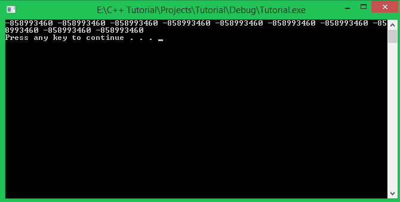
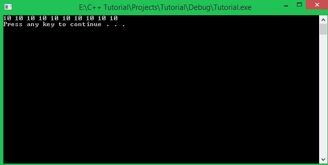
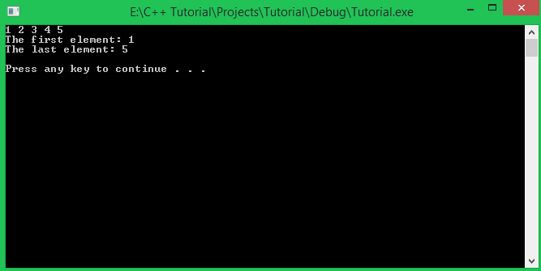
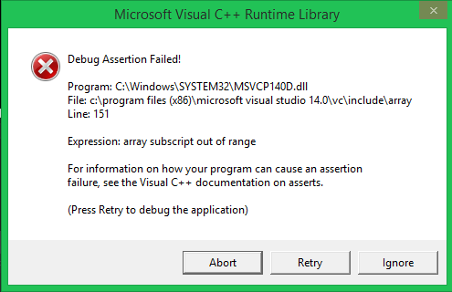
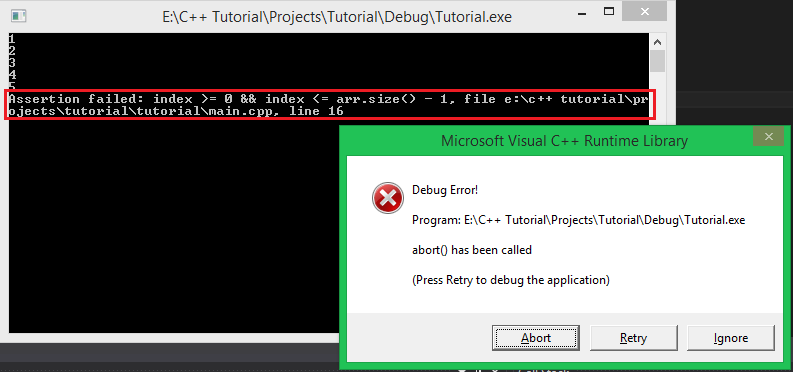

Chào các bạn! Rất vui khi nhận được sự theo dõi của các bạn trong khóa học lập trình trực tuyến ngôn ngữ C++ này.

Đến với bài học ngày hôm nay, chúng ta sẽ tiếp tục làm việc với kiểu dữ liệu mảng một chiều, nhưng chúng ta sẽ sử dụng thư viện **array** trong **namespace std**. 

Đây là một thư viện giúp chúng ta sử dụng mảng một chiều một cách hiệu quả, rõ ràng hơn, ngoài ra nó còn giúp chúng ta hạn chế được lỗi thường gặp như truy cập đến chỉ số vượt ngoài giới hạn số phần tử đang sử dụng.

###Thư viện array

Để sử dụng thư viện **array**, các bạn chỉ cần include thư viện này như sau:

	#include <array>
	using namespace std;

Chúng ta cũng cần có thêm dòng khai báo **namespace std** vì thư viện **array** được định nghĩa bên trong nó.

Thư viện **array** cung cấp cho chúng ta kiểu dữ liệu **array**, biến được tạo ra bởi kiểu dữ liệu này chỉ là một biến đơn, nhưng vùng nhớ mà nó quản lý sẽ tương đương với số lượng phần tử tối đa mà chúng ta khai báo từ trước (gần giống như mảng một chiều). 

Đối tượng được tạo ra bởi lớp **array** chỉ cung cấp cho chúng ta một vùng nhớ để lưu trữ một số lượng phần tử xác định trước, nhưng thông qua một số phương thức được định nghĩa bên trong lớp **array** này, chúng ta còn có thể truy xuất một số thông tin liên quan như số lượng phần tử, kiểm tra mảng có rỗng hay không, ...

#####Khai báo biến với kiểu dữ liệu array

Một đối tượng có kiểu array khi được khai báo cần xác định được 2 điều:

- Kiểu dữ liệu của các phần tử mà biến array sẽ chứa.
- Số lượng phần tử tối đa của mảng.

Cú pháp khai báo biến kiểu **array**:

```array< <data_type>, <number_of_elements> > <array_name>;```

Ví dụ chúng ta cần sử dụng một mảng kiểu **int32_t** có 10 phần tử, chúng ta khai báo như sau:

	array<int32_t, 10> arr;

#####Khởi tạo giá trị

Khi chưa khởi tạo giá trị cho biến kiểu **array**, chúng ta sẽ nhận được những giá trị không có ý nghĩa khi in chúng ra màn hình. Ví dụ với mảng **arr** trên:



Chúng ta có thể khởi tạo giá trị cho toàn bộ phần tử trong mảng chỉ với 1 dòng lệnh:

```<array_name>.assign(<value>);```

Giả sử mình muốn gán giá trị 10 cho toàn bộ phần tử trong mảng **arr**, mình viết như sau:

	arr.assign(10);

Kết quả của việc in mảng arr ra màn hình sau khi khởi tạo:



#####Truy xuất đến các thành phần trong biến có kiểu array

Chúng ta có thể truy cập đến một phần tử của đối tượng của lớp **array** bằng toán tử [ ] như lúc các bạn sử dụng mảng một chiều. Ví dụ:

	arr[1];

Hoặc các bạn có thể sử dụng phương thức **at(```<index>```)** được định nghĩa trong lớp **array** như sau:

	arr.at(1);

Sử dụng **arr[1]** và **arr.at(1)** đều trả về kết quả là giá trị của phần tử thứ 2 trong mảng.

#####Truy xuất một số thông tin bên trong đối tượng của lớp array

Chúng ta có thể truy xuất một vài thông tin liên quan đến mảng một chiều bằng một số phương thức bên trong đối tượng của lớp **array**.

- Xem số lượng phần tử mà đối tượng của lớp **array** có thể chứa:

		cout << "Number of elements: " << arr.size() << endl;

	Phương thức size() trả về số lượng phần tử mà bạn đã khai báo lúc tạo ra đối tượng của class **array**.

- Kiểm tra xem mảng một chiều được chứa bên trong đối tượng của lớp **array** có rỗng hay không:

	Mảng một chiều rỗng nghĩa là số lượng phần tử bằng 0.
		
		if(arr.empty())
			cout << "Array is empty." << endl;
		else
			cout << "Number of elements: " << arr.size() << endl;

	Phương thức **empty()** trả về giá trị **true** nếu mảng bên trong đối tượng **arr** có số lượng phần tử là 0.

- Truy xuất đến phần tử đầu tiên và phần tử cuối cùng của mảng bên trong đối tượng của lớp **array**:

		cout << "The first element: " << arr.front() << endl;
		cout << "The last element: " << arr.back() << endl;

	Ví dụ mảng một chiều của mình được khởi tạo giá trị là 1 2 3 4 5. Kết quả in ra màn hình sẽ là:

	
		
	Phương thức **front()** sẽ trả về giá trị của phần tử đầu tiên trong mảng, ngược lại, phương thức **back()** sẽ trả về giá trị của phần tử cuối cùng trong mảng.

#####Nhập dữ liệu cho đối tượng của lớp array

Tương tự lúc các bạn nhập dữ liệu cho mảng một chiều thông thường, chúng ta sử dụng đối tượng **cin** để đưa giá trị được nhập từ bàn phím vào trong mỗi phần tử mà đối tượng của lớp **array** đang nắm giữ.

	for (int i = 0; i < arr.size(); i++) {
		
		cout << "Enter value to element " << i + 1 << ": ";
		cin >> arr[i];
	}

#####Lớp array ngăn chặn hành vi truy cập phần tử có chỉ số không phù hợp

Chúng ta chỉ có thể truy xuất đến các phần tử trong đối tượng của lớp **array** với chỉ số trong phạm vi từ ```0``` đến ```(size() - 1)```. Sau đây là những hành vi truy xuất hợp lệ:

	#define ARRAY_SIZE 10
	array<int32_t, ARRAY_SIZE> arr;
	arr.assign(10);

	//Access to all of elements of arr object
	for (int32_t index = 0; index <= arr.size() - 1; index++) {
		cout << arr[index] << " ";
	}
	cout << endl;

Và dưới đây là một số hành vi truy xuất giá trị của đối tượng arr bằng những chỉ số không hợp lệ:

	//Try to access array with wrong index
	arr[-1];
	arr[arr.size() + 10];

Khi gặp những dòng lệnh này, **compiler** sẽ đưa ra cảnh báo:



Vì bên trong lớp **array** có sử dụng thư viện **cassert** để đặt ra những **Assertion**, những Assertion này kiểm tra về chỉ số mà bạn đưa vào cho toán tử **[ ]** và phương thức **at()** để kiểm tra sự hợp lệ của chỉ số trước khi thực hiện lệnh. Mọi hành vì không phù hợp với điều kiện trong **Assertion** sẽ bị ngăn chặn.

Các bạn cũng có thể tự mình tạo ra những **Assertion** bằng cách sử dụng thư viện **cassert**.

###Thư viện cassert

Thư viện **cassert** cung cấp cho chúng ta macro có tên là ```assert(expression)``` giúp chúng ta tạo ra những **Assertion** trong chương trình.

Khi gặp macro **assert(expression)**, chương trình sẽ kiểm tra biểu thức *expression* (là một biểu thức điều kiện có thể trả về giá trị **true/false**) và có hai trường hợp có thể xảy ra:

- **expression** trả về giá trị **true**:

	Chương trình sẽ tiếp tục thực hiện các dòng lệnh phía sau **Assertion** một cách bình thường. Ví dụ:

		float f_value = 1.0;
		assert(typeid(f_value) == typeid(float));
	
		f_value++;
		cout << f_value << endl;

	Đoạn chương trình trên có 1 **Assertion** thực hiện công việc kiểm tra kiểu dữ liệu của biến **f_value**. Vì biểu thức ```typeid(f_value) == typeid(float)``` trả về giá trị **true**, nên chương trình vẫn được tiếp tục hoạt động.

- **expression** trả về giá trị **false**:

	Chương trình sẽ dừng lại tại thời điểm phát hiện biểu thức bên trong **Assertion** cho giá trị **false**.

		#define ARRAY_SIZE 5
		array<int32_t, ARRAY_SIZE> arr;

		for(int32_t index = 0; index <= arr.size(); index++)	{
			
			assert(index >= 0 && index <= arr.size() - 1);			
			cin >> arr[index];		
		}

	Đoạn chương trình trên thực hiện nhập dữ liệu cho đối tượng **arr** có kiểu **array**. Bên trong vòng lặp **for**, mình đặt 1 **Assertion** nhằm kiểm tra chỉ số của mảng có được cung cấp chính xác hay không. Chỉ số chính xác sẽ nằm trong khoảng từ ```0``` đến ```(arr.size() - 1)```.

	Bây giờ mình sẽ chạy đoạn chương trình trên để xem kết quả:

	

	Ngoài việc chương trình đưa ra cửa sổ thông báo lỗi và bắt các bạn Abort chương trình đang chạy, trên cửa sổ console còn đưa ra thông báo lỗi tại dòng mình đặt **Assertion**.

	Trước khi lỗi xảy ra, mình vẫn nhập dữ liệu bình thường. Vì lúc đó chỉ số index của vòng lặp **for** vẫn thõa mãn biểu thức điều kiện bên trong **Assertion**. Nhưng mà vòng lặp for của mình lại lặp với biến index chạy từ 0 đến **arr.size()**, vì thế, giá trị index tại lần lặp cuối cùng đã vi phạm biểu thức trong **Assertion** mà mình tự đặt ra.

##
###Tổng kết

Trong bài học hôm nay, các bạn đã được tìm hiểu thêm thư viện **array** hổ trợ cho các bạn quản lý mảng một chiều một cách hiệu quả và dễ dàng hơn. Mình cũng đã hướng dẫn cho các bạn cách để tạo ra những **Assertion** cho chương trình của các bạn với thư viện **cassert**. Bất cứ khi nào các bạn cần đảm bảo chương trình của các bạn không vi phạm quy tắc nào đó, các bạn có thể dùng macro **assert(expression)** của thư viện **cassert** để hạn chế những lỗi có thể xảy ra.

**Hẹn gặp lại các bạn trong bài học tiếp theo trong khóa học lập trình C++ hướng thực hành.**

Mọi ý kiến đóng góp hoặc thắc mắc có thể đặt câu hỏi trực tiếp tại diễn đàn.

[www.daynhauhoc.com](www.daynhauhoc.com "DayNhauHoc")