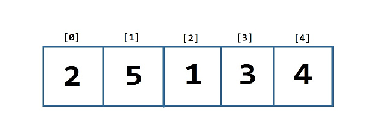
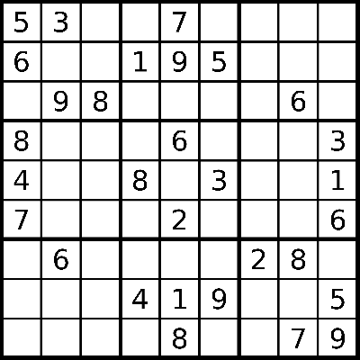
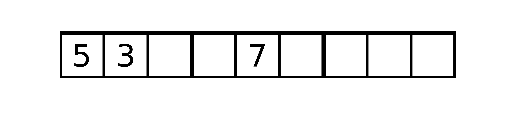
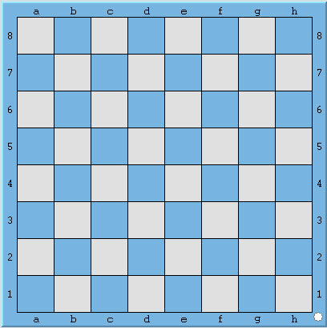
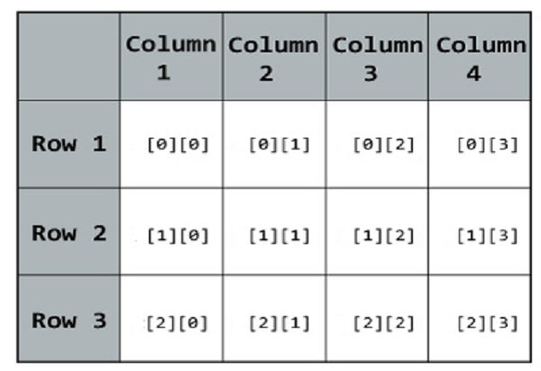

Chào tất cả các bạn đang theo dõi khóa học lập trình trực tuyến ngôn ngữ C++.

Trong các bài học trước, mình đã giới thiệu đến các bạn về mảng một chiều trong ngôn ngữ C/C++.

>Mảng một chiều có thể được hiểu là một dãy các phần tử ***có cùng kiểu dữ liệu*** được đặt liên tiếp nhau trong một vùng nhớ, chúng ta có thể ngay lập tức truy xuất đến một phần tử của dãy đó thông qua chỉ số của mỗi phần tử.

Bây giờ các bạn thử tưởng tượng nếu kiểu dữ liệu của mảng một chiều là mảng một chiều? Hay nói cách khác, chúng ta có một mảng chứa các mảng một chiều? Lúc này, chúng trở thành **mảng 2 chiều**.

------------------------------

###2D Array

Trước hết, mình cho các bạn xem lại hình ảnh minh họa cho **mảng một chiều** trên máy tính:



Đây là **mảng 1 chiều** gồm có 5 phần tử được đánh chỉ số từ 0 đến 4.

Và dưới đây là hình ảnh minh họa cho cách tổ chức dữ liệu **mảng hai chiều**:



Đây là bảng câu đố của game **Sudoku** được tạo thành từ 9x9 ô vuông (9 dòng và 9 cột). Giả sử mình tách dòng đầu tiên của bảng game này ra đứng riêng biệt: 



Nó lại trở thành mảng **1 chiều** có 9 phần tử.

Vậy, **mảng một chiều** khi mô phỏng nó bằng hình ảnh, chúng ta chỉ thấy được 1 hàng ngang có nhiều cột phân chia thành các ô (tượng trưng cho các ô nhớ trong máy tính). Còn khi chúng ta nhìn vào **mảng hai chiều**, chúng ta thấy có nhiều hàng, mỗi hàng lại có nhiều cột, đặc biệt hơn là số lượng cột ở mỗi hàng đều bằng nhau.

Ngôn ngữ C/C++ có hổ trợ cho chúng ta tổ chức dữ liệu theo dạng bảng như trên, hay thường gọi là **mảng hai chiều**. Thế thì khi nào chúng ta cần sử dụng mảng hai chiều trong chương trình máy tính? Trong thực tế, chúng ta gặp rất nhiều thứ được bố trí dưới dạng mảng 2 chiều. Dưới đây là một số ví dụ thực tế:

- Phòng học:

	

	Như hình minh họa, chúng ta có một phòng học có 2 dãy bàn hàng ngang, mỗi dãy bàn ngang có thể đủ chổ cho 3 sinh viên. Như vậy mình gọi đây là mảng hai chiều 2x3 (2 hàng, 3 cột).

- Bàn cờ vua:

	

	Bàn cờ vua là một bảng hình vuông có 8 hàng, mỗi hàng có 8 cột, tổng cộng có 64 ô vuông, mỗi ô có thể đặt 1 quân cờ. Chúng ta có thể gọi đây là một mảng hai chiều 8x8 (8 dòng, 8 cột).

- Trò chơi Tic Tac Toe:

	

	Trò chơi này được chơi trên một bảng 3x3 (3 hàng, 3 cột). Nếu trò chơi này được mô phỏng trên máy tính, chúng ta có thể sử dụng một mảng hai chiều 3x3 để lưu trữ các kí tự **'x'** hoặc **'o'**.

Qua một số hình ảnh minh họa như trên, hi vọng các bạn đã có thể hình dung được mảng hai chiều là như thế nào. Bây giờ mình sẽ đi vào chi tiết về cách khai báo, khởi tạo giá trị và cách sử dụng mảng hai chiều trong ngôn ngữ C++.

#####Khai báo mảng hai chiều

Đối với mảng một chiều, chúng ta chỉ cần khai báo số lượng phần tử (số lượng cột) cho một hàng duy nhất, do đó, khai báo mảng một chiều có dạng:

```<data_type> <name_of_array>[num_of_columns];```

Ví dụ:

	int iArray[100]; //declare an array of integer can hold 100 elements

Bây giờ, khi quản lý mảng hai chiều, chúng ta còn phải quan tâm thêm về số hàng mà mảng hai chiều cần cấp phát:

```<data_type> <name_of_array>[num_of_rows][num_of_columns];```

***Lưu ý, khi khai báo số lượng phần tử của mảng hai chiều, số hàng phải đặt trước số cột.***

Ví dụ:

	int array2D[3][5]; // 5x5 elements (3 rows, 5 columns)

Có thể nói cách khác, mảng có tên **array2D** có kiểu dữ liệu **int**, mảng **array2D** gồm có 3 mảng một chiều, mỗi mảng một chiều trong đó có thể chứa được tối đa 5 phần tử.

#####Khởi tạo mảng hai chiều

Mình lấy lại ví dụ về mảng có tên **array2D** như trên, mình sẽ khởi tạo giá trị cho mảng như sau:

	int array2D[3][5] = 
	{
		{ 1,  2,  3,  4,  5 },  //row 1
		{ 6,  7,  8,  9,  10 }, //row 2
		{ 11, 12, 13, 14, 15 }  //row 3
	};

Do mảng **array2D** có 3 hàng, mỗi hàng lại là một mảng một chiều khác nhau, nên mình đã sử dụng cách khởi tạo của mảng một chiều, áp dụng cho mỗi hàng trong mảng hai chiều **array2D**.

Các bạn có thể khởi tạo mảng hai chiều theo cách sau:

	int array2D[3][5] = 
	{
		1, 2, 3, 4, 5, 6, 7, 8, 9, 10, 11, 12, 13, 14, 15
	};

Nhưng mình vẫn khuyến khích các bạn sử dụng cách mình trình bày ở trước để tránh nhầm lẫn trong việc tổ chức dữ liệu.

Những phần tử chưa được khởi tạo giá trị sẽ được gán bằng giá trị mặc định tùy vào mỗi kiểu dữ liệu khác nhau. Như ví dụ sau mình sử dụng kiểu **int** để khai báo mảng hai chiều:

	int seats[3][5] =
	{
		{ 1, 2 },		//row 1 = 1, 2, 0, 0, 0
		{ 6, 7, 8 },	//row 2 = 6, 7, 8, 0, 0
		{ 11 },			//row 3 = 11, 0, 0, 0, 0
	};

Tương tự mảng một chiều, nếu các bạn khởi tạo mảng hai chiều ngay khi khai báo, compiler có thể tự xác định số hàng cần cấp phát:

	int array2D[][4] = 
	{
		{ 1, 2, 3, 4 },
		{ 5, 6, 7, 8 }
	};

***Các bạn có thể bỏ trống phần khai báo số lượng hàng, nhưng không thể không khai báo số lượng cột.***

#####Truy cập các phần tử trong mảng hai chiều

Lấy ví dụ mình có một mảng hai chiều có 3 hàng và 4 cột tạo thành bảng như sau:

	int board[3][4];



Để xác định tọa độ (ví trị) của một phần tử trong một mảng hai chiều, chúng ta cần xác định hai tham số là chỉ số dòng và chỉ số cột. Chúng ta truy cập vào chỉ số dòng trước và chỉ số cột sau. Ví dụ:

	board[1][2]; //Access element on row 2 and column 3

Thực hiện truy cập mảng board với chỉ số dòng là 1 và chỉ số cột là 2 sẽ trỏ đến ô nhớ tại dòng thứ 2 và cột thứ 3, do chỉ số của mảng sẽ bắt đầu từ 0. Tương tự, để truy cập phần tử của cùng của mảng hai chiều 3x4, chúng ta truy cập với chỉ số (2, 3).

Để truy cập toàn bộ mảng hai chiều, chúng ta có thể sử dụng 2 vòng lặp: vòng lặp ngoài sẽ truy cập lần lượt các dòng, vòng lặp bên trong sẽ truy cập tất cả các cột của dòng hiện tại mà vòng lặp ngoài đang truy cập đến.

	int board[3][4] = 
	{
		{ 1, 1, 1, 1 },
		{ 2, 2, 2, 2 },
		{ 3, 3, 3, 3}
	};

	for(int row = 0; row < 3; row++)
	{
		for(int col = 0; col < 4; col++)
		{
			cout << board[row][col] << " ";
		}
		cout << endl;
	} 

#####Nhập dữ liệu cho mảng hai chiều

Cũng tương tự việc các bạn nhập dữ liệu cho mảng một chiều, chúng ta sử dụng đối tượng **cin** trong thư viện **iostream**. Các bạn chỉ cần lưu ý rằng khi thao tác với các phần tử trong mảng hai chiều, chúng ta phải cung cấp đủ 2 chỉ số (hàng và cột) thì mới xác định được địa chỉ phần tử mà chúng ta cần thao tác.

```cin >> <name_of_array>[row_index][col_index];```

Trong đó, ```row_index``` là chỉ số dòng của phần tử, ```col_index``` là chỉ số cột của phần tử.

Ví dụ:

	int board[3][3];
	
	for(int row = 0; row < 3; row++)
	{
		for(int col = 0; col < 3; col++)
		{
			cin >> board[row][col];
		}
	}

--------------------------

###Tổng kết

Trong bài học này, chúng ta đã cùng tìm hiểu về một cách tổ chức dữ liệu mới trên máy tính. Mảng hai chiều được sử dụng khá phổ biến để giải quyết một số thuật toán yêu cầu tối ưu như Quy Hoạch Động, bài toán đồ thị, ... Cũng có thể được sử dụng trong việc thiết kế một số trò chơi đơn giản. Chúng ta sẽ còn ứng dụng nhiều về mảng hai chiều trong các bài học sau.

###Bài tập cơ bản

1/ Viết chương trình nhập dữ liệu cho mảng hai chiều có số dòng, số cột dương (tùy ý bạn). In ra màn hình kết quả là tổng của mỗi dòng trong mảng hai chiều bạn vừa nhập.

Ví dụ mình nhập mảng hai chiều 3x3 như sau:

	1 3 4
	2 1 6
	3 3 5

Kết quả in ra màn hình sẽ là:

	8
	9
	11

Trong đó, 8 là tổng các giá trị trong dòng đầu tiên, 9 là tổng các giá trị của dòng thứ 2, 11 là tổng các giá trị của dòng thứ 3.

2/ Viết chương trình tìm kiếm sự xuất hiện của giá trị X nhập từ bàn phím trong mảng hai chiều.

-------------------------

**Hẹn gặp lại các bạn trong bài học tiếp theo trong khóa học lập trình C++ hướng thực hành.**


Mọi ý kiến đóng góp hoặc thắc mắc có thể đặt câu hỏi trực tiếp tại diễn đàn.

[www.daynhauhoc.com](www.daynhauhoc.com "DayNhauHoc")