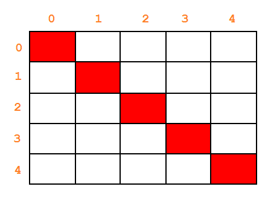

Chào các bạn! Chúng ta tiếp tục đồng hành trong khóa học lập trình trực tuyến ngôn ngữ C++.

Trong bài học này, mình sẽ hướng dẫn các bạn thực hiện một số thao tác cơ bản với mảng hai chiều, cũng có thể coi đây là giải một số bài tập mẫu cơ bản, giúp các bạn hình thành tư duy giải các bài toán có thể giải quyết được bằng mảng hai chiều cơ bản.

#####Tính tổng các phần tử trên đường chéo chính

Trường hợp mảng hai chiều có đường chéo chính và đường chéo phụ chỉ tồn tại khi số hàng bằng số cột (có nghĩa là ma trận vuông). Khi đó, đường chéo chính có dạng:



Đặc điểm của các phần tử nằm trên đường chéo chính của ma trận vuông là chỉ số hàng luôn bằng chỉ số cột. 

```{ a[i][i] | 0 <= i <= n-1 }```

Giả sử số hàng (hoặc số cột) của ma trận vuông này là N, chúng ta chỉ cần sử dụng vòng lặp for để lặp từ giá trị 0 đến N-1, cứ mỗi lần lặp với biến vòng lặp index, chúng ta cộng dồn giá trị của phần tử ```Array[index][index]``` vào biến tổng nào đó.

	int main()
	{
		int myArr[100][100];
		int level;
		cout << "Enter level of squared matrix: ";
		cin >> level;
	
		//input
		for (int row = 0; row < level; row++)
		{
			for (int col = 0; col < level; col++)
			{
				cin >> myArr[row][col];
			}
		}
	
		//calculate
		int sum = 0;
		for (int index = 0; index < level; index++)
		{
			sum += myArr[index][index];
		}
	
		//output
		cout << "Result: " << sum << endl;
	
		system("pause");
		return 0;
	}

Trong chương trình trên, mảng hai chiều **myArr** chưa được khởi tạo khi khai báo, nên mình phải cung cấp thông tin số hàng và số cột cụ thể cho compiler.

#####Xóa một dòng trong mảng hai chiều

Về phần input, chúng ta nhập dữ liệu bao gồm số hàng, số cột và giá trị của mỗi phần tử trong mảng hai chiều.

Trong phần xử lý, chúng ta cần nhập số dòng cần loại bỏ khỏi mảng hai chiều. Mình chưa thiết kế phần xử lý trường hợp nhập sai số dòng. Sau đó, tương tự việc xóa một phần tử trong mảng một chiều, ở mảng hai chiều, một phần tử chính là một mảng một chiều. Do đó, chúng ta không phải ghi đè giá trị sau lên giá trị trước, mà chúng ta cần ghi đè dữ liệu của dòng sau lên dòng trước đó.

	int main()
	{
		int myArr[100][100];
		int num_of_row, num_of_col;
	
		//input
		cout << "Enter number of rows: "; cin >> num_of_row;
		cout << "Enter number of columns: "; cin >> num_of_col;
		for (int row = 0; row < num_of_row; row++)
		{
			for (int col = 0; col < num_of_col; col++)
			{
				cin >> myArr[row][col];
			}
		}
	
		//process
		int removeRow;
		cout << "Enter the row you want to remove: ";
		cin >> removeRow;
	
		//Overide the next row onto the previous row
		for (int row = removeRow; row < num_of_row - 1; row++) 
		{
			for (int col = 0; col < num_of_col; col++)
			{
				myArr[row][col] = myArr[row + 1][col]; 
			}
		}
		num_of_row--;
	
	
		//output
		for (int row = 0; row < num_of_row; row++)
		{
			for (int col = 0; col < num_of_col; col++)
			{
				cout << myArr[row][col] << " ";
			}
			cout << endl;
		}
	
		system("pause");
		return 0;
	}

-----------------------------

###Tổng kết

Trên đây chỉ mới là một số thao tác cơ bản khi cần sử dụng đến mảng hai chiều. Hi vọng bài học này có thể giúp các bạn hiểu rõ hơn về bản chất của mảng hai chiều khi lưu trữ trong máy tính.

###Bài tập cơ bản

Dựa trên chương trình xóa một dòng trong mảng hai chiều mà mình đã làm mẫu ở trên, các bạn hãy viết chương trình xóa một cột X được nhập từ bàn phím trong mảng hai chiều.

-------------------------

**Hẹn gặp lại các bạn trong bài học tiếp theo trong khóa học lập trình C++ hướng thực hành.**


Mọi ý kiến đóng góp hoặc thắc mắc có thể đặt câu hỏi trực tiếp tại diễn đàn.

[www.daynhauhoc.com](www.daynhauhoc.com "DayNhauHoc")