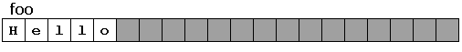
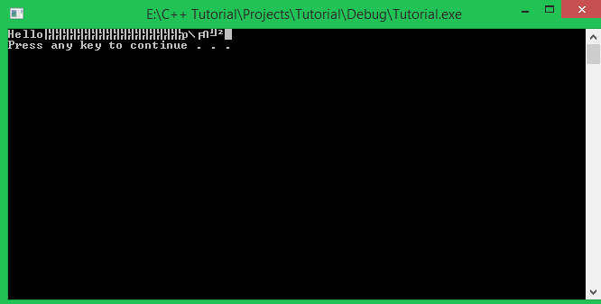
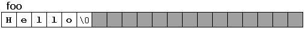
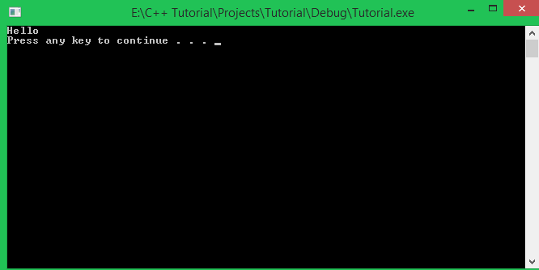
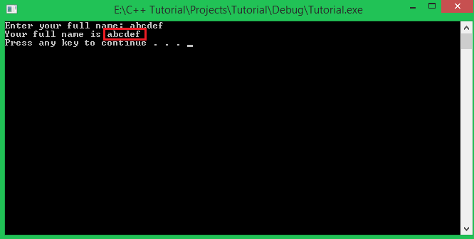
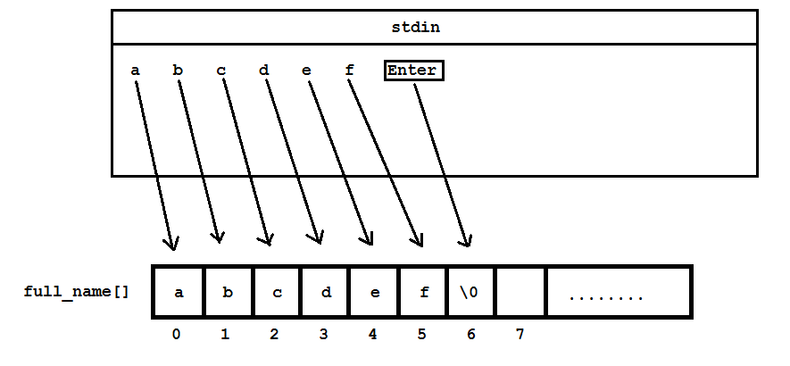
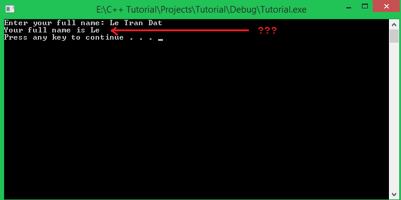
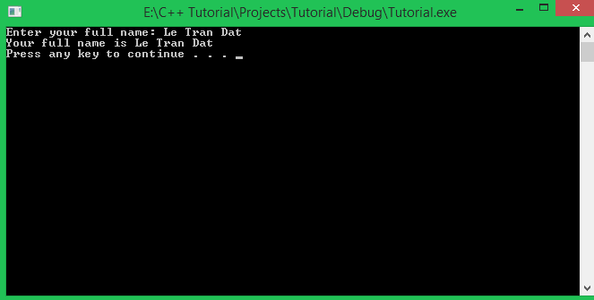

Chào các bạn học viên đang theo dõi khóa học lập trình trực tuyến ngôn ngữ C++. Chúng ta cùng đến với bài học tiếp theo trong ngày hôm nay: **Mảng kí tự.**

Các bạn đã từng thấy mình làm việc với **mảng kí tự** trong các bài học về **mảng một chiều**. Nhưng có một số điểm khác biệt giữa mảng kí tự và mảng một chiều mà chúng ta cần phân biệt, mình sẽ làm rõ cho các bạn trong bài học này.

###Mảng kí tự (C-style string)

Mảng kí tự là mảng một chiều mà kiểu dữ liệu của tất cả các phần tử trong mảng đều là kiểu kí tự (**char**).

Mảng kí tự được định nghĩa trong ngôn ngữ C nhưng chúng ta cũng có thể dùng nó trong ngôn ngữ C++. Bên cạnh đó, ngôn ngữ C++ còn hổ trợ cho chúng ta lớp **string** để làm việc với mảng kí tự một cách hiệu quả hơn (chúng ta sẽ học đến bài này trong một số bài học kế tiếp). Vì vậy, chúng ta thường gọi mảng kí tự là **C-style string** để phân biệt với lớp **string** trong ngôn ngữ C++.

#####Vấn đề khi sử dụng mảng kí tự

Cách khai báo mảng kí tự hoàn toàn giống với cách khai báo mảng một chiều. Ví dụ:

	char foo[20];

Sau khi khai báo như trên, chúng ta có mảng một chiều kiểu kí tự với 20 ô nhớ (đủ để chứa 20 kí tự.


Như các bạn đã biết, chúng ta có thể khai báo mảng với số lượng phần tử lớn hơn số lượng cần thiết để đảm bảo không xảy ra xung đột vùng nhớ. Với mảng **foo** như trên, mình lưu một vài kí tự vào mảng như sau:

	foo[0] = 'H';
	foo[1] = 'e';
	foo[2] = 'l';
	foo[3] = 'l';
	foo[4] = 'o';

Mảng foo của chúng ta bây giờ trở thành:



>Với mảng kí tự (C-style string), chúng ta không cần sử dụng vòng lặp **for** để duyệt qua lần lượt từng phần tử của mảng mà có thể sử dụng đối tượng **cout** để in trực tiếp toàn bộ kí tự trong mảng ra màn hình như một biến thông thường.

	cout << foo << endl;

Cùng nhìn vào kết quả chương trình vừa in ra:



Kết quả là từ ```"Hello"``` được in ra màn hình, nhưng đi kèm theo đó là những kí tự rác không có ý nghĩa. Trong khi đó, chúng ta mong muốn kết quả in ra chỉ là từ ```"Hello"```. Tại sao lại xảy ra điều này?

***Đó là vì cách định nghĩa toán tử **"<<"** của đối tượng **cout** cho mảng kí tự không giống với các biến đơn thông thường hay mảng một chiều có kiểu dữ liệu khác.***

Khi toán tử **"<<"** của đối tượng **cout** nhận được đầu vào là một mảng kí tự (**C-style string**), nó sẽ lần lượt chuyển toàn bộ kí tự lưu trong mảng kí tự từ trái qua phải vào đối tượng file **stdout**, cho đến khi gặp điểm dừng. Các điểm dừng có thể là phần tử cuối cùng trong mảng kí tự, hoặc kí tự kết thúc mảng kí tự **'\0'**.

Cũng với mảng kí tự **foo** ở ví dụ trên, mình thay đổi một chút như sau:

	foo[0] = 'H';
	foo[1] = 'e';
	foo[2] = 'l';
	foo[3] = 'l';
	foo[4] = 'o';
	foo[5] = '\0';

Lúc này, mảng kí tự **foo** của chúng ta sẽ là:



Bây giờ các bạn thử dùng đối tượng **cout** để in mảng kí tự **foo** ra màn hình xem có điều gì thay đổi:



Trong quá trình xuất mảng kí tự ra màn hình bằng đối tượng **cout**, nếu chương trình bắt gặp kí tự **'\0'** thì chương trình sẽ coi như chuỗi những kí tự đó đã kết thúc, mặc dù phía sau kí tự **'\0'** vẫn còn nhiều phần tử hoặc ô nhớ trống.

#####Những cách khai báo mảng kí tự chính xác

Mình sẽ đưa ra một số cách khai báo mảng kí tự, và các bạn có thể chọn cách khai báo mà các bạn cảm thấy thuận tiện khi sử dụng.

- Khai báo nhưng không khởi tạo:

		char foo[20];

	Dòng lệnh trên có nghĩa là khai báo 1 mảng kí tự gồm 20 ô nhớ đủ để chứa 20 kí tự, chưa có phần tử nào được cung cấp kí tự cụ thể, vì thế, chúng ta thường dùng cách khai báo này khi các bạn muốn tùy ý nhập dữ liệu vào mảng **foo**.

- Khai báo và khởi tạo như mảng một chiều thông thường:

		char foo[] = { 'L', 'e', ' ', 'T', 'r', 'a', 'n', ' ', 'D', 'a', 't', '\0' };

	*Với cách khai báo này, các bạn đừng quên đặt kí tự kết thúc mảng kí tự cho phần tử cuối cùng nhé.*

	Với cách khai báo mảng kí tự **foo** như trên, chương trình sẽ cung cấp vừa đủ 12 ô nhớ để lưu trữ đúng 12 kí tự mình khởi tạo (bao gồm kí tự **'\0'**). Các kí tự trong mảng **foo** này có thể được gán lại hoặc thay đổi tùy ý.

- Khai báo và khởi tạo bằng một chuỗi kí tự cố định:

		char foo[] = "Le Tran Dat";

	Chương trình sẽ tự động cấp phát bộ nhớ vừa đủ để lưu 11 kí tự của chuỗi mình đã gán, và 1 ô nhớ để lưu thêm kí tự kết thúc chuỗi **'\0'**. Chương trình sẽ tự động thêm vào kí tự kết thúc chuỗi **'\0'** khi khởi tạo cho mảng kí tự bằng một chuỗi các kí tự như trên.
	
	Với cách khởi tạo này, mình gán luôn cho mảng kí tự **foo** một chuỗi kí tự được đặt trong cặp dấu nháy kép. Chuỗi kí tự trong cặp dấu nháy kép này được coi như là một chuỗi cố định (tương tự hằng số) và chúng ta không thế thay đổi kí tự khác cho bất kì phần tử nào trong mảng.

#####Nhập dữ liệu cho mảng kí tự từ bàn phím

Chúng ta vẫn dùng đối tượng **cin** của thư viện **iostream** để nhập dữ liệu từ bàn phím cho mảng kí tự, nhưng có một chút khác biệt.

Chúng ta không cần duyệt qua tất cả các phần tử trong mảng kí tự bằng vòng lặp **for** để nhập dữ liệu cho từng phần tử nữa, thay vào đó, chúng ta chỉ cần truyền vào đối tượng **cin** tên của mảng kí tự chúng ta cần nhập dữ liệu.

	char full_name[50];

	cout << "Enter your full name: ";
	cin >> full_name;

	cout << "Your full name is " << full_name << endl;

Trong lần đầu tiên mình chạy đoạn chương trình trên, mình sẽ nhập vào chuỗi kí tự ```"abcdef"``` và kết quả như hình bên dưới:



Khi mình nhập chuỗi "abcdef" và nhấn phím Enter để tạo ra kí tự xuống dòng **'\n'**, chương trình sẽ tự động thêm kí tự kết thúc chuỗi **'\0'** vào sau chuỗi ```"abcdef"```. Vì thế, vẫn còn nhiều ô nhớ phía sau nhưng chương trình chỉ in ra 6 kí tự đầu tiên.



Trong lần thứ hai mình chạy đoạn chương trình trên, mình sẽ thử nhập vào tên đầy đủ của mình là "Le Tran Dat", các bạn cùng xem chương trình sẽ xử lý dữ liệu mình nhập vào như thế nào:



Khi đọc dữ liệu mình đã nhập là "Le Tran Dat", đến khi gặp kí tự khoảng trắng thì phần còn lại của input không được đưa vào mảng kí tự **full_name** nữa. Vậy là có 2 kí tự khiến đối tượng **cin** thực hiện thêm kí tự kết thúc chuỗi, đó là kí tự **new-line '\n'** khi nhấn phím Enter và kí tự khoảng trắng. Điều này hoàn toàn nằm ngoài mong đợi của chúng ta.

#####Khắc phục vấn đề nhập chuỗi kí tự có chứa khoảng trắng

Đối tượng **cin** cung cấp cho chúng ta phương thức ```getline()``` để chúng ta có thể nhập chuỗi kí tự từ bàn phím và lưu vào biến mà vẫn có thể nhận kí tự khoảng trắng. Cách sử dụng như sau:

	char full_name[50];

	cout << "Enter your full name: ";
	cin.getline(full_name, 50);

	cout << "Your full name is " << full_name << endl;

Phương thức ```getline``` của đối tượng **cin** cần được đưa vào tên của mảng kí tự mà bạn cần nhập dữ liệu, và số lượng kí tự tối đa mà bạn muốn nhập. Bây giờ mình sẽ thử chạy lại đoạn chương trình trên và nhập vào tên đầy đủ của mình (bao gồm cả kí tự khoảng trắng)



Phương thức ```getline``` của đối tượng **cin** còn có thêm một cách sử dụng khác nhưng thường ít người quan tâm.

	char full_name[50];

	cout << "Enter your full name: ";
	cin.getline(full_name, 50, '\n');

	cout << "Your full name is " << full_name << endl;

Trong ví dụ này, mình sử dụng lại phương thức ```getline``` nhưng mình đưa vào thêm đối số thứ ba đại diện cho kí tự mà đối tượng **cin** cho là dấu hiệu ngừng nhập chuỗi kí tự. Mình truyền vào kí tự **'\n'** nghĩa là khi gặp kí tự **'\n'** được tạo ra khi ấn phím Enter thì kết thúc nhập chuỗi.

#####Sử dụng hàm gets_s để nhập dữ liệu tương tự phương thức getline

Trước khi ra đời chuẩn C++11, chúng ta thường sử dụng hàm **gets** để nhập dữ liệu cho mảng kí tự. Nhưng Visual studio 2015 áp dụng chuẩn C++11 trở lên, nên hàm **gets** bây giờ đổi tên thành **gets_s**.

Cách sử dụng hàm **gets_s**:

	char *gets_s( char *str );
	
	char *gets_s( char *str, rsize_t n );

Với cách sử dụng thứ nhất, chúng ta truyền vào hàm **gets_s** tên của mảng kí tự mà chúng ta cần đưa dữ liệu từ file **stdin** vào. Ví dụ:

	char full_name[50];
	gets_s( full_name );

Khi gặp hàm **gets_s**, chương trình sẽ dừng lại và chờ bạn nhập xong chuỗi kí tự, kết thúc bằng việc ấn phím Enter.

Với cách sử dụng thứ hai, chúng ta truyền thêm vào một đối số là số kí tự tối đa mà bạn muốn nhập.

	char full_name[50];
	gets_s( full_name, 20 );

Với đoạn chương trình trên, nếu bạn nhập chuỗi có số kí tự lớn hơn 20 thì chương trình sẽ thông báo đầu vào không hợp lệ. Vì hàm ```gets_s( char *str, rsize_t n )``` đã đặt **Assertion** để kiểm tra số lượng kí tự các bạn nhập vào. Chúng ta thường ưu tiên sử dụng cách thứ nhất hơn.

##
###Tổng kết

Trong bài học ngày hôm nay, mình đã giúp các bạn phân biệt những điểm khác nhau khi sử dụng **C-style string** với mảng một chiều có kiểu dữ liệu khác, và những cách nhập dữ liệu phù hợp khi dùng **C-style string**.


**Hẹn gặp lại các bạn trong bài học tiếp theo trong khóa học lập trình C++ hướng thực hành.**

Mọi ý kiến đóng góp hoặc thắc mắc có thể đặt câu hỏi trực tiếp tại diễn đàn.

[www.daynhauhoc.com](www.daynhauhoc.com "DayNhauHoc")