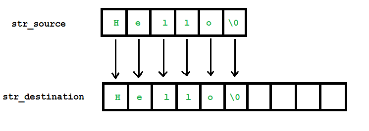
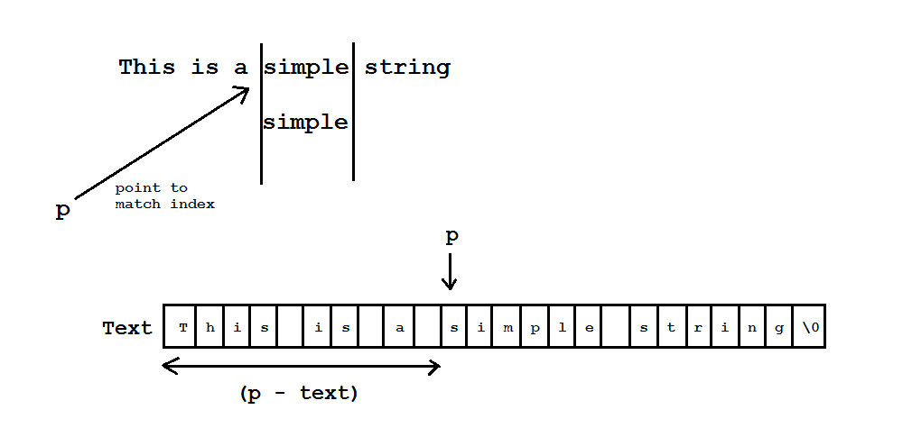

Chào các bạn học viên đang theo dõi khóa học lập trình trực tuyến, những người đang có mong muốn trở thành lập trình viên C++.

Trong bài học này, chúng ta sẽ cùng tìm hiểu một số cách để thao tác với **C-style string** thông qua các hàm đã được định nghĩa sẵn trong thư viện **cstring**. Vì có rất nhiều công việc cần giải quyết khi thao tác với mảng kí tự nên người ta đã tạo ra thư viện **cstring** để định nghĩa một tập hợp các hàm xử lý mảng kí tự, giúp chúng ta tiết kiệm thời gian và công sức viết code hơn trong khi chúng ta chỉ cần sử dụng lại những gì đã có sẵn.

Các bạn cần include thư viện **cstring** để có thể sử dụng các hàm được định nghĩa bên trong nó.

###Thiết lập giá trị cho một vùng nhớ thuộc mảng kí tự

Hàm **memset** sẽ giúp chúng ta lấp vào một số ô nhớ liên tiếp nhau trong mảng kí tự bằng một giá trị xác định. Dưới đây là khai báo của hàm **memset**:

```void* memset( void *ptr, int value, size_t num);```

Các bạn có thể hiểu hàm memset thiết lập **num** bytes ô nhớ đầu tiên bắt đầu từ địa chỉ **ptr** bằng giá trị value định sẵn. Ví dụ như sau:

	char foo[] = "Almost every programmer should know memset!";
	cout << foo << endl;

	memset(foo, '-', 7);
	cout << foo << endl;

Sau khi chạy đoạn chương trình này, kết quả mình nhận được trên màn hình console là 2 dòng text như sau:

	Almost every programmer should know memset!

	-------every programmer should know memset!

Như vậy, 7 bytes đầu tiên (tương đương với 7 kí tự trong mảng **foo**) đã bị hàm **memset** thiết lập bằng kí tự dấu trừ.

Chúng ta cũng thường sử dụng hàm memset để khởi tạo toàn bộ mảng kí tự bằng một giá trị xác định nào đó.

	char foo[20];
	memset(foo, 'a', sizeof(foo));
	foo[sizeof(foo) - 1] = '\0'; //Don't forget to set the ending character at the end of C-style string.

Với đoạn code này, mảng kí tự foo sẽ được lấp toàn bộ mảng bằng kí tự a, và kí tự cuối cùng sẽ được thiết lập là kí tự kết thúc chuỗi như mình đã trình bày trong bài học về mảng kí tự.

###Xem độ dài của chuỗi kí tự

Các bạn cần phân biệt rõ số lượng ô nhớ được cấp phát cho mảng kí tự ```sizeof(c_string)``` và độ dài của chuỗi kí tự ```(length of c_string)```.

Độ dài của chuỗi kí tự được tính từ kí tự đầu tiên cho đến kí tự kết thúc chuỗi (**'\0'**), trong khi đó, số lượng ô nhớ được cấp phát cho mảng kí tự được trả về thông qua toán tử **sizeof**.

Để lấy được giá trị là độ dài của chuỗi kí tự được lưu bên trong mảng kí tự, chúng ta có thể sử dụng hàm **strlen** được khai báo như sau:

```size_t strlen ( const char * str );```

Hàm **strlen** nhận vào tên mảng kí tự mà các bạn muốn lấy độ dài và trả về một số nguyên là độ dài chuỗi kí tự lưu trong mảng. Ví dụ:

	char foo[50] = "C++ Programming language";
	cout << "Length of foo string: " << strlen(foo) << endl;

Đoạn code trên sẽ cho ra kết quả độ dài của chuỗi kí tự ```"C++ Programming language"``` là 24. Trong khi đó, nếu các bạn dùng toán tử **sizeof(foo)** thì kết quả sẽ là 50, vì mình yêu cầu cấp phát 50 ô nhớ cho mảng kí tự ```foo```.

###Sao chép mảng kí tự

Khi sử dụng thư viện **cstring**, chúng ta có 2 cách để sao chép chuỗi kí tự từ một mảng kí tự sang mảng kí tự khác.

#####Sử dụng hàm strcpy

Khai báo của hàm **strcpy** trong thư viện **cstring**:

```char * strcpy ( char * destination, const char * source );```

Hàm **strcpy** cho phép bạn sao chép toàn bộ chuỗi kí tự được lưu bên trong mảng kí tự **source** sang mảng kí tự **destination**.

Ví dụ:

	char str_source[] = "This is source string";
	char str_destination[30];

	strcpy(str_destination, str_source);
	cout << "str_destination: " << str_destination << endl;

Cách hoạt động của hàm strcpy:



***Lưu ý: Mảng kí tự ```str_destination``` phải được cấp phát đủ bộ nhớ để lưu trữ chuỗi kí tự được copy từ mảng kí tự ```str_source```.***

#####Sử dụng hàm strncpy

Hàm **strncpy** trong thư viện **cstring** được khai báo như sau:

```char * strncpy ( char * destination, const char * source, size_t num );```

Hàm **strncpy** cho phép bạn sao chép **num** kí tự từ mảng kí tự **source** sang mảng kí tự **destination**.

Ví dụ:

	char str_source[] = "This is source string";
	char str_destination[30];

	strncpy(str_destination, str_source, strlen(str_source) / 2);

Với đoạn code trên, chỉ có một nữa số lượng kí tự của mảng ```str_source``` được copy sang mảng ```str_destination```.

#####Sử dụng hàm strncpy_s khi sử dụng Visual studio 2015

Khi sử dụng hàm **strcpy** và **strncpy**, có một số trường hợp dẫn đến việc copy dữ liệu không an toàn. Ví dụ:

	char str_source[] = "aaaaaaaaaaaaaaaaaaaaaa";
	char str_destination[10];

	strcpy(str_destination, str_source);

Đoạn code trên có thể gây xung đột vùng nhớ vì số lượng kí tự được copy vượt ra ngoài giới hạn vùng nhớ của ```str_destination```. Dó đó, Visual studio 2015 sẽ ngăn chặn hành vi build chương trình.

Vì Visual studio 2015 áp dụng chuẩn C++11 trở lên, nên chúng ta cần sử dụng hàm ```strncpy_s``` thay thế cho 2 hàm copy mảng kí tự trong thư viện **cstring**.

	char str_source[] = "This is source string";
	char str_destination[30];

	strncpy_s(str_destination, str_source, strlen(str_source));

Trong ví dụ trên, mình thực hiện copy toàn bộ mảng ```str_source``` vào mảng ```str_destination``` bằng cách truyền vào đối số thứ ba của hàm là độ dài toàn bộ chuỗi kí tự bên trong mảng ```str_source```.

Nếu gặp trường hợp số lượng ô nhớ của mảng ```str_destination``` không đủ để chứa số lượng phần tử được copy từ mảng ```str_source```, Visual studio sẽ đưa ra thông báo vi phạm **Assertion** của hàm ```strncpy_s```.

###So sánh hai chuỗi kí tự

Hàm **strcmp** sẽ giúp chúng ta so sánh hai chuỗi kí tự.

```int strcmp ( const char * str1, const char * str2 );```

Khi sử dụng hàm so sánh 2 chuỗi **strcmp**, có 3 trường hợp có thể xảy ra:

- Giá trị trả về là 0:

	Điều này có nghĩa nội dung của hai chuỗi kí tự này hoàn toàn giống nhau. Ví dụ:

		char str1[] = "This is a string";
		char str2[] = "This is a string";

		if(strcmp(str1, str2) == 0)	{
			cout << "str1 and str2 are equal" << endl;		
		}
		else	{
			cout << "str1 ans str2 are not equal" << endl;
		}

- Giá trị trả về nhỏ hơn 0:

	Điều này có nghĩa tại vị trí phát hiện cặp kí tự không tương xứng giữa str1 và str2 tạm gọi là vị trí ```index_not_match```, ta có: 
		
	```str1[index_not_match] < str[index_not_match]```

	Ví dụ:

		char str1[] = "abcDEF";
		char str2[] = "abcdef";

	Khi so sánh chuỗi ```str1``` và chuỗi ```str2``` như trên bằng dòng lệnh ```strcmp(str1, str2)```, ta nhận được giá trị trả về nhỏ hơn 0, vì tại vị trí có chỉ số là 3, kí tự **'D'** của ```str1``` có mã ASCII nhỏ hơn kí tự **'d'** của ```str2```.

- Giá trị trả về lớn hơn 0:

	Ngược lại với việc giá trị trả về nhỏ hơn 0. Mình lấy lại ví dụ trên:

		char str1[] = "abcDEF";
		char str2[] = "abcdef";

	Nếu các bạn thực hiện so sánh như sau:

		strcmp(str2, str1);

	Giá trị trả về sẽ lớn hơn 0.

###Nối chuỗi kí tự bằng một chuỗi kí tự khác

Để thực hiện thao tác nối một chuỗi bằng chuỗi kí tự khác, chúng ta sử dụng hàm **strcat** trong thư viện **cstring**:

```char * strcat ( char * destination, const char * source );```

Ý nghĩa của hàm này là nối vào sau chuỗi **destination** một bản copy của chuỗi kí tự **source**.

***Lưu ý: Mảng kí tự destination phải có đủ bộ nhớ để chứa được thêm chuỗi mới được nối vào.***

	char str_destination[50] = "Hello";
	strcat( str_destination, " " );
	strcat( str_destination, "every" );
	strcat( str_destination, "one");

	cout << str_destination << endl;

>Tuy nhiên, Visual studio 2015 sử dụng chuẩn C++11 trở lên, vì thế đối với môi trường làm việc là Visual studio 2015, chúng ta nên sử dụng hàm ```strcat_s```.

Hàm ```strcat_s``` có cách sử dụng hoàn toàn giống với hàm ```strcat```, các bạn chỉ cần đổi lại tên hàm:

	char str_destination[50] = "Hello";
	strcat_s( str_destination, " " );
	strcat_s( str_destination, "every" );
	strcat_s( str_destination, "one");

###Tìm kiếm chuỗi kí tự trong một chuỗi kí tự khác

Phần này có liên quan đến khái niệm con trỏ mà các bạn sẽ được học trong các bài học sắp tới, vì thế, mình sẽ chưa giải thích nhiều về thao tác của hàm tìm kiếm chuỗi mà thư viện **cstring** cung cấp.

Để thực hiện tìm kiếm chuỗi kí tự ```pattern``` bên trong chuỗi kí tự ```text``` nào đó, chúng ta sử dụng hàm **strstr**:

```const char * strstr ( const char * text, const char * pattern );```

Có thể tạm hiểu, hàm này sẽ trả về địa chỉ của ô nhớ của mảng kí tự **text** mà hàm này tìm thấy sự trùng khớp giữa chuỗi kí tự **pattern** với chuỗi kí tự **text**. Nếu không tìm thấy, hàm này trả về giá trị **NULL**.

Để biết được vị trí mà hàm **strstr** tìm thấy chuỗi **pattern** trong chuỗi **text**, các bạn có thể lấy địa chỉ của hàm **strstr** trả về trừ đi địa chỉ của ô nhớ đầu tiên trong mảng kí tự **text**.

	char text[] = "This is a simple string";
	char pattern[] = "simple";

	char *p = strstr(text, pattern);
	
	if (p == NULL) {
		cout << "Could not find the pattern string in the text string" << endl;
	}
	else    {

		int32_t match_index = (p - text) / sizeof(char);
		cout << "The pattern string match the text string at: " << match_index << endl;
	}



##
###Tổng kết

Trong bài học này, chúng ta vừa làm quen với một số thao tác cơ bản với **C-style string**.

Một số hàm trong thư viện **cstring** khi sử dụng trong môi trường làm việc Visual studio 2015 sẽ bị cảnh báo không an toàn, và chương trình không thể biên dịch. Đối với những hàm này, chúng ta cần sử dụng theo chuẩn của Visual studio 2015, nhưng đó không phải là những hàm chuẩn, nó chỉ dùng trong môi trường của Visual studio 2015.

Thư viện **cstring** còn hổ trợ cho chúng ta rất nhiều những hàm khác, nhưng thường ít được sử dụng. Các bạn có thể truy cập liên kết bên dưới để tham khảo thêm về thư viện **cstring**:

[http://www.cplusplus.com/reference/cstring/](http://www.cplusplus.com/reference/cstring/)

###Bài tập cơ bản

1/ Viết chương trình nhập một chuỗi kí tự vào từ bàn phím, chuyển tất cả các kí tự trong chuỗi thành dạng in hoa. Ví dụ:

Chuỗi kí tự nhập vào: "This is a simple string"

Output: "THIS IS A SIMPLE STRING"

2/ Viết chương trình nhập vào một chuỗi kí tự **str** và một kí tự **ch** từ bàn phím, đếm trong chuỗi kí tự **str** có bao nhiêu lần xuất hiện kí tự **ch** mà bạn vừa nhập.


**Hẹn gặp lại các bạn trong bài học tiếp theo trong khóa học lập trình C++ hướng thực hành.**

Mọi ý kiến đóng góp hoặc thắc mắc có thể đặt câu hỏi trực tiếp tại diễn đàn.

[www.daynhauhoc.com](www.daynhauhoc.com "DayNhauHoc")