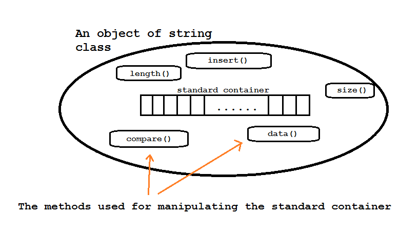
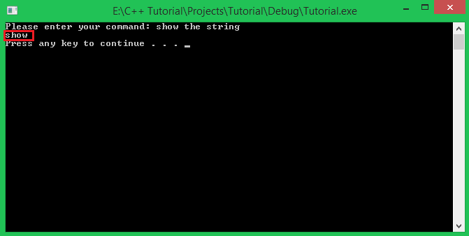
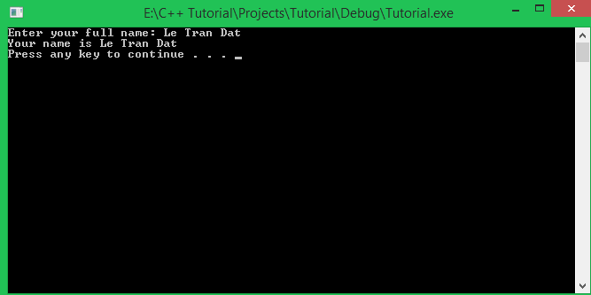
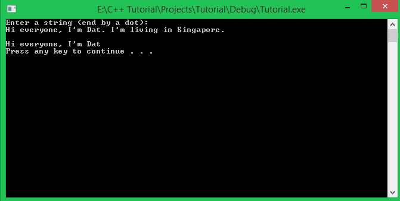
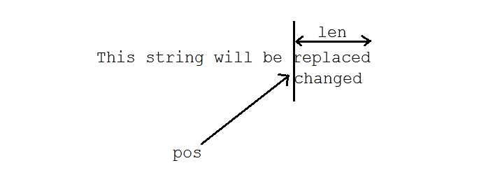
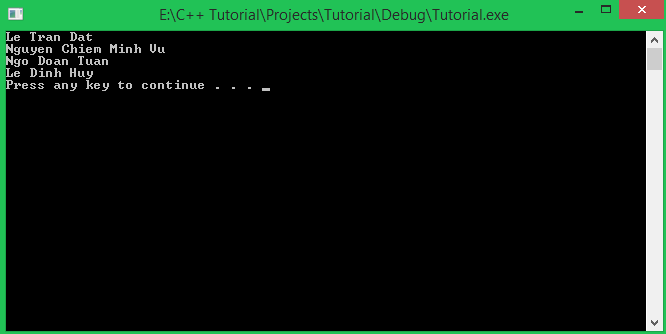
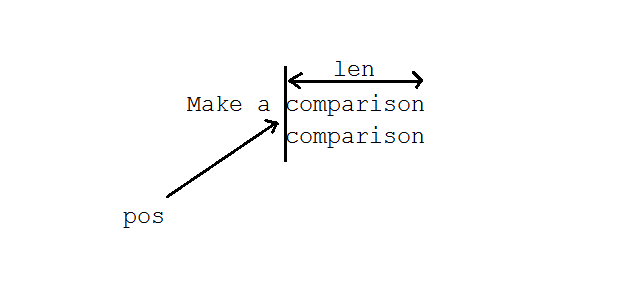

Chào các bạn học viên đang theo dõi khóa học lập trinh trực tuyến ngôn ngữ C++.

Trong những bài học trước, mình đã hướng dẫn các bạn thực hiện một số thao tác đơn giản với **C-style string**, hay còn gọi là mảng kí tự.

Để thao tác với mảng kí tự, chúng ta cần include thư viện **cstring** vào chương trình để được cung cấp một số hàm sẵn có. Tuy vậy, việc xử lý mảng kí tự vẫn còn nhiều khó khăn. Một ví dụ điển hình là việc bạn thực hiện nối chuỗi kí tự bằng hàm **strcat**. Bạn luôn phải để tâm đến việc số lượng ô nhớ mà bạn đã cấp phát cho mảng kí tự có đủ để chứa thêm chuỗi kí tự được nối vào không. Hay là khi bạn khai báo một mảng kí tự, bạn cũng phải đặt ra câu hỏi: *Liệu bao nhiêu ô nhớ là đủ?* Và bạn phải luôn đặt kí tự '**\0**' tại vị trí kết thúc chuỗi kí tự... Quá nhiều thứ khiến bạn phải để tâm.

Trong bài học hôm nay, mình sẽ giới thiệu với các bạn về kiểu dữ liệu **string** được định nghĩa trong thư viện **string** của ngôn ngữ C++ (các bạn đừng nhầm lẫn giữa thư viện **cstring** của ngôn ngữ C với thư viện **string** của ngôn ngữ C++, hai thư viện này hoàn toàn riêng biệt).

Các bạn có thể làm được gì với thư viện **string** mà ngôn ngữ C++ cung cấp? Trước hết, chúng ta hãy cùng xem thư viện **string** là gì, và nó chứa những gì bên trong.

###Cpp-Style string

Mình tạm gọi là **Cpp-style string** để tiện phân biệt với **C-style string** mà các bạn đã học trong một số bài học trước.

**string** là một lớp chuẩn mô tả về về chuỗi kí tự, nó cung cấp khả năng lưu trữ chuỗi kí tự gọi là **standard container**, và thêm vào đó một số chi tiết được thiết kế để xử lý chuỗi kí tự mà nó đang lưu trữ.



>Một ưu điểm mà lớp **string** đem lại cho chúng ta là **standard container** có thể tự thay đổi kích thước vùng nhớ cho phù hợp với yêu cầu về mặt lưu trữ chuỗi kí tự. Do đó, các bạn có thể tùy ý nối hoặc chèn thêm dữ liệu vào **standard container** cho đến khi dung lượng bộ nhớ không đủ để cung cấp nữa.

#####Khai báo và khởi tạo

Tương tự như cách chúng ta khai báo biến thông thường, kiểu dữ liệu sẽ được dùng trong bài học này là **string** (Các bạn cần include thư viện **string** vào trước khi sử dụng).

	#include <string>
	using namespace std;
	
	//.........
	string my_string;

Lớp **string** cũng được đặt trong **namespace std** nên dòng lệnh ```using namespace std``` là cần thiết.

Vậy là chúng ta đã khai báo được một đối tượng có tên là ```my_string``` từ lớp **string**. Các bạn có thể khởi tạo chuỗi kí tự cho đối tượng tại thời điểm khai báo bằng một số cách như sau:

	string empty_string();
	string my_string = "Learning C++ is easy";
	string another_string("Don't give it up");

	string temp_string("What the hell is going on?");
	string one_more = temp_string;
	string it_just_began(temp_string);

Chúng ta có thể khởi tạo bằng cách gán cho đối tượng một chuỗi kí tự thông qua toán tử gán **'='** hoặc lấy chuỗi kí tự từ một đối tượng của lớp **string** khác, và còn nhiều cách nữa.

#####string input & output

- Output:

	Để đưa dữ liệu bên trong **standard container** của **string** ra màn hình console, chúng ta sử đụng đối tượng **cout** như cách chúng ta vẫn thường dùng, chỉ cần sử dụng tên biến của đối tượng string.

		string output_string = "I'm learning C++ programming language";
		cout << output_string << endl;

- Input:

	Chúng ta có thể sử dụng đối tượng **cin** để nhập dữ liệu vào từ bàn phím cho những đối tượng của lớp **string**.
	
		string input_string;
		cout << "Please enter your command: ";
		cin >> input_string;
	
	Với cách nhập dữ liệu này, chúng ta lại gặp phải trường hợp dữ liệu truyền vào **string** bị dừng khi gặp kí tự khoảng trắng.
	
	

	Trong một số trường hợp, chúng ta chỉ yêu cầu người dùng nhập 1 từ thì có thể sử dụng đối tượng **cin** như cách trên, ví dụ:

		string command;

		do
		{
			cout << "Enter \"new\" to create a new file." << endl;
			cout << "Enter \"cancel\" to discard the previous behavior." << endl;
			cout << "Enter \"quit\" to exit the program." << endl;
	
			cout << "=============================================" << endl;
			cout << "Enter your command: ";
			cin >> command;
			cout << "=============================================" << endl;
	
			//do something depend on the command
	
		} while (true);

	Nhưng trong một số trường hợp, chúng ta cần **string** nhận vào kí tự khoảng trắng, ví dụ khi nhập họ tên đầy đủ, thì chúng ta cần có một cách khác.

	Để khắc phục trường hợp string không nhận kí tự khoảng trắng, chúng ta sử dụng hàm **getline** được định nghĩa bên trong thư viện **string**.

		string name;
		cout << "Enter your full name: ";
		getline( cin, name );

	Mình truyền vào **getline** đối tượng **cin** để nhận dữ liệu từ bàn phím, khi cần nhận dữ liệu từ file thì mình sẽ truyền vào đối số đầu tiên một đối tượng có kiểu file stream (phần này các bạn sẽ được học sau).

	Bây giờ thì chúng ta có thể nhập dữ liệu mà không bị giới hạn bởi kí tự khoảng trắng nữa.

	
	
	Hàm getline mặc định xem kí tự **'\n'** được tạo ra khi nhấn phím Enter là kí tự kết thúc nhập dữ liệu cho **string**. Chúng ta có thể thay đổi điều này.

	Hàm **getline** có thể nhận thêm đối số thứ 3 đại diện cho kí tự kết thúc nhập dữ liệu cho **string**. Ví dụ:

		string str;
		cout << "Enter a string (end by a dot): " << endl;
		getline(cin, str, '.');
	
		cout << str << endl;

	Đoạn chương trình trên khiến chương trình dừng lại và chờ cho đến khi quá trình nhập dữ liệu của bạn kết thúc, nó chỉ kết thúc khi phát hiện dấu chấm.

	

###String manipulating

Mình vừa hướng dẫn các bạn cách khai báo mà sử dụng kiểu dữ liệu **string** của ngôn ngữ C++, tiếp theo là phần thao tác với **standard container** của một đối tượng **string**.

#####Tính độ dài chuỗi kí tự được lưu trong standard container

Lớp string định nghĩa cho chúng ta 2 phương thức để thực hiện việc lấy ra độ dài của chuỗi kí tự được lưu trong **standard container**.

	string my_favorite_quote = "By my will, this shall be finished";

	cout << "Length of the quote: " << my_favorite_quote.length() << endl;
	cout << "Length of the quote: " << my_favorite_quote.size() << endl;

Hai phương thức **length** và **size** của lớp **string** đều được dùng để tính độ dài của chuỗi kí tự trong **standard container**.

Khi **string** có độ dài chuỗi kí tự là 0, nó được xem là **string** rỗng. Để kiểm tra xem **string** có rỗng hay không, chúng ta sử dụng phương thức **empty**, phương thức này trả về giá trị **true** khi **string** rỗng, ngược lại, trả về giá trị **false**.

	string empty_string = "";
	if(empty_string.empty())
		cout << "string is empty" << endl;

Chúng ta cũng có thể làm một **string** có chứa dữ liệu trở thành **string** rỗng bằng phương thức **clear**.

	string str = "This is a sample string".
	str.clear();

	if(str.empty())
		cout << "str is now empty" << endl;

#####Truy cập phần tử trong string

Cũng tương tự như việc truy cập phần tử trong mảng kí tự, chúng ta sử dụng cặp dấu ngoặc vuông và truyền vào một giá trị số nguyên đại diện cho chỉ số của phần tử cần truy xuất.

	string str = "Learn from others people";

	for(int32_t index = 0; index <= str.length() - 1; index++)	{
		cout << str[index] << " ";
	}

	cout << endl;

	for(int32_t index = 0; index <= str.length() - 1; index++)	{
		cout << str.at(index) << " ";
	}

Phương thức **at** của lớp **string** cũng thực hiện truy xuất đến phần tử có chỉ số index tương tự cặp dấu ngoặc vuông.

Nếu chương trình phát hiện hành vi truy xuất đến phần tử có chỉ số không hợp lệ ```(index < 0 hoặc index >= string length)```, **Assertion** sẽ ép buộc chương trình kết thúc và thông báo dòng lệnh gây ra lỗi cho bạn.

2 cách truy cập phần tử trên được dùng để truy xuất phần tử có chỉ số không cố định. Lớp tring còn cung cấp cho chúng ta 2 phương thức để truy xuất nhanh đến phần tử đầu tiên và phần tử cuối cùng của chuỗi kí tự trong **standard container**.

	string sample = "Access to the first and the last element";
	cout << "First: " << sample.front() << endl;
	cout << "Last: " << sample.back() << endl;

**Assertion** đặt trong 2 phương thức **front** và **back** sẽ được kích hoạt nếu **string** rỗng.

#####Thay đổi dữ liệu trong string

Có khá nhiều phương thức được lớp **string** định nghĩa dùng để thay đổi dữ liệu trong **standard container**.

- Nối thêm 1 kí tự vào sau **string**:

	Chúng ta chỉ cần truyền vào phương thức **push_back** kí tự mà chúng ta muốn thêm vào sau chuỗi kí tự trong **standard container**.

		string str = "A sentence must end with a dot";
		str.push_back('.');

- Xóa phần tử cuối cùng của **string**:

	Ngược lại với phương thức ```push_back``` ở trên, phương thức ```pop_back``` xóa đi kí tự cuối cùng trong **string**. Nếu các bạn thực hiện phương thức này khi **string** rỗng, chương trình sẽ gây ra lỗi xung đột vùng nhớ, vì thế, các bạn cần kiểm tra trước khi xóa.

		string str = "The dot will be removed.";
		if(!str.empty())
			str.pop_back();

- Nối chuỗi kí tự vào sau **string**:

	Chúng ta có thể sử dụng phương thức **append** của lớp **string** để nối thêm một chuỗi kí tự vào sau chuỗi kí tự trong **standard container**.

	```string& append (const string& str);```

	```string& append (const char* s);```

	Các bạn có thể truyền vào phương thức **append** một đối tượng có kiểu string hoặc tên của một mảng kí tự nào đó.
		
		string str = "";
		str.append("Le");
		str.append(" ");
		str.append("Tran");
		str.append(" Dat");

	Bên cạnh đó, lớp **string** cũng đã định nghĩa lại toán tử nối chuỗi kí tự giúp chúng ta tiết kiệm thời gian viết code hơn.

		string str = "";
		str += "Use \"+=\" operator ";
		str += "to append string";

	Toán tử **'+='** có chức năng hoàn toàn giống với phương thức **append**.

- Chèn một **string** vào vị trí bất kì trong **string**:

	Phương thức insert có thể giúp chúng ta chèn một **string** vào vị trí pos.
	
	```string& insert (size_t pos, const string& str);```

	Ví dụ:

		string str = "how to use.";
		string str2 = "i will introduce you ";
	
		cout << str << endl;
	
		str.insert(0, str2);
		cout << str << endl;
	
		str.insert(str.length() - 1, " string in C++");
		cout << str << endl;

	Trong lần sử dụng phương thức **insert** đầu tiên, mình chèn **str2** vào **str** tại vị trí đầu tiên. Sau đó, mình chèn thêm một chuỗi kí tự tại vị trí ```str.length() - 1``` (trước dấu chấm kết thúc câu).

	*Sử dụng phương thức **insert** với vị trí chèn không hợp lệ sẽ gây ra lỗi xung đột vùng nhớ.*

- Thay thế một phần của **string**:

	Chắc các bạn cũng có thể đoán được tên của phương thức mà mình chuẩn bị nói tới. Phương thức **replace** dùng để thay thế một đoạn con của chuỗi kí tự lưu trong **standard container** bằng 1 string hoặc 1 mảng kí tự khác.

		string& replace (size_t pos,  size_t len,  const string& str);
		string& replace (size_t pos,  size_t len,  const char* s);

	Ở trên đây là 2 cách mà chúng ta thường dùng. Trong đó, **pos** là vị trí trong **standard container** mà bạn muốn thực hiện thay thế, **len** là số lượng kí tự trong **standard container** mà bạn muốn thay, **str** là đoạn kí tự mới được ghép vào trong **standard container**.

	Ví dụ:

		string my_string = "This string will be replaced";
		cout << my_string << endl;
	
		my_string.replace(20, 8, "changed");
		cout << my_string << endl;

	Nhìn vào kết quả đoạn chương trình trên và hình dung xem thử điều gì vừa diễn ra.

	

	Tại vị trí **pos** của string gốc, chương trình xóa đi **len** kí tự, và chèn **str** vào string gốc tại ví trí **pos**. Đó là cách mà phương thức **replace** hoạt động.

#####Tìm kiếm

Có nhiều phương thức trong lớp string được định nghĩa cho các trường hợp tìm kiếm phức tạp. Mình chỉ hướng dẫn các bạn sử dụng phương thức **find** của lớp **string** để tìm kiếm vị trí xuất hiện của chuỗi con bên trong đối tượng mà bạn đang dùng để gọi phương thức **find**.

Ví dụ mình có **string** dùng để lưu một số tên của các thành viên trong nhóm thực hiện tutorial này:

	string name_list = "Le Tran Dat\nNguyen Chiem Minh Vu\nNgo Doan Tuan\nLe Dinh Huy";

Thử in name_list ra màn hình:



Yêu cầu nhập vào một cái tên từ bàn phím và xác định xem tên đó có tồn tại trong danh sách trên hay không.

Sau đây là một số khai báo phương thức **find** trong lớp **string** sẽ giúp các bạn giải quyết vấn đề mình vừa đặt ra.

```size_t find (const string& str, size_t pos = 0) const;```

Tìm kiếm sự xuất hiện của chuỗi con **str** bên trong **standard container** của đối tượng mà các bạn dùng để gọi phương thức **find**, vị trí bắt đầu tìm kiếm mặc định là 0.

	string name;
	cout << "Enter a name: ";
	getline(cin, name);

	int32_t search_index = name_list.find(name);

Nếu ```name``` được tìm thấy bên trong ```name_list```, biến ```search_index``` sẽ nhận được giá trị là chỉ sổ mà ```name``` được tìm thấy. Nếu không được tìm thấy, biến ```search_index``` nhận giá trị -1.

	if(search_index == -1)
		cout << name << " is not exist in name_list" << endl;
	else
		cout << "Found at: " << search_index << endl;

Phương thức **find** này dễ sử dụng hơn so với việc sử dụng hàm **strstr** trong thư viện **cstring** để tìm kiếm trong mảng kí tự.

#####So sánh 2 string

Phép so sánh 2 string cũng được thực hiện theo thứ tự từ điển (từ trái sang phải) giống như khi so sánh hai mảng kí tự. 

```int compare (const string& str) const;```

Hoặc

```int compare (const char* s) const;```

Phương thức so sánh **compare** trả về một giá trị số nguyên. Tương tự như so sánh 2 mảng kí tự bằng hàm **strcmp**, giá trị trả về sẽ là 1 trong 3 trường hợp:

- Giá trị trả về là 0:

	Điều này có nghĩa nội dung của hai chuỗi kí tự này hoàn toàn giống nhau. Ví dụ:

		string str1 = "This is a string";
		string str2 = "This is a string";

		if(str1.compare(str2) == 0)	{
			cout << "str1 and str2 are equal" << endl;		
		}
		else	{
			cout << "str1 ans str2 are not equal" << endl;
		}

- Giá trị trả về nhỏ hơn 0:

	Điều này có nghĩa tại vị trí phát hiện cặp kí tự không tương xứng giữa str1 và str2 tạm gọi là vị trí ```index_not_match```, ta có: 
		
	```str1[index_not_match] < str[index_not_match]```

	Ví dụ:

		string str1 = "abcDEF";
		string str2 = "abcdef";

	Khi so sánh string ```str1``` và string ```str2``` như trên bằng dòng lệnh ```str1.compare(str2)```, ta nhận được giá trị trả về nhỏ hơn 0, vì tại vị trí có chỉ số là 3, kí tự **'D'** của ```str1``` có mã ASCII nhỏ hơn kí tự **'d'** của ```str2```.

- Giá trị trả về lớn hơn 0:

	Ngược lại với việc giá trị trả về nhỏ hơn 0. Mình lấy lại ví dụ trên:

		string str1 = "abcDEF";
		string str2 = "abcdef";

	Nếu các bạn thực hiện so sánh như sau:

		str2.compare(str1);

	Giá trị trả về sẽ lớn hơn 0.

Một cách sử dụng khác của phương thức **compare**:

```int compare (size_t pos, size_t len, const string& str) const;```

Ví dụ:

	string my_string = "Make a comparison";
	int comparison = my_string.compare(7, 10, "comparison");
	cout << "Result of the comparison: " << comparison << endl;

Đối số **pos** được mình gán giá trị 7, đại diện cho vị trí bắt đầu so sánh. Tại vị trí có chỉ số 7, mình lấy ra 10 kí tự liên tiếp nhau để lần lượt so sánh với chuỗi "comparison" được mình truyền vào ở đối số thứ 3 trong phương thức **compare**.



Chương trình phát hiện 2 chuỗi kí tự con này giống nhau, nên giá trị trả về là 0.

##
###Tổng kết

Kiểu dữ liệu **string** trong C++ hổ trợ cho chúng ta rất nhiều khi thao tác với chuỗi kí tự. Vì thế, mình ưu tiên **Cpp-style string** hơn việc sử dụng **C-style string**.

Trong bài học này, mình chỉ mới giới thiệu cho các bạn một số khái niệm, cách sử dụng và thao tác cơ bản khi sử dụng lớp **string**. Vẫn còn nhiều phương thức xử lý chuỗi trong lớp string mà mình chưa đề cập đến, các bạn có thể tham khảo thêm tại địa chỉ: 
[http://www.cplusplus.com/reference/string/string/](http://www.cplusplus.com/reference/string/string/)

**Hẹn gặp lại các bạn trong bài học tiếp theo trong khóa học lập trình C++ hướng thực hành.**

Mọi ý kiến đóng góp hoặc thắc mắc có thể đặt câu hỏi trực tiếp tại diễn đàn.

[www.daynhauhoc.com](www.daynhauhoc.com "DayNhauHoc")