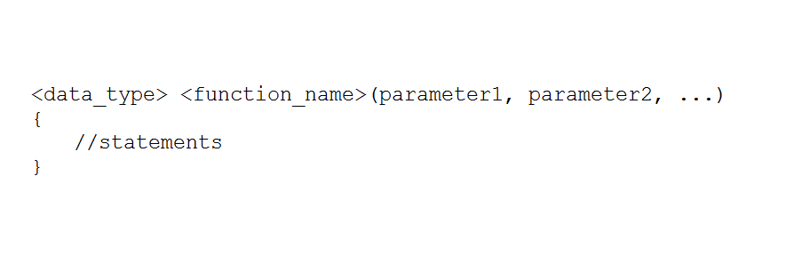
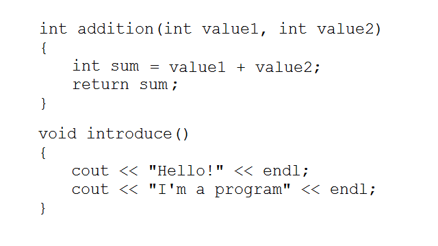

Chào các bạn học viên đang theo dõi khóa học lập trình trực tuyến ngôn ngữ C++.

Trong bài học hôm nay, chúng ta sẽ cùng tìm hiểu một chủ đề rất quan trọng đối với phần C++ cơ bản, đó chính là **Function** (có thể gọi là Hàm).

##
###Function (Hàm)

Có nhiều cách để nói về khái niệm **function** khác nhau.

>Function là một đoạn các câu lệnh có thể tái sử dụng. Function cho phép lập trình viên cấu trúc chương trình thành những phân đoạn khác nhau để thực hiện những công việc khác nhau.

Các bạn đã từng sử dụng **function** (hàm) trong những bài học trước. Những hàm tính toán toán học trong thư viện **cmath**, những hàm xử lý **C-style string** thuộc thư viện **cstring**, hay thậm chí là hàm **main** mà các bạn đã nghe nói đến ở phần đầu của khóa học này.

**Function** (hàm) được người ta ví như một cái hộp đen, các bạn không biết bên trong nó là gì, nhưng nó có một đầu vào (input) và một đầu ra (output). Việc của các bạn khi sử dụng cái hộp đen này (thực hiện lời gọi hàm) là đưa những dữ liệu đầu vào tương thích vào đầu vào của nó, và nó sẽ cho bạn kết quả tại đầu ra.

Ví dụ:

	#include <cstring>
	//......
	char str[] = "This is a sample string";
	int length = strlen(str); //use strlen function

Mình hoàn toàn không biết bên trong hàm strlen gồm có những dòng lệnh gì, được thực hiện như thế nào, mà chỉ biết rằng hàm **strlen** có đầu vào là một chuỗi kí tự, đầu ra của nó là một giá trị đặc tả độ dài của chuỗi kí tự mình truyền vào.

Cứ mỗi lần các bạn sử dụng hàm trong một câu lệnh, chúng ta gọi đó là 1 lời gọi hàm (**function call**). Chúng ta có thể thực hiện gọi hàm nhiều lần trong một chương trình, ví dụ:

	char str1[] = "string 1";
	char str2[] = "string 2";

	if(strlen(str1) == strlen(str2))	{
		//do something
	}

Đây chính là khả năng tái sử dụng của hàm. Với một lần định nghĩa hàm, chúng ta có thể dùng nó nhiều lần (có thể với nhiều input khác nhau) tùy vào mục đích sử dụng.

###Khai báo (declare) và định nghĩa (define) function

Một **function** (hàm) được tạo ra từ những yếu tố sau:

- Kiểu trả về của hàm (data type of output).
- Tên hàm (function name).
- Danh sách tham số (function parameters).
- Khối lệnh (block of statements).



***Một hàm được định nghĩa thường nhằm để giải quyết một công việc nào đó (có thể thực hiện nhiều lần lặp đi lặp lại). Vì thế, tên hàm nên diễn đạt được tên công việc mà các bạn muốn máy tính thực hiện.***

- Hàm có thể có giá trị trả về hoặc không có giá trị trả về.
- Hàm bắt buộc phải có tên, quy tắc đặt tên giống với quy tắc đặt tên biến.
- Hàm có thể có 1 tham số, nhiều tham số hoặc không có tham số nào.
- Khối lệnh phía sau hàm chứa những dòng lệnh mà nó sẽ được thực hiện trong mỗi lần gọi hàm.

Ví dụ:



Mình vừa định nghĩa 2 hàm mẫu có tên là **addition** và **introduce**, trong đó:

- Hàm addition có kiểu trả về là **int**. Hàm introduce không có kiểu trả về (**void**).
- Hàm addition nhận 2 giá trị đầu vào là 2 số nguyên. Hàm introduce không cần giá trị đầu vào nào cả.
- Hàm addition có biến cục bộ tên là summary được khai báo bên trong khối lệnh. Hàm introduce không có biến nào được khai báo.
- Hàm addition tính tổng giá trị của 2 biến ở đầu vào, và return giá trị tổng bằng từ khóa **return**. Hàm introduce không có giá trị trả về nên chưa cần sử dụng từ khóa **return**.

***Các bạn cần đặt phần code định nghĩa các hàm nằm trên hàm main thì chúng ta mới có thể sử dụng chúng bên trong hàm main được. Cũng tương tự, nếu chúng ta gọi hàm A từ khối lệnh bên trong hàm B thì hàm A phải được định nghĩa bên trên hàm B.***

###Sử dụng hàm (do function call)

Cũng tương tự như cách các bạn sử dụng hàm của các thư viện có sẵn, nhưng chúng ta đã định nghĩa hàm **addition** và **introduce** bên trong file main.cpp nên chúng ta có thể gọi trực tiếp đến chúng mà không cần include thư viện nào khác.

	int addition(int value1, int value2)
	{
		int sumary = value1 + value2;
		return sumary;
	}

	void introduce()
	{
		cout << "Hello!" << endl;
		cout << "I'm a program" << endl;
	}

	int main()
	{
		introduce();

		int32_t i_value1 = 5;
		int32_t i_value2 = 7;
		int32_t sum = addition(i_value1, i_value2);

		cout << i_value1 << " + " << i_value2 << " = " << sum << endl;
		
		return 0;
	}

- Vì hàm **introduce** không có giá trị trả về nên chúng ta chỉ cần gọi tên của nó ra, và hàm **introduce** cũng không nhận giá trị đầu vào nào cả, nên chúng ta để trống bên trong cặp dấu ngoặc đứng sau lời gọi hàm.

- Đối với hàm **addition** nó sẽ có giá trị trả về là kiểu số nguyên, nên mình khai báo thêm biến **sum** bên trong hàm **main** để lưu trữ giá trị sau khi tính toán của hàm **addition**. Ngoài ra, hàm addition yêu cầu 2 giá trị số nguyên làm đầu vào, nên mình đưa biến ```i_value1``` và ```i_value2``` vào cặp dấu ngoặc phía sau tên hàm.

###Hoạt động bên trong lời gọi hàm

Mỗi hàm sẽ thực hiện một công việc mà lập trình viên định nghĩa cho chúng. Thông thường, một chương trình sẽ tạm thời gián đoạn một công việc đang được thực hiện để thực hiện công việc khác mà nó bắt buộc phải làm. Bạn có thể thấy điều này trong thực tế. Ví dụ, bạn đang đọc sách nhưng nhận được một cuộc gọi điện thoại từ người thân, bạn sẽ đánh dấu trang sách mà bạn đang đọc, thực hiện cuộc gọi, và trở lại đọc sách tại trang mà bạn đã đánh dấu.

Chương trình C++ làm việc tương tự như vậy. Chương trình đang thực hiện một chuỗi các câu lệnh bên trong khối lệnh hiện tại, đến khi 1 lời gọi hàm xuất hiện, nó nói với CPU tạm hoãn công việc trong khối lệnh hiện tại và chuyển đến thực thi hàm khác.

Sau khi thực hiện xong công việc bên trong hàm được gọi, CPU quay lại thực hiện các câu lệnh phía sau vị trí mà nó đã đánh dấu tại lời gọi hàm.


###Địa chỉ của hàm (function address)

Khi chạy chương trình, những hàm được định nghĩa khác nhau cũng được cấp phát cho những vùng nhớ khác nhau nằm đâu đó trong thiết bị lưu trữ của máy tính. Có chút gì đó tương tự với biến (**variable**) phải không các bạn?

Đối với biến (**variable**), hệ điều hành cung cấp vùng nhớ cho nó để lưu trữ giá trị. Đối với hàm (**function**), hệ điều hành cung cấp vùng nhớ cho nó để lưu trữ các đoạn mã lệnh.

- Khi thực hiện lời gọi biến thông qua tên biến, chương trình tìm đến vùng nhớ mà tên biến đó đang nắm giữ để truy xuất giá trị của biến.

- Khi thực hiện lời gọi hàm (function call) thông qua tên hàm, chương trình tạm gián đoạn công việc đang thực hiện, chuyển đến vùng nhớ mà hàm đó đang nắm giữ và thực hiện những mã lệnh trong vùng nhớ đó.

Mình sẽ cho các bạn xem địa chỉ của hàm addition và introduce trên máy tính của mình (kĩ thuật này mình sẽ nói đến trong các bài học tiếp theo):


Như các bạn thấy, hàm addition và introduce có 2 địa chỉ khác nhau trong bộ nhớ máy tính.

###Sử dụng từ khóa return

Từ khóa **return** được sử dụng trong 2 ngữ cảnh khác nhau:

- Đối với hàm không có giá trị trả về (hàm kiểu **void**):

	Đối với hàm kiểu **void**, từ khóa **return** chỉ có chức năng kết thúc công việc của hàm tại thời điểm sử dụng. Ví dụ:

		void doSomething()
		{
			return; //Terminates this function
			cout << "This line will not be displayed" << endl;
		}

	Khi gặp từ khóa return trong hàm, các dòng lệnh đứng sau nó sẽ không được thực thi vì chương trình lúc này đã thoát khỏi khối lệnh của hàm. Chúng ta có thể xác định một số trường hợp cụ thể dẫn tới việc kết thúc hàm bằng một vài cấu trúc điều kiện. Ví dụ:

		void getValueFromKeyboard()
		{
			int32_t value;
			cin >> value;
			if(value < 0)
				return;
			else
				cout << value << endl;
		}

- Đối với hàm có giá trị trả về (hàm kiểu khác **void**):
	
	Đối với hàm có kiểu trả về khác **void**, từ khóa **return** là bắt buộc phải có. Từ khóa **return** trong trường hợp này có chức năng kết thúc công việc của hàm và trả về kết quả (**output** của hàm), vì thế chúng ta cần có 1 giá trị (hoặc 1 biến) đi kèm với từ khóa **return**.

		int return5()
		{
			return 5;
			cout << "The end of the function" << endl;
		}

	Lấy ví dụ như hàm **return5** ở trên, một khi hàm này được gọi từ khối lệnh khác, giá trị 5 sẽ được trả về. Dòng lệnh đứng sau câu lệnh **return** sẽ không được thực thi.

###Hàm main

Đã đến lúc chúng ta nhìn lại hàm **main** mà chúng ta vẫn khai báo hằng ngày để xem nó hoạt động thật sự như thế nào.

Khi chương trình C++ được thực thi, hệ điều hành thực hiện 1 lời gọi hàm đến địa chỉ của hàm **main**, và những mã lệnh bên trong hàm **main** được thực thi lần lượt từ trên xuống dưới. Cuối cùng, hàm main **return** 1 giá trị số nguyên (thường là 0) trở lại cho hệ điều hành. Đây là lý do hàm **main** được định nghĩa là ```int main() {  }```.

Tại sao hệ điều hành cần lấy được giá trị trả về của hàm **main**? Giá trị trả về của hàm **main** được gọi là **status code**, nó thông báo với hệ điều hành rằng chương trình có được thực hiện thành công hay không. Lập trình viên chúng ta thường quy ước rằng giá trị 0 nghĩa là thành công, giá trị âm nghĩa là có lỗi xảy ra trong chương trình.

Chúng ta có thể xem được **status code** sau khi debug chương trình bằng Visual studio 2015.


Việc sử dụng từ khóa **return** trong vòng lặp **for** đã giúp mình biết rằng có vấn đề xảy ra bên trong đoạn lệnh đó, như thế mình có thể sửa lỗi dễ dàng hơn.

###Thử định nghĩa lại một số hàm toán học thông dụng

Bây giờ chúng ta cùng thử định nghĩa lại một số hàm cơ bản trong thư viện **cmath** mà các bạn đã được học trong các bài học trước.

*(Mình làm điều này chỉ để giúp các bạn hiểu hơn về cách khai báo, định nghĩa, và sử dụng hàm cơ bản. Bài học này chỉ giúp các bạn có cái nhìn đầu tiên về hàm (function) trong C++, mình sẽ làm rõ các phần chi tiết về hàm trong những bài học tiếp theo).*

- Hàm **pow:**

	Hàm **pow** trong thư viện **cmath** giúp chúng ta tính lũy thừa của một cơ số (base) với số mũ (exponential) cho trước. Các bạn tính lũy thừa không sử dụng công cụ hổ trợ tính toán như thế nào? Cách chúng ta thường sử dụng là nhân exponential lần giá trị base lại với nhau.

		float myPow(float base, int32_t exponential)
		{
			float result = 1;
			//calculate power of base
			for(int32_t i = 1; i <= exponential; i++)
				result *= base;

			return result;
		}

	Trong thân hàm, mình sử dụng biến result để lưu trữ giá trị tính toán, sau khi thực hiện trả về giá trị lũy thừa đã tính, biến result sẽ bị hủy và kết thúc công việc của hàm **myPow**.

- Hàm **abs:**

	Tương tự đối với hàm **abs** trong thư viện **cmath**, hàm này sẽ trả về giá trị là giá trị tuyệt đối của một giá trị đầu vào. Vì thế, hàm này sẽ có kiểu dữ liệu trả về khác kiểu **void**.

		float myAbs(float value)
		{
			if(value < 0)
				return -value;
			else
				return value;
		}

Như vậy chúng ta đã có một số hàm cơ bản như tính lũy thừa, tính giá trị tuyệt đối, chúng ta có thể gọi trực tiếp hàm **myPow** hoặc **myAbs** mà không cần phải thực hiện include thư viện **cmath** vào nữa.

***Tuy nhiên, mình không khuyên các bạn làm lại những thứ đã có sẵn.***

##
###Tổng kết

**Function** (hàm) là một khái niệm quan trọng giúp các bạn thiết kế chương trình một cách đơn giản hơn. Trong bài này, chúng ta chỉ mới có cái nhìn đầu tiên về cách khai báo, định nghĩa và sử dụng hàm. Mình sẽ hướng dẫn các bạn cách tổ chức chương trình với các hàm một cách cụ thể trong các bài học tiếp theo.

**Hẹn gặp lại các bạn trong bài học tiếp theo trong khóa học lập trình C++ hướng thực hành.**

Mọi ý kiến đóng góp hoặc thắc mắc có thể đặt câu hỏi trực tiếp tại diễn đàn.

[www.daynhauhoc.com](www.daynhauhoc.com "DayNhauHoc")