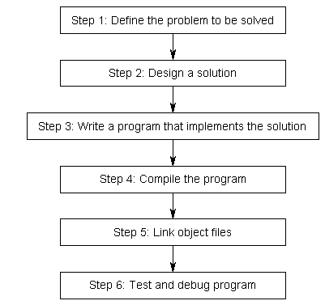
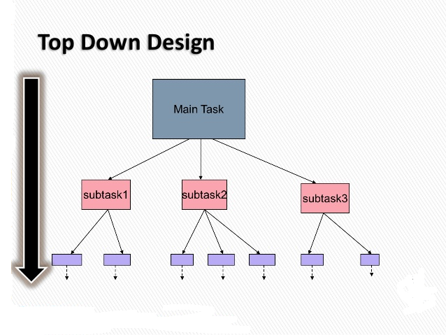

Chào tất cả các bạn học viên đang cùng đồng hành trong khóa học lập trình trực tuyến ngôn ngữ C++.

Trong bài học trước, chúng ta cùng tìm hiểu khái niệm và cách sử dụng **Function** (Hàm) trong C++. Hàm đóng vai trò như là một chương trình con bên trong một chương trình lớn. Khái niệm hàm được đề ra dựa trên tư tưởng "chia để trị" (**divide to conquer**).

Ví dụ: Trường đại học có rất nhiều ban ngành khác nhau, ban giám hiệu nhà trường không thể quản lý và nắm rõ tình hình của tất cả các ban ngành được. Vì thế, nhà trường đã phân thành các khoa riêng biệt, mỗi khoa có 1 người làm trưởng khoa sẽ tổ chức và quản lý giảng viên và sinh viên của khoa đó. Mỗi khoa lại có nhiều bộ môn khác nhau, vậy là lại có thêm những người làm tổ trưởng tổ bộ môn sẽ giúp trưởng khoa quản lý ở phạm vi nhỏ hơn.

Vậy là khi ban giám hiệu nhà trường cần báo cáo chi tiết tình hình học tập của sinh viên trong toàn trường, ban giám hiệu chỉ cần yêu cầu các trưởng khoa gửi về báo cáo của từng khoa. Lúc này, các trưởng khoa lại yêu cầu xuống các cấp bậc nhỏ hơn như các tổ trưởng tổ bộ môn làm báo cáo tình hình học tập của sinh viên trong từng bộ môn. 

Ví dụ trên là điển hình cho tư tưởng "chia để trị". Đối với việc thiết kế và phát triển một chương trình, ứng dụng phần mềm cũng tương tự như vậy. Một phần mềm được thiết kế nhằm giải quyết một vấn đề thực tế nào đó, nhưng khi gặp vấn đề quá lớn, lập trình viên cần tách các công việc cụ thể ra để giao cho các chương trình con giải quyết.

Chúng ta cùng nhìn lại các bước thiết kế và phát triển ứng dụng phần mềm:



(Nguồn: www.learncpp.com)

***Việc xác định vấn đề (bước 1) và thiết kế giải pháp (bước 2) sẽ quyết định phần lớn đến mức độ thành công của sản phẩm.***

###Thiết kế chương trình

#####Xác định vấn đề

Mình lấy ví dụ có một khách hàng cần chúng ta làm ra một ứng dụng tạo báo cáo thống kê cho cửa hàng của họ.

Từ đây, chúng ta cần chú ý đến một vài điểm:

- Đối tượng khách hàng sẽ sử dụng sản phẩm là ai.
- Xác định kiến trúc hệ điều hành mà khách hàng sử dụng.
- Xác định bạn sẽ làm ứng dụng một mình hay làm cùng team.
- Thu thập yêu cầu của khách hàng.
- Lập ra chiến lược kiểm thử, phản hồi, phát hành sản phẩm.
- Xác định cách mà bạn sẽ bảo trì code.

Nhưng chúng ta đang là những lập trình viên đang trong quá trình học tập, vì thế câu trả lời cho toàn bộ những điểm trên là: Bạn sẽ viết ứng dụng này một mình, sử dụng hệ điều hành mà bạn đang sử dụng, với IDE mà bạn quen thuộc nhất, và chỉ có bạn được sử dụng code mà bạn đã viết.

#####Chia nhỏ vấn đề lớn thành các vấn đề đơn giản hơn

Trong thực tế, việc giải quyết một công việc phức tạp tại một thời điểm là rất khó khăn. Chúng ta thường chia nhỏ các công việc ra để thực hiện rồi lấy kết quả của từng phần công việc nhỏ hợp lại thành sản phẩm cuối cùng. 

Đây là đặc trưng của hướng tiếp cận **top-down** khi giải quyết một vấn đề.



Áp dụng phương pháp tiếp cận **top-down** cho vấn đề đã được đặt ra:

- Ứng dụng lập báo cáo thống kê:

	- Thu thập dữ liệu bán hàng trong tháng vừa qua.
	- Áp dụng các công thức trong thống kê vào ứng dụng.
	- Lập bảng, vẽ biểu đồ từ kết quả thống kê.
	- Kết nối đến máy in và in kết quả.

Từ những công việc trên, chúng ta lại tiếp tục chia nhỏ chúng ra, ví dụ:

- Thu thập dữ liệu bán hàng trong tháng vừa qua.
	
	-	Tính doanh thu cho mỗi sản phẩm được bán trong ngày.
	-	Tính tổng doanh thu trong ngày.
	-	Lưu trữ các số liệu trong ngày.
	

----------

	
- Áp dụng các công thức trong thống kê vào ứng dụng.

	- Tính tổng doanh thu.
	- So sánh doanh thu tháng này với các tháng còn lại.
	- Thống kê mặt hàng nào được ưa chuộng nhất.

----------


- Lập bảng, vẽ biểu đồ từ kết quả thống kê.

	- Đưa dữ liệu đã thống kê vào bảng.
	- Vẽ biểu đồ từ dữ liệu trong bảng.

----------


- Kết nối đến máy in và in kết quả.

	- Kiểm tra kết nối giữa máy tính và máy in.
	- Truyền dữ liệu từ máy tính đến máy in.
	- In báo cáo.


----------

Sau khi chia nhỏ vấn đề thành các task nhỏ, việc còn lại sẽ là chuyển các task nhỏ đó thành các chương trình con trong phần mềm sản phẩm.

Trên đây chỉ là ví dụ minh họa cho việc áp dụng phương pháp tiếp cận **top-down** vào việc thiết kế chương trình. Trên thực tế, ứng dụng phần mềm thống kê là một vấn đề lớn, cần sự cộng tác của nhiều người.

###Áp dụng phương pháp tiếp cận top-down vào chương trình C++

Với phương pháp tiếp cận **top-down** chúng ta sẽ đưa mỗi task nhỏ vào một hàm để xử lý. Ví dụ chúng ta có một chuỗi các công việc cần thực hiện trong mỗi buổi sáng như sau:

- Wake up
- Get out of bed
- Eat breakfast
- Brush the teeth
- Drive to work
- Working

Vậy thì chúng ta sẽ định nghĩa những hàm con tương ứng với từng công việc cần thực hiện ở trên, và khi buổi sáng đến, chúng ta chỉ việc gọi lại các hàm này theo thứ tự nào đó, và chúng ta sẽ hoàn thành công việc cho một buổi sáng.

	//Execute this program every morning
	int main()
	{
		wakeUp();
		getOutOfBed();
		eatBreakfast();
		brushTheTeeth();
		driveToWork();
		working();

		return 0;
	}

###Làm một chương trình Calculator cơ bản trên console

Đầu tiên, mình sẽ tạo sẵn cho các bạn một khung chương trình bên trong hàm **main**:

	int main()
	{
		int choice;
	
		do
		{
			cout << "__________________Program list__________________" << endl;
			cout << "(1) - Calculator" << endl;
			cout << "(2) - Other program" << endl;
			cout << "(0) - Exit" << endl;
			cout << "Enter your choice: "; cin >> choice;
			cout << "________________________________________________" << endl;
	
			switch (choice)
			{
			case 1:
				calculator();
				break;
	
			case 2:
				otherProgram();
				break;
	
			default:
				//This case means that you enter wrong number
				break;
			}
	
			system("cls"); //clear the console
		} while (choice != 0);
	
		system("pause");
		return 0;
	}

Khi chạy chương trình này, chúng ta sẽ có được một menu gồm các chương trình tiện ích mà chúng ta sẽ định nghĩa chúng. Người dùng sẽ được phép chọn 1 trong số những chương trình mà menu đưa ra thông qua bàn phím. Trong ví dụ này, khi người dùng lựa chọn chương trình số 1, họ có thể sử dụng **Simple Calculator program**. Lựa chọn số 2 chúng ta chưa định nghĩa, vì thế, chúng ta viết cho trường hợp số 2 như sau:

	void otherProgram()
	{
		cout << "This program is under construction" << endl;
		system("pause");
	}

Đặt lời gọi hàm **otherProgram()** vào case 2 trong cấu trúc rẽ nhánh **switch**, và mỗi khi người dùng chọn số 2, hệ thống sẽ đưa ra thông báo ***"This program is under construction"***.

Trọng tâm của mục này là hướng dẫn các bạn thiết kế một **Simple Calculator** program cho lựa chọn số 1. Chúng ta phải xác định sẽ định nghĩa hàm ```void calculator()``` như thế nào.

	void calculator()
	{
		
	}

Để làm được điều này, chúng ta hãy cùng phân tích và thiết kế giải pháp dựa vào phương pháp **top-down** như mình đã trình bày ở trên.


----------


Đầu tiên, một chương trình tính toán cơ bản phải giải quyết được các phép toán cộng (+), trừ (-), nhân (*), chia (/), ... cơ bản. Chúng ta sẽ định nghĩa một số hàm thực hiện các phép tính cơ bản trên có trả về kết quả.

	float addition(float value1, float value2)
	{
		return value1 + value2;
	}
	
	float subtraction(float value1, float value2)
	{
		return value1 - value2;
	}
	
	float multiplication(float value1, float value2)
	{
		return value1 * value2;
	}
	
	float division(float value1, float value2)
	{
		return value1 / value2;
	}


----------

Mình sẽ thêm vào một số phép toán khác như **sin**, **cos** để xuất hiện một chút khó khăn trong quá trình thiết kế chương trình.

	//include cmath library

	float Sin(float angle)
	{
		return sin(angle);
	}
	
	float Cos(float angle)
	{
		return cos(angle);
	}


----------

Việc tiếp theo chúng ta cần quan tâm là nhận dữ liệu đầu vào như thế nào. Chúng ta phải dựa trên loại toán tử (hoặc phép tính) để lấy số lượng đầu vào thích hợp.

Ví dụ khi người dùng nhập vào toán tử +, -, * hoặc /, chúng ta sẽ cần 2 giá trị đầu vào để làm đầu vào cho các hàm **addition**, **subtraction**, **multiplication** hoặc **division**. Nhưng khi người dùng muốn tính các giá trị lượng giác như **sin** hoặc **cos**, chúng ta chỉ tiếp nhận 1 giá trị đầu vào để đưa vào hàm **Sin** hoặc **Cos** để tính.

Đó là lý do mình sử dụng mảng 1 chiều kiểu **string** làm biến toàn cục để lưu trữ dãy các toán tử.

	string operation[] = { "+", "-", "*", "/", "sin", "cos" };

Khi người dùng nhập toán tử từ bàn phím, mình sẽ lấy toán tử đó so sánh lần lượt với các phần tử trong mảng operation, từ đó nhận vào số lượng giá trị đầu vào thích hợp.

Với mỗi lần nhận giá trị đầu vào, chúng ta sẽ gọi hàm **getUserInput** 1 lần.

	float getUserInput()
	{
		cout << "Enter a value: ";
		float value;
		cin >> value;
	
		return value;
	}

Cũng tương tự cho việc nhận toán tử, chúng ta có hàm **getOperation**

	string getOperation()
	{
		cout << "Enter operation: ";
		string op;
		cin >> op;
	
		return op;
	}

Hàm đảm nhiệm công việc so sánh toán tử sẽ trả về -1 khi không có toán tử nào tương tự bên trong mảng operation:

	int compareOperation(string op)
	{
		for (int i = 0; i < operationSize; i++)
		{
			if (op == operation[i])
				return i;
		}
		return -1;
	}


----------

Sau khi tất cả các hàm con cần thiết cho việc tính toán và nhận input, việc còn lại chúng ta làm định nghĩa hàm **calculator** mà chúng ta sẽ gọi bên trong hàm **main**.
	
Để quyết định xem có bao nhiêu giá trị sẽ được nhận vào từ bàn phím, chúng ta phải yêu cầu người dùng nhập trước toán tử. Sử dụng toán tử vừa nhập để so sánh với các phần tử bên trong mảng một chiều toàn cục **operation** để xác định hàm tính toán nào sẽ được gọi.

	void printResult(float result)
	{
		cout << "Result: " << result << endl;
	}
	
	void calculator()
	{
		float value1, float value2;
		float result;
	
		string op = getOperation();
	
		int indexOp = compareOperation(op);
		switch (indexOp)
		{
		case 0:
			value1 = getUserInput();
			value2 = getUserInput();
			result = addition(value1, value2);
			break;
		
		case 1:
			value1 = getUserInput();
			value2 = getUserInput();
			result = subtraction(value1, value2);
			break;
		
		case 2:
			value1 = getUserInput();
			value2 = getUserInput();
			result = multiplication(value1, value2);
			break;
		
		case 3:
			value1 = getUserInput();
			value2 = getUserInput();
			result = division(value1, value2);
			break;
		
		case 4:
			value1 = getUserInput();
			result = Sin(value1);
			break;
		
		case 5:
			value1 = getUserInput();
			result = Cos(value1);
			break;
	
		default:
			cout << "This operation is not defined yet!" << endl;
			system("pause");
			return;
		}
	
		printResult(result);
		system("pause");
	}

Trong trường hợp người dùng nhập vào toán tử chưa được định nghĩa (chưa có trong mảng toàn cục **operation**) thì hàm **calculator** sẽ được kết thúc bằng lệnh **return** sau từ khóa **default**.

----------

Vậy là chúng ta đã có thể kết hợp các hàm chúng ta vừa viết thành một chương trình **calculator** hoàn chỉnh (mặc dù vẫn còn khá đơn giản). Từ khối lệnh của hàm **calculator**, chúng ta sẽ thực hiện gọi các hàm có liên quan phục vụ cho quá trình tính toán.

Dưới đây là toàn bộ mã nguồn của chương trình mình vừa viết cùng các bạn:

	#include <iostream>
	#include <cmath>
	#include <string>
	using namespace std;
	
	string operation[] = { "+", "-", "*", "/", "sin", "cos" };
	int operationSize = 6;
	
	float addition(float value1, float value2)
	{
		return value1 + value2;
	}
	
	float subtraction(float value1, float value2)
	{
		return value1 - value2;
	}
	
	float multiplication(float value1, float value2)
	{
		return value1 * value2;
	}
	
	float division(float value1, float value2)
	{
		return value1 / value2;
	}
	
	float Sin(float angle)
	{
		return sin(angle);
	}
	
	float Cos(float angle)
	{
		return cos(angle);
	}
	
	float getUserInput()
	{
		cout << "Enter a value: ";
		float value;
		cin >> value;
	
		return value;
	}
	
	string getOperation()
	{
		cout << "Enter operation: ";
		string op;
		cin >> op;
	
		return op;
	}
	
	int compareOperation(string op)
	{
		for (int i = 0; i < operationSize; i++)
		{
			if (op == operation[i])
				return i;
		}
		return -1;
	}
	
	void printResult(float result)
	{
		cout << "Result: " << result << endl;
	}
	
	void calculator()
	{
		float value1, value2;
		float result;
	
		string op = getOperation();
	
		int indexOp = compareOperation(op);
		switch (indexOp)
		{
		case 0:
			value1 = getUserInput();
			value2 = getUserInput();
			result = addition(value1, value2);
			break;
		
		case 1:
			value1 = getUserInput();
			value2 = getUserInput();
			result = subtraction(value1, value2);
			break;
		
		case 2:
			value1 = getUserInput();
			value2 = getUserInput();
			result = multiplication(value1, value2);
			break;
		
		case 3:
			value1 = getUserInput();
			value2 = getUserInput();
			result = division(value1, value2);
			break;
		
		case 4:
			value1 = getUserInput();
			result = Sin(value1);
			break;
		
		case 5:
			value1 = getUserInput();
			result = Cos(value1);
			break;
	
		default:
			cout << "This operation is not defined yet!" << endl;
			system("pause");
			return;
		}
	
		printResult(result);
		system("pause");
	}
	
	void otherProgram()
	{
		cout << "This program is under construction" << endl;
		system("pause");
	}
	
	int main()
	{
		
		int choice;
	
		do
		{
			cout << "__________________Program list__________________" << endl;
			cout << "(1) - Calculator" << endl;
			cout << "(2) - Other program" << endl;
			cout << "(0) - Exit" << endl;
			cout << "Enter your choice: "; cin >> choice;
			cout << "________________________________________________" << endl;
	
			switch (choice)
			{
			case 1:
				calculator();
				break;
	
			case 2:
				otherProgram();
				break;
	
			default:
				break;
			}
	
			system("cls"); //clear the console
		} while (choice != 0);
	
		system("pause");
		return 0;
	}


----------

**Một vài lời khuyên trong việc thiết kế chương trình:**

- Đừng cố gắng code tất cả mọi thứ ở cùng một thời điểm, và đừng chia nhỏ sự tập trung của bạn cho nhiều task khác nhau. Tập trung vào 1 task tại một thời điểm nhất định có thể giúp bạn tránh được một số nhầm lẫn hoặc thiếu sót chi tiết.

- Những lập trình viên mới thường có suy nghĩ viết xong toàn bộ chương trình rồi mới thực hiện biên dịch. Điều này khiến bạn dễ phát sinh hàng trăm lỗi trong chương trình. Vì thế, cứ mỗi lần viết hoàn thiện một chức năng nhỏ nào đó trong chương trình, hãy thực hiên biên dịch để sửa lỗi ngay lập tức. Nó sẽ khiến bạn tốn nhiều thời gian không trong việc viết code, nhưng sẽ giảm lượng thời gian sửa lỗi đi đáng kể.

- **Giữ chương trình của bạn luôn luôn đơn giản.** Thông thường, những lập trình viên mới thường có cái nhìn tổng thể vào một vấn đề cần giải quyết. Ví dụ: *"tôi muốn viết một trò chơi nhập vai 3D với những con quái vật được sinh ra ngẫu nhiên trong thành phố".* Nếu bạn cố gắng viết một thứ gì đó phức tạp ngay lúc bắt đầu, bạn sẽ dễ bị chán nản và từ bỏ. Thay vào đó, làm cho mục tiêu ban đầu của bạn đơn giản hơn, ví dụ: *"tôi muốn làm cho nhân vật chính trong trò chơi có thể di chuyển"*.

##
###Tổng kết

Phương pháp tiếp cận **top-down** là một trong những hướng tiếp cận khá phổ biến trong việc lập trình C++. Hi vọng qua bài học này, các bạn đã có thể tự mình thiết kế những chương trình đơn giản bằng cách chia nhỏ lượng công việc và đưa chúng vào các hàm con để dễ xử lý hơn.

###Bài tập cơ bản

1/ Cũng với ví dụ mẫu về chương trình Calculator mình vừa làm ở trên, các bạn hãy thử thêm vào một số phép toán khác, ví dụ phép toán lũy thừa, căn bậc 2, ...

2/ Viết chương trình chuẩn hóa **C-style string** theo các quy tắc sau:

- String không được có kí tự khoảng trắng ở 2 đầu.
- Mỗi từ trong string cách nhau bởi 1 kí tự khoảng trắng.
- Chữ cái đầu tiên của mỗi từ phải được viết in hoa, các chữ cái còn lại viết dạng in thường.

Ví dụ:

- Input: ```"  le  Tran  dat  "```
- Output: ```"Le Tran Dat"``` 

**Hẹn gặp lại các bạn trong bài học tiếp theo trong khóa học lập trình C++ hướng thực hành.**

Mọi ý kiến đóng góp hoặc thắc mắc có thể đặt câu hỏi trực tiếp tại diễn đàn.

[www.daynhauhoc.com](www.daynhauhoc.com "DayNhauHoc")