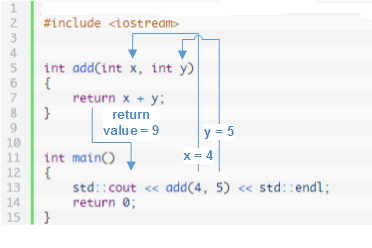
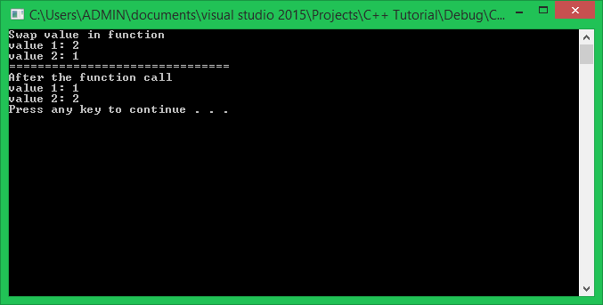
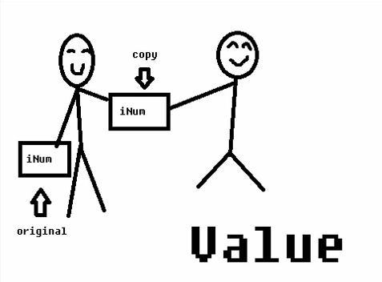
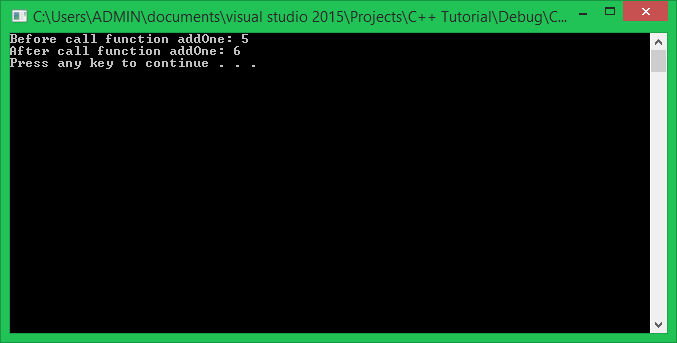

Chào các bạn! Rất vui khi được gặp lại các bạn trong khóa học lập trình trực tuyển ngôn ngữ C++.

Trong bài học ngày hôm nay, chúng ta sẽ tìm hiểu về một số cách khác nhau để truyền đối số vào hàm. Như thế nào gọi là đối số?

Ví dụ mình định nghĩa một hàm như sau:

	void foo(int param1, int param2) //param1 and param2 are parameters
	{
		//do something
	}

Như vậy, chúng ta có **param1** và **param2** là 2 tham số (parameters) của hàm **foo**.

>Tham số của hàm là những biến được khai báo trong việc khai báo hàm. Tham số đóng vai trò tiếp nhận giá trị đầu vào cho hàm mỗi khi hàm được gọi.

Giả sử trong hàm **main** mình thực hiện gọi hàm **foo**:

	int main()
	{
		foo(1, 2); //1 and 2 are arguments
		return 0;
	}

Như vậy, chúng ta có **1** và **2** là 2 đối số (arguments). Khi đó, giá trị **1** và **2** sẽ được tiếp nhận và lưu trữ tạm thời trong 2 tham số **param1** và **param2**.

>Đối số là giá trị được truyền vào hàm mỗi khi thực hiện lời gọi hàm. Đối số phải có kiểu dữ liệu phù hợp với tham số của hàm.

Ngôn ngữ C++ hổ trợ cho chúng ta nhiều kiểu truyền đối số khác nhau tương ứng với mỗi kiểu khai báo tham số khác nhau:

- Truyền đối số là giá trị.
- Truyền đối số là tham chiếu.
- Truyền đối số là địa chỉ.

Trong bài này, chúng ta sẽ tìm hiểu 2 kiểu truyền đối số cơ bản: truyền giá trị và truyền tham chiếu.

##
###Truyền đối số là giá trị (pass arguments by value)

Truyền đối số vào hàm là giá trị có nghĩa là chúng ta sẽ đưa giá trị vào hàm và các tham số sẽ tiếp nhận những giá trị được truyền vào.

Ví dụ:

	int add(int x, int y)
	{
		return x + y;
	}

Hàm add trên sẽ hoạt động như sau:

Với lời gọi hàm **add(4,5)** thì giá trị 4 sẽ truyền vào cho biến **x** của tham số đầu tiên, giá trị 5 sẽ được gán cho biến **y** của tham số thứ hai.

Biến **x** và **y** được khai báo làm tham số của hàm **add** đóng vai trò như là biến cục bộ hoạt động bên trong hàm **add**. Vì thế, tại thời điểm kết thúc phiên làm việc của hàm, các biến tham số này sẽ bị hủy và những giá trị được truyền vào không còn tồn tại.

#####Điều gì xảy ra khi truyền đối số cho hàm là giá trị của một biến (variable)?

Ở ví dụ trên, hàm **add** được truyền vào 2 giá trị xác định là 4 và 5. Bây giờ mình thử lấy ví dụ khi truyền đối số cho hàm là giá trị của biến như sau:

	void swapValue(int value1, int value2)
	{
		cout << "Swap value in function" << endl;

		int temp = value1;
		value1   = value2;
		value2   = temp;

		cout << "value 1: " << value1 << endl;
		cout << "value 2: " << value2 << endl;
	}

Hàm **swapValue** mình vừa định nghĩa được khai báo 2 tham số kiểu **int**, chúng sẽ tiếp nhận 2 giá trị số nguyên và thực hiện hoán vị giá trị của 2 số nguyên này bên trong hàm.

Các bạn cùng xem điều gì xảy ra khi thực hiện lời gọi hàm **swapValue**:

	int main()
	{
		int a = 1;
		int b = 2;
		swapValue(a, b);

		cout << "===============================" << endl;
		cout << "After the function call" << endl;
		cout << "value 1: " << a << endl;
		cout << "value 2: " << b << endl;

		system("pause");
		return 0;
	}

Đối số được truyền vào cho hàm **swapValue** lần lượt là giá trị của biến **a** và giá trị của biến **b** sẽ được tiếp nhận bởi tham số **value1** và **value2**. Chúng ta sẽ có kết quả trên màn hình là giá trị của 2 biến **a** và **b** sau khi thực hiện hoán vị bên trong hàm, và giá trị của 2 biến **a** và **b** sau khi thực hiện lời gọi hàm **swapValue**.

Như các bạn cũng đã thấy, giá trị của 2 biến **value1** và **value2** (nhận được từ đối số là giá trị của biến **a** và **b**) đã bị hoán vị cho nhau. Nhưng sau khi thực hiện xong công việc bên trong hàm **swapValue** và trở lại thực hiện công việc còn lại bên trong hàm **main**, giá trị của 2 biến **a** và **b** vẫn không có gì thay đổi.

Điều này có nghĩa cái mà tham số **value1** và **value2** tiếp nhận chỉ là 2 bản sao giá trị của biến **a** và **b**.

Mọi thay đổi giá trị của tham số bên trong hàm không tác động gì đến giá trị gốc mà đối số đang nắm giữ. Thử nghiệm với ví dụ sau:

	void printAddressOfParameter(int parameter)
	{
		cout << "Address of argument: " << &parameter << endl;
	}

	int main()
	{
		int argument;
		cout << "Address of argument: " << &argument << endl;
		printAddressOfParameter(argument);
	
		system("pause");
		return 0;
	}

Khi chạy đoạn chương trình này, các bạn sẽ thấy địa chỉ của biến **argument** và địa chỉ của tham số **parameter** trong hàm hoàn toàn khác biệt.

###Truyền đối số cho hàm là tham chiếu (pass argument by reference)

Cách hoạt động của hàm nhận đầu vào (**input**) là giá trị khá dễ hiểu và dễ cài đặt, nhưng nó có một số hạn chế như sau:

- Khi truyền đối số cho hàm là giá trị, cách duy nhất để có được đầu ra (**output**) là trả về giá trị thông qua từ khóa return.

- Khi truyền đối số cho hàm là giá trị, hảm chỉ có thể trả về 1 giá trị duy nhất tại 1 lần gọi hàm (nếu hàm có kiểu trả về).

Thử lấy ví dụ để thấy rõ 2 vấn đề trên:

	int addOne(int value)
	{
		return value + 1;
	}

Mình vừa định nghĩa một hàm có chức năng cộng thêm vào đối số 1 đơn vị. Cách duy nhất mình nhận được giá trị đầu ra của hàm này là định nghĩa hàm có kiểu trả về và sử dụng từ khóa **return**.

	int main()
	{
		int number = 9;
		number = addOne(number); //function call

		system("pause");
		return 0;
	}

Vì thế, nếu mình muốn lấy được giá trị đầu ra của hàm **addOne**, mình phải sử dụng phép gán giá trị trả về của hàm cho biến mà mình làm đối số.

***Thực hiện truyền đối số cho hàm là tham chiếu (pass argument by reference) sẽ giúp chúng ta khắc phục 2 nhược điểm trên.***

#####Nhắc lại khái niệm tham chiếu (reference)

>Một biến tham chiếu (**reference variable**) được xem như một cái tên khác (**nickname** or **alias name**) của một biến khác có cùng kiểu dữ liệu. Sau khi biến tham chiếu được khai báo và khởi tạo, nó sử dụng chung vùng nhớ với biến mà nó tham chiếu đến.

Chúng ta sử dụng toán tử một ngôi & để khai báo biến tham chiếu:

	int number = 5;
	int &reference = number;

	reference = 10; //change value of number variable through its reference
	cout << number << endl;

Khi một trong hai biến bị hủy (biến tham chiếu hay biến gốc bị hủy do ra khỏi khối lệnh mà nó được khai báo), vùng nhớ mà 2 biến này kiểm soát vẫn chưa bị hủy nếu còn ít nhất 1 biến quản lý nó, cái bị hủy sẽ chỉ là tên biến.

	int main()
	{
	    int n = 0;
	    int &ref = n;
	    
	    {
	        int n2 = 5;
	        ref = n2;
	    }
	    
	    cout << ref << endl;
	    return 0;
	}

Như ví dụ này, biến **ref** tham chiếu đến biến **n2** trong khối lệnh con của hàm **main**, khi ra khỏi khối lệnh con, biến **n2** bị hủy nhưng vùng nhớ được cấp phát cho nó vẫn còn và vẫn đang được biến **ref** quản lý.

***Cách hoạt động của biến tham chiếu cũng tương tự như việc định nghĩa hàm có tham số là biến tham chiếu.***

#####Truyền đối số cho hàm là tham chiếu (pass argument by reference)

Để truyền đối số cho hàm là tham chiếu, chúng ta đơn giản thêm vào toán tử & lúc khai báo tham số cho hàm.

	void addOne(int &value)
	{
		value++;
	}

Lấy lại ví dụ hàm **addOne** nhưng với cách khai báo tham số là tham chiếu. Lúc này, tại thời điểm gọi hàm **addOne**, chương trình sẽ không tạo ra một vùng nhớ riêng để nhận giá trị của đối số nữa, mà nó sẽ tạo ra một biến tham chiếu và tham chiếu trực tiếp đến vùng nhớ của đối số.

Chúng ta cùng xem kết quả của lời gọi hàm **addOne** khi truyền đối số là tham chiếu.

Kết quả là giá trị của đối số đã được tăng lên 1 đơn vị. Tại thời điểm gọi hàm **addOne**, một tham chiếu được tạo ra để tham chiếu đến vùng nhớ của đối số. Sau khi ra khỏi hàm, biến tham chiếu bị hủy, nhưng như mình đã nói ở trên, vẫn còn một biến (được dùng làm đối số) đang quản lý vùng nhớ đó nên chỉ có tên của biến tham chiếu bị hủy.

Như các bạn thấy, mình đã định nghĩa lại hàm **addOne** thành hàm không có kiểu trả về, vì giá trị đầu ra của mình đã được trả về bằng chính đối số được truyền vào. Lợi dụng đặc điểm này, chúng ta có thể trả về cùng lúc nhiều giá trị chỉ với 1 lần gọi hàm.

#####Trả về nhiều giá trị thông qua nhiều tham số

Thỉnh thoảng, chúng ta cần 1 hàm trả về nhiều giá trị trong khi sử dụng từ khóa return chỉ trả về được 1 giá trị, đó là lúc chúng ta sử dụng biến tham chiếu làm tham số cho hàm.

	void getSinCos(float degrees, float &sinOut, float &cosOut)
	{
		float radian = degrees * PI / 180.0;
	
		sinOut = sin(radian);
		cosOut = cos(radian);
	}

Hàm getSinCos nhận giá trị đầu vào đầu tiên là giá trị, trả về 2 giá trị đầu ra thông qua 2 biến tham chiếu.

	int main()
	{
		float degrees = 180.0, Sin, Cos;
		getSinCos(degrees, Sin, Cos);
	
		cout << "sin = " << Sin << endl;
		cout << "cos = " << Cos << endl;
	
		system("pause");
		return 0;
	}

##
###Tổng kết

**Truyền đối số vào hàm là giá trị**

- Ưu điểm:

	+ Giá trị làm đối số có thể là 1 giá trị xác định, giá trị của biến, biểu thức, ...
	+ Đối số truyền vào hàm sẽ không bị hàm tác động trực tiếp đến, đảm bảo an toàn dữ liệu khi sử dụng hàm.

- Nhược điểm:

	+ Chương trình tạo ra những bản sao giá trị gây tốn thêm vùng nhớ sử dụng.
	+ Cách duy nhất để lấy được đầu ra (**output**) là thông qua từ khóa return với hàm có kiểu trả về.
	+ Không thể truyền mảng một chiều vào hàm bằng giá trị.

**Truyền đối số vào hàm là tham chiếu**

- Ưu điểm:

	+ Cho phép thay đổi giá trị của đối số.
	+ Chương trình không tạo bản sao giá trị của đối số nên tiết kiệm bộ nhớ và hoạt động nhanh hơn.
	+ Có thể trả về nhiều giá trị trong một lần gọi hàm.

- Nhược điểm:

	+ Sử dụng tham số là tham chiếu không hợp lý có thể gây sai sót dữ liệu.

**Hẹn gặp lại các bạn trong bài học tiếp theo trong khóa học lập trình C++ hướng thực hành.**

Mọi ý kiến đóng góp hoặc thắc mắc có thể đặt câu hỏi trực tiếp tại diễn đàn.

[www.daynhauhoc.com](www.daynhauhoc.com "DayNhauHoc")