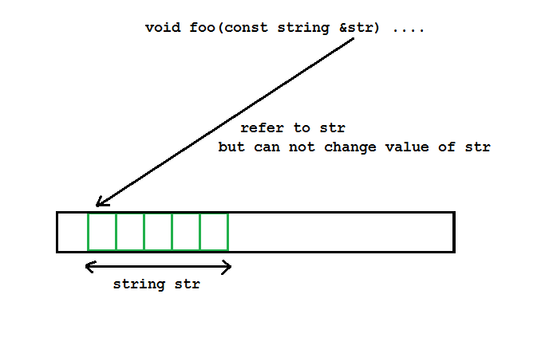

Chào các bạn! Chúng ta cùng tiếp tục đồng hành trong khóa học lập trình trực tuyến ngôn ngữ C++.

Đến với bài học này, chúng ta sẽ tìm hiểu thêm một số vấn đề về tham số của hàm. Mình đã trình bày cho các bạn về tham số nhận giá trị, tham số nhận tham chiếu trong các bài học trước. Bây giờ chúng ta sẽ đi tìm hiểu về 2 khái niệm mới khi khai báo tham số cho hàm:

- Tham số hằng.
- Tham số mặc định.

##
###Tham số hằng

#####Khai báo hàm có chứa tham số hằng

Như các bạn biết, một biến được định nghĩa với từ khóa **const** đứng trước là biến lưu trữ giá trị được khởi tạo 1 lần, và giá trị đó không thay đổi trong suốt quá trình thực thi chương trình. Mọi câu lệnh tác động đến giá trị của biến hằng số sẽ gây ra lỗi khi biên dịch.

Cú pháp định nghĩa biến hằng số mà các bạn đã được học:

```const <data_type> <variable_name> = <init_value>;```

hoặc 

```<data_type> const <variable_name> = <init_value>;```

Việc khai báo tham số hằng cho hàm cũng tương tự, các bạn đặt từ khóa const trước kiểu dữ liệu của tham số hoặc tên biến của tham số là được. Ví dụ:

	void receiveInput(const int param1, const float param2)
	{
		//................
	}

Khác với việc khởi tạo giá trị cho biến hằng số thông thường, tham số hằng sẽ được khởi tạo giá trị lúc gọi hàm. Vì phần định nghĩa hàm chỉ mới chỉ ra cách mà hàm hoạt động, khi gọi hàm và truyền đối số vào hàm, hệ điều hành lúc đó mới cấp phát vùng nhớ cho các tham số và biến cục bộ bên trong hàm.

#####Truyền đối số cho tham số hằng (pass by const)

Tham số hằng có thể nhận đối số là hằng số hoặc không phải hằng số. Ví dụ:

	void printMessage(const string message)
	{
		cout << message << endl;
	}

	int main()
	{
		string non_const_msg = "This is non-const message";
		const string const_msg = "This is const message";

		printMessage(non_const_msg);
		printMessage(const_msg);

		system("pause");
		return 0;
	}

Vì chúng ta sử dụng phương thức truyền đối số là giá trị, nên một bản copy của đối số sẽ được tạo ra để làm giá trị khởi tạo cho tham số hằng, và tham số của hàm lúc này chỉ tương tác bên trong hàm chứ không làm ảnh hưởng đến đối số được truyền vào.

Chúng ta thử nghiệm với việc truyền đối số vào tham số hằng tiếp nhận giá trị là một tham chiếu qua ví dụ sau:

	void foo(const string &str)	{
		str[5] = 'a'; //error
	}
	
	int main() {
		
		string str = "what the hell is going on?";
		foo(str);
		
		//change value of str outside foo function
		str[5] = 'a'; // ok
		
		return 0;
	}

Mình chạy thử đoạn chương trình trên thì nhận được thông báo lỗi **error: assignment of read-only location**. Điều này có nghĩa mặc dù tham số của hàm đã tham chiếu đến 1 vùng nhớ của biến không phải hằng, nhưng tham số của hàm là hằng, nên mọi câu lệnh có hành vi thay đổi giá trị bên trong vùng nhớ mà biến str đang nắm giữ là không cho phép.



Trong khi đó, biến str không phải là hằng, nên nó có thể thay đổi giá trị trong vùng nhớ mà nó đang nắm giữ.

Mặc dù 2 đối tượng str và tham chiếu của str đều sử dụng chung 1 vùng nhớ, nhưng đối tượng là tham chiếu của str là hằng, nên nó không thể tự ý thay đổi giá trị của str trong khi đối tượng str thì có thể.

***Mục đích của việc khai báo tham số hằng là để đảm bảo rằng hàm đó không thể thay đổi giá trị của đối số truyền vào (cho dù truyền bằng tham chiếu). Khi chương trình phát sinh lỗi, chúng ta có thể loại bớt trường hợp lỗi do hàm có tham số hằng gây ra, giúp chúng ta dễ dàng sửa lỗi hơn.***

###Tham số mặc định (default parameter)

Tham số mặc định là tham số có một giá trị khởi tạo tại thời điểm khai báo.

- Khi người dùng không cung cấp đối số cho tham số mặc định, giá trị mặc định sẽ được sử dụng.
- Khi người dùng cung cấp đối số cho tham số mặc định, tham số sẽ được gán lại bằng giá trị của đối số được truyền vào.

#####Cách khai báo tham số mặc định

Để khai báo tham số mặc định cho hàm, bạn chỉ cần sử dụng toán tử assignment (**=**) như lúc các bạn khởi tạo cho biến thông thường.

	void printValue(int x, int y = 10)
	{
		cout << "x: " << x << endl;
		cout << "y: " << y << endl;
	}

Vì tham số thứ 2 của hàm printValue đã có giá trị mặc định nên khi gọi hàm, chúng ta có thể chỉ truyền vào 1 đối số cho tham số x.

	//...........
	printValue(5);
	//...........

Hoặc các bạn muốn thay đổi giá trị khác cho tham số y, chúng ta truyền vào giá trị mới cho nó.

	//........
	printValue(5, 5);
	//........

#####Trường hợp khai báo tham số mặc định không hợp lệ

Sử dụng tham số mặc định giúp người dùng có nhiều lựa chọn hơn trong việc truyền đối số. Nhưng có 1 yêu cầu đặt ra khi khai báo hàm có tham số mặc định, đó là mọi tham số mặc định khi khai báo phải đặt phía sau tham số không có giá trị mặc định.

	void printValue(int x = 10, int y)
	{
		//Error
	}

Ví dụ như cách khai báo trên sẽ gây ra lỗi khi biên dịch.

***Vì tham số mặc định là tham số tùy chọn, chương trình không ràng buộc người dùng phải truyền đối số cho tham số mặc định khi gọi hàm. Trong khi đó, với tham số không có giá trị mặc định thì bắt buộc phải truyền đối số khi gọi hàm. Vì thế, đặt tham số mặc định trước tham số không có giá trị mặc định sẽ gây mâu thuẫn về ngữ nghĩa.***

##
###Tổng kết

Như vậy, chúng ta đã biết cách sử dụng tham số hằng và tham số mặc định khi sử dụng hàm trong C/C++. Đây là những cách sử dụng tham số thường xuyên được sử dụng. Các bạn sẽ còn gặp lại chúng trong các bài học sau.

**Hẹn gặp lại các bạn trong bài học tiếp theo trong khóa học lập trình C++ hướng thực hành.**

Mọi ý kiến đóng góp hoặc thắc mắc có thể đặt câu hỏi trực tiếp tại diễn đàn.

[www.daynhauhoc.com](www.daynhauhoc.com "DayNhauHoc")