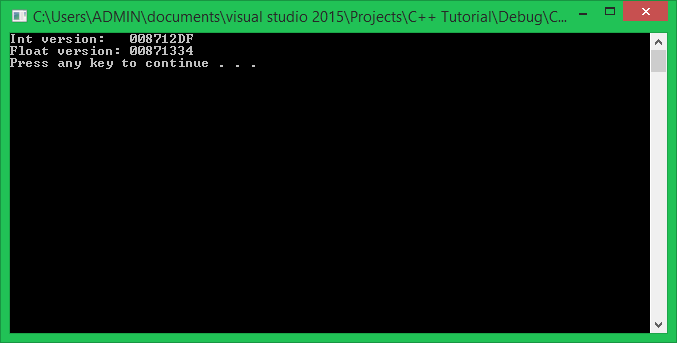
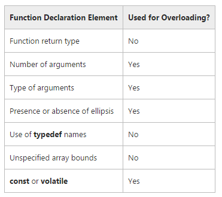

Chào các bạn! Chúng ta cùng tiếp tục đồng hành trong khóa học lập trình trực tuyến ngôn ngữ C++.

Trong bài học này, chúng ta cùng tìm hiểu về kĩ thuật **Function overloading**. Kĩ thuật này chỉ được cho phép trong ngôn ngữ C++, không thể áp dụng vào ngôn ngữ C.

##
###Function overloading

Function overloading là một đặc trưng của ngôn ngữ C++, nó cho phép lập trình viên tạo ra nhiều hàm có cùng tên, với điều kiện các hàm này khác số lượng tham số hoặc kiểu tham số.

Thử xem xét hàm bên dưới:

	int add(int i1, int i2)
	{
		return i1 + i2;
	}

Hàm đơn giản này nhận vào 2 tham số kiểu số nguyên và trả về kết quả là tổng của 2 số nguyên được truyền vào. Vấn đề đặt ra là **nếu chúng ta cần cộng 2 số thực**? Hàm add trên hoàn toàn không phù hợp vì giá trị số thực truyền vào sẽ bị chuyển thành số nguyên, gây ra sai sót khi giá trị cần tính bị mất đi phần thập phân.

Cách dễ thấy nhất là định nghĩa thêm 1 hàm khác có 2 tham số kiểu số thực:

	int addInteger(int i1, int i2)
	{
		return i1 + i2;
	}

	float addFloat(float f1, float f2)
	{
		return f1 + f2;
	}

Điều này có thể khiến chúng ta vất vả hơn khi phải nhớ chính xác tên hàm cần gọi.  **Function overloading** cung cấp cho bạn giải pháp tốt hơn để xử lý vấn đề này. Sử dụng kĩ thuật **function overloading**, bạn có thể định nghĩa nhiều hàm add với những kiểu dữ liệu đầu vào khác nhau.

	int add(int i1, int i2)
	{
		return i1 + i2;
	}

	float add(float f1, float f2)
	{
		return f1 + f2;
	}

Lúc này, chúng ta có 2 phiên bản khác nhau của hàm **add**.

	int add(int i1, int i2); //int version
	float add(float f1, float f2); //float version

2 phiên bản này cùng tên với nhau, nhưng hoàn toàn là 2 hàm riêng biệt với địa chỉ khác nhau trong vùng nhớ.

***Việc quyết định cần gọi đến phiên bản hàm nào phụ thuộc vào đối số mà bạn truyền vào khi gọi hàm.***

Nếu bạn cung cấp 2 đối số kiểu số nguyên, phiên bản **add(int i1, int i2)** sẽ được sử dụng. Ngược lại, nếu bạn truyền vào 2 số thực, C++ sẽ biết rằng cần phải gọi phiên bản kiểu số thực. Và chúng ta còn có thể định nghĩa thêm nhiều hàm có tên **add** nữa, với điều kiện những hàm này có số lượng tham số khác nhau hoặc khác về kiểu dữ liệu của tham số. Ví dụ:

	int add(int i1, int i2, int i3)
	{
		return i1 + i2 + i3;
	}

Khi bạn truyền vào 3 đối số kiểu số nguyên, phiên bản hàm add với 3 tham số sẽ được gọi thay cho phiên bản có 2 tham số kiểu số nguyên.

###Overloading considerations

Chúng ta cùng xem xét một số cách sử dụng hợp lệ của kĩ thuật **Function overloading** trong C++.

Đây là bảng tham khảo những thành phần của hàm được cho phép áp dụng vào kĩ thuật **Function overloading**. Như chúng ta thấy, hàm không thể được overload bằng cách sử dụng các kiểu trả về khác nhau.

Thử xem xét trường hợp bạn muốn viết 1 hàm trả về một giá trị ngẫu nhiên, nhưng bạn cần một phiên bản trả về kiểu số nguyên, một phiên bản khác trả về kiểu số thực.

	int getRandom();
	float getRandom();

Trong trường hợp này, compiler sẽ báo lỗi, vì hai phiên bản này có cùng kiểu tham số là **void**. Do đó, hai hàm này cần được đặt bằng 2 tên khác nhau.

###Cách chọn hàm tương ứng với những hàm được overload

Thực hiện 1 lời gọi hàm với những hàm đã được overload sẽ xảy ra 3 trường hợp:

**Một phiên bản phù hợp được tìm thấy.**

	void print(char value);
	void print(int value);

	print(0);

Mặc dù giá trị 0 có thể dùng để gán cho 1 biến kiểu kí tự, nhưng C++ nhận dạng được phiên bản hàm print nhận tham số kiểu int phù hợp hơn. Do đó, **print(int)** sẽ được sử dụng trong trường hợp này.

**Không tìm thấy phiên bản nào phù hợp.**

Khi không tìm thấy phiên bản nào có tham số phù hợp hoàn toàn, C++ sẽ tìm đến những phiên bản hàm mà đối số có thể phù hợp thông qua ép kiểu.

- Char, unsigned char, short sẽ được ép kiểu ngầm định sang int.
- Unsigned short có thể tự ép kiểu ngầm định sang int hoặc unsigned int, tùy vào kích thước của giá trị.
- Float có thể tự ép kiểu ngầm định sang double.

Ví dụ:

	void print(double value);
	void print(int value);

	print('a');

Trong trường hợp này, không có phiên bản hàm nào có tham số kiểu char, kí tự 'a' sẽ được ép kiểu ngầm định sang int, do đó **print(int)** sẽ được gọi.

**Tìm thấy nhiều hơn 1 phiên bản phù hợp nhưng không rõ ràng**

Ví dụ:

	void print(string s);
	void print(float f);

	print('a');

Trong trường hợp này, không có phiên bản hàm print(char), và cũng không có print(int) để thực hiện ép kiểu ngầm định, kí tự 'a' sẽ được ép về kiểu float để phù hợp với print(float).

##
###Tổng kết

Kỹ thuật Function overloading có thể khiến chương trình trở nên phức tạp và nguy hiểm khi để C++ ép kiểu tự động. 

**Hẹn gặp lại các bạn trong bài học tiếp theo trong khóa học lập trình C++ hướng thực hành.**

Mọi ý kiến đóng góp hoặc thắc mắc có thể đặt câu hỏi trực tiếp tại diễn đàn.

[www.daynhauhoc.com](www.daynhauhoc.com "DayNhauHoc")