Chào các bạn học viên đang theo dõi khóa học lập trình trực tuyến ngôn ngữ C++.

Trong chương này, chúng ta sẽ cùng nhau tìm hiểu về khái niệm con trỏ (**Pointer**) - một đặc trưng của ngôn ngữ lập trình C/C++.

Trước khi vào bài học này, chúng ta cùng nhau xem lại một số khái niệm liên quan đến vùng nhớ, địa chỉ của biến, tham chiếu...

#####Variable

Variable (hay còn gọi là biến) là một ô nhớ đơn lẻ hoặc một vùng nhớ được hệ điều hành cấp phát cho chương trình C++ nhằm để lưu trữ giá trị vào bên trong vùng nhớ đó. Để truy xuất đến giá trị mà biến đang nắm giữ, chương trình cần tìm đến vùng nhớ (địa chỉ) của biến để đọc giá trị bên trong vùng nhớ đó, cũng như bạn muốn lấy món đồ bên trong cái hộp, bạn cần biết cái hộp được đặt ở đâu.

Khi thao tác với các biến thông thường, chúng ta không cần quan tâm đến địa chỉ vùng nhớ của biến. Khi cần truy xuất giá trị của biến, chúng ta chỉ cần gọi định danh (hay thường gọi là tên biến).

Ví dụ:

	int money;

Khi dòng lệnh này được CPU thực thi, một vùng nhớ có kích thước 4 bytes sẽ được cấp phát. Lấy ví dụ biến money này được đặt tại ô nhớ 1224 (trong địa chỉ ảo của máy tính).


Bất cứ khi nào chương trình thấy các bạn sử dụng biến money trong câu lệnh, chương trình hiểu rằng cần tìm đến ô nhớ 1224 để lấy giá trị đó ra.

#####Virtual memory & Physical memory

Việc truy xuất dữ liệu trên bộ nhớ máy tính cần phải thông qua một số bước trung gian, người dùng không thể trực tiếp truy xuất vào các ô nhớ trên các thiết bị lưu trữ. Chúng ta chỉ có thể trỏ đến vùng nhớ ảo (virtual memory) trên máy tính, còn việc truy xuất đến bộ nhớ vật lý (physical memory) từ bộ nhớ ảo phải được thực hiện bởi thiết bị phần cứng có tên là **Memory management unit (MMU)** và một chương trình định vị địa chỉ bộ nhớ gọi là **Virtual address space**.

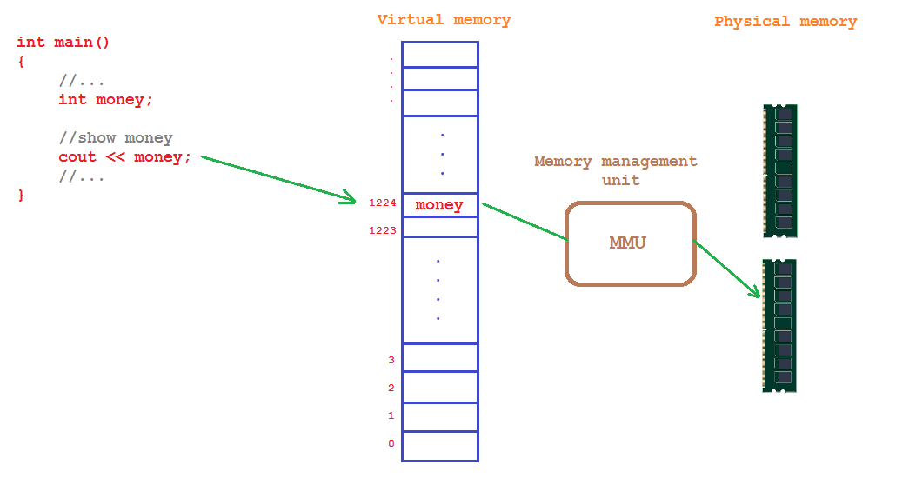

Virtual memory làm che giấu sự phân mảnh của bộ nhớ vật lý, khiến chúng ta có cảm giác đang thao tác với các vùng nhớ liên tục. Trong hình trên, từ phía Virtual memory cho đến Physical memory thuộc về phần quản lý của hệ điều hành, lập trình viên và người dùng chúng ta không thể can thiệp trực tiếp đến trong quá trình máy tính đang hoạt động.

#####Variable address & address-of operator

Địa chỉ của biến mà chúng ta nhìn thấy thật ra chỉ là những giá trị đã được đánh số thứ tự đặt trên Virtual memory. Để lấy được địa chỉ ảo của biến trong chương trình, chúng ta sử dụng toán tử **'&'** đặt trước tên biến.

	int x = 5;
    std::cout << x << '\n'; // print the value of variable x
    std::cout << &x << '\n'; // print the memory address of variable x

Trên máy tính của mình, kết quả của đoạn chương trình trên được in ra như sau:

	5
	0027FEA0

Dòng đầu tiên là kết quả của việc truy xuất giá trị của biến thông qua định danh (tên biến). Dòng thứ hai là kết quả của việc truy xuất đến địa chỉ ảo của biến.

#####Tham chiếu (Reference)

Mục đích của tham chiếu trong C++ là tạo ra một biến khác có cùng kiểu dữ liệu nhưng sử dụng chung vùng nhớ với biến được tham chiếu đến.

	int i1 = 10;
	int &i_ref = i1;        //reference to i1, not means address of i1

	cout << &i1 << endl;    //get address of i1
	cout << &i_ref << endl; //get address of i_ref

Kết quả chúng ta được:

	0xBFEB475C
	0xBFEB475C

Như vậy, mọi hành vi thay đổi giá trị của ```i_ref``` đều tác động trực tiếp đến ```i1```.

***Lưu ý: Biến tham chiếu sẽ có địa chỉ cố định sau khi khởi tạo. Chúng ta không thể tham chiếu lại lần nữa.***

#####Dereference operator

Toán tử trỏ đến (**dereference operator**) hay còn gọi là **indirection operator** (toán tử điều hành gián tiếp) được kí hiệu bằng dấu sao **" * "** cho phép chúng ta lấy ra giá trị của vùng nhớ có địa chỉ cụ thể.

Ví dụ:

	int n = 5;
	
	cout << n << endl;     //print the value of variable n
	cout << &n << endl;    //print the virtual memory address of variable n
	cout << *(&n) << endl; //print the value at the virtual memory address of variable n

- Dòng lệnh cout đầu tiên khá dễ hiểu, nó thực hiện in ra giá trị của biến n bằng cách gọi định danh n, còn lại phần truy xuất đến địa chỉ ảo của biến n sẽ do chương trình đảm nhiệm.

- Dòng lệnh cout thứ hai không dùng để lấy ra giá trị bên trong vùng nhớ mà biến n đang nắm giữ, mà nó lấy ra địa chỉ ảo của biến n.

- Dòng lệnh cout thứ ba chúng ta sử dụng toán tử trỏ đến **" * "** đặt trước toán tử **address-of**. Khi đó, **(&n)** sẽ lấy ra địa chỉ ảo của biến n, và toán tử * sẽ truy xuất giá trị bên trong địa chỉ đó.

Kết quả của đoạn chương trình trên là:

	5
	0xBFD181AC
	5

Ngoài việc truy xuất giá trị trong vùng nhớ của một địa chỉ cụ thể, toán tử trỏ đến (**dereference operator**) còn có thể dùng để thay đổi giá trị bên trong vùng nhớ đó.

	int n = 5;
	cout << n << endl;
	*(&n) = 10;
	cout << n << endl;

Kết quả đoạn chương trình này là:
	
	5
	10

Như vậy, **dereference operator** cho phép chúng ta thao tác trực tiếp trên **Virtual memory** mà không cần thông qua định danh.

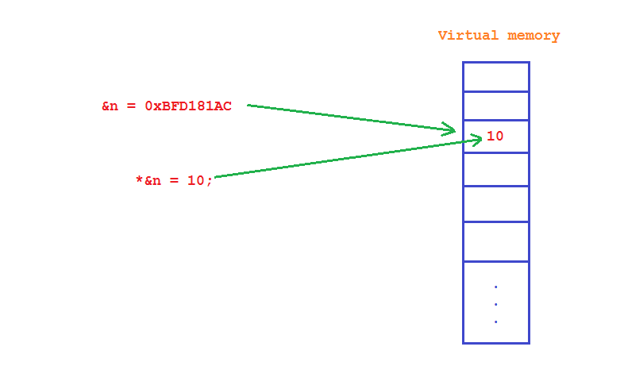

Mặc dù **dereference operator** có kí hiệu giống **multiplication operator**, nhưng các bạn có thể phân biệt được vì **dereference operator** là toán tử một ngôi, trong khi đó, **multiplication operator** là toán tử hai ngôi.

Khác với tham chiếu (**reference**), toán tử trỏ đến (**dereference operator**) không tạo ra một tên biến khác, mà nó truy xuất trực tiếp đến vùng nhớ có địa chỉ cụ thể trên **Virtual memory**.

---------------------------------

###Con trỏ (Pointer)

Với những khái niệm mình trình bày ở trên (một số khái niệm các bạn đã được học), bây giờ chúng ta có thể nói đến con trỏ (**pointer**).

>Một con trỏ (a **pointer**) là một biến được dùng để lưu trữ địa chỉ của biến khác.

Khác với tham chiếu, con trỏ là một biến có địa chỉ độc lập so với vùng nhớ mà nó trỏ đến, nhưng giá trị bên trong vùng nhớ của con trỏ chính là địa chỉ của biến (hoặc địa chỉ ảo) mà nó trỏ tới.

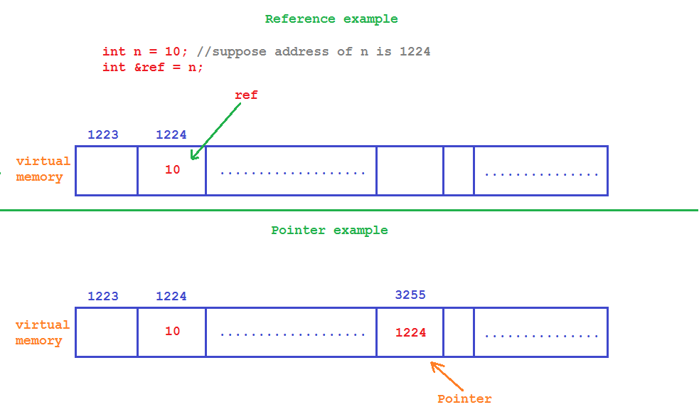

Trong ví dụ trên, một con trỏ sau khi khai báo đã được cấp phát vùng nhớ tại địa chỉ 3255, và nó trỏ đến địa chỉ 1224, do đó, giá trị bên trong vùng nhớ của con trỏ là 1224.

#####Khai báo con trỏ

Cũng giống như biến thông thường, biến con trỏ cần được khai báo trước khi sử dụng. Con trỏ yêu cầu cú pháp khai báo mới hơn một chút so với biến thông thường.

	<data_type> *<name_of_pointer>;

Khác với biến thông thường, chúng ta cần đặt thêm dấu sao giữa kiểu dữ liệu và tên biến của con trỏ.

Ví dụ:

	int *iPtr;
	float *fPtr;
	double *dPtr;

	int *iPtr1, *iPtr2;

***Lưu ý: Dấu sao trong khai báo con trỏ không phải là toán tử trỏ đến (dereference operator), nó chỉ là cú pháp được ngôn ngữ C/C++ quy định.***

#####Cách khai báo dễ gây nhầm lẫn

Ngôn ngữ C/C++ yêu cầu đặt dấu sao giữa kiểu dữ liệu và tên con trỏ nhưng không bắt buộc phải đặt nó gần với kiểu dữ liệu hay gần với tên con trỏ. Do đó, những cách khai báo dưới đây đều được cho phép:

	int *iPtr1; //We recommended you use this way to declare pointers
	int* iPtr2;

Nhưng mình khuyến nghị các bạn sử dụng cách khai báo đặt dấu sao ngay trước tên con trỏ vì cách thứ hai có thể gây nhầm lẫn.

	int* iPtr1, iPtr2;

Với cách khai báo này, **iPtr1** là một con trỏ kiểu **int**, trong khi đó, **iPtr2** là một biến kiểu **int**. Để có được hai con trỏ, chúng ta cần khai báo như sau:

	int *iPtr1, *iPtr2;

#####Kích thước của con trỏ trong bộ nhớ

Các bạn cùng chạy thử đoạn chương trình dưới đây:

	cout << sizeof(char*) << endl;
	cout << sizeof(int*) << endl;
	cout << sizeof(double*) << endl;
	cout << sizeof(string*) << endl;

Đoạn chương trình trên cho ra kết quả như sau:

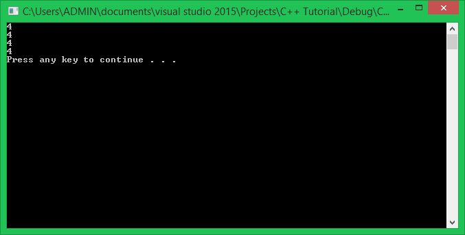

Tại cửa sổ giao diện của Visual studio 2015, chúng ta chuyển sang Debug trên nền tảng 64 bits.

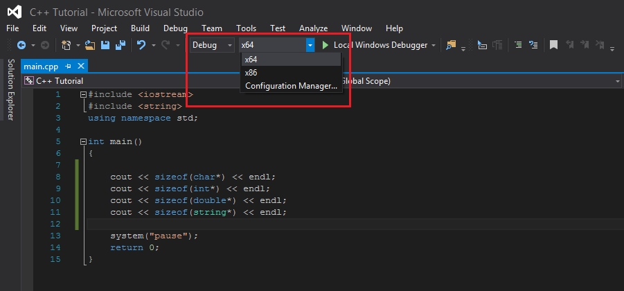

Nhấn F5 lại lần nữa và xem lại kết quả:

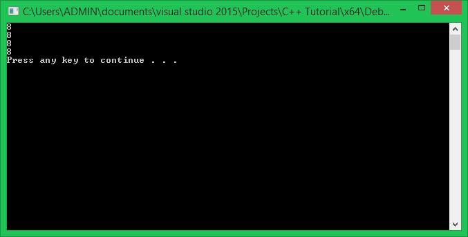

***Như vậy, chúng ta thấy rằng khi chạy trên nền tảng hệ điều hành 32 bits con trỏ sẽ có kích thước 4 bytes, khi chạy trên nền tảng hệ điều hành 64 bits con trỏ sẽ có kích thước 8 bytes.***

Kiểu dữ liệu của con trỏ thay đổi không hề tác động đến kích thước bộ nhớ của con trỏ. Bởi vì giá trị thực sự của con trỏ là kiểu số nguyên không dấu (**unsigned int**), trong nền tảng hệ điều hành **32 bits**, giá trị mà con trỏ lưu trữ sẽ là ```unsigned __int32```, và trong nền tảng hệ điều hành **64 bits**, giá trị của con trỏ lưu trữ có kiểu ```unsigned __int64```.

***Kiểu dữ liệu của con trỏ không mô tả giá trị địa chỉ được lưu trữ bên trong con trỏ, mà kiểu dữ liệu của con trỏ dùng để xác định kiểu dữ liệu của biến mà nó trỏ đến trên bộ nhớ ảo.***

Vậy tại sao lại cần 4 bytes cho một con trỏ trong hệ điều hành 32 bits, và cần 8 bytes cho một con trỏ trong hệ điều hành 64 bits?

Phạm vi giá trị của ```unsigned __int32``` là từ 0 đến 4294967295, phạm vi giá trị này đủ để đánh dấu địa chỉ tất cả ô nhớ trong **Virtual memory** của nền tảng hệ điều hành **32 bits**. Tương tự, phạm vi giá trị của ```unsigned __int64``` là tử 0 đến 18446744073709551615, đủ để đánh dấu địa chỉ của tất cả ô nhớ trong **Virtual memory** của nền tảng hệ điều hành **64 bits**.

Một biến, hoặc một vùng nhớ khi được đưa vào sử dụng sẽ có địa chỉ thuộc phạm vi giá trị của kiểu unsigned int (tùy vào mỗi nền tảng hệ điều hành) mà mình kể trên, nằm trên **Virtual memory**. Và kích thước bộ nhớ của con trỏ được cấp phát vừa đủ để chứa địa chỉ ảo của biến hoặc vùng nhớ đó.

#####Gán giá trị cho con trỏ

Giá trị mà biến con trỏ lưu trữ là địa chỉ của biến khác có cùng kiểu dữ liệu với biến con trỏ.

	int *ptr;
	int value = 5;
	
	ptr = &value;

Do đó, chúng ta cần sử dụng **address-of operator** để lấy ra địa chỉ ảo của biến rồi mới gán cho con trỏ được. Lúc này, biến ptr sẽ lưu trữ địa chỉ ảo của biến value.

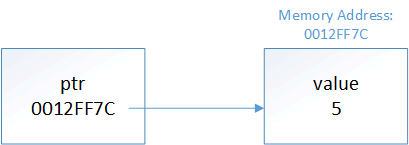

(Nguồn: [www.learncpp.com](http://www.learncpp.com))

Chúng ta có thể nói rằng con trỏ **ptr** đang nắm giữ địa chỉ của biến **value**, cũng có thể nói con trỏ **ptr** trỏ đến biến **value**.

Đoạn chương trình sau sẽ in ra địa chỉ của biến value và giá trị được lưu bởi con trỏ ptr sau khi trỏ đến biến value:

	int main()
	{
		int value = 5;
		int *ptr = &value;
		
		cout << &value << endl;
		cout << ptr << endl;

		system("pause");
		return 0;
	}

Kết quả thu được trên màn hình console:

	0012FF7C
	0012FF7C

Lý do mà chúng ta gán được địa chỉ của biến **value** cho con trỏ kiểu **int** (int *) là vì **address-of operator** của một biến kiểu **int** trả về giá trị kiểu con trỏ kiểu **int** (int *).

Thử xem xét đoạn chương trình sau:

	#include <iostream>
	using namespace std;
	
	int main()
	{
		
		int value = 5;
		cout << typeid(&value).name() << endl;
		
		system("pause");
		return 0;
	}

Kết quả in ra màn hình của toán tử lấy địa chỉ ở trên là:

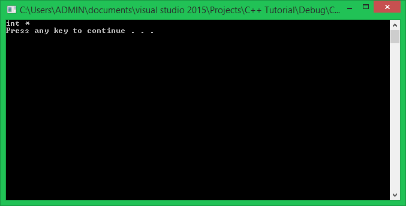

Do đó, chúng ta có thể gán ```&value``` cho con trỏ kiểu **int** (int *).

Bên cạnh đó, khi có hai con trỏ cùng kiểu thì chúng ta có thể gán trực tiếp mà không cần sử dụng **address-of operator**.

	int main()
	{
		int value = 5;
		int *ptr1, *ptr2;

		ptr1 = &value; //ptr1 point to value
		ptr2 = ptr1;   //assign value of ptr1 to ptr2

		cout << ptr1 << endl;
		cout << ptr2 << endl;

		system("pause");
		return 0;
	}

Lúc này, **ptr1** và **ptr2** cùng giữ địa chỉ của biến **value**.

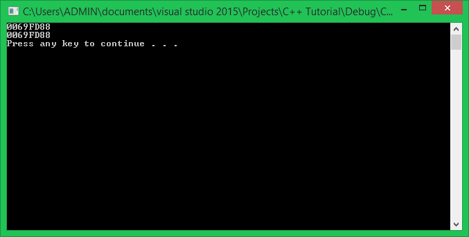

***Khác với tham chiếu (reference), một con trỏ có thể trỏ đến địa chỉ khác trong bộ nhớ ảo sau khi đã được gán giá trị. Tham chiếu (reference) không thể thay đổi địa chỉ sau lần tham chiếu đầu tiên.***

Ví dụ:

	int main()
	{
		int *ptr;

		int arr[5] = { 1, 2, 3, 4, 5 };

		for(int i = 0; i < 5; i++)
		{
			ptr = &arr[i];
			cout << ptr << endl;
		}

		system("pause");
		return 0;
	}

Kết quả của đoạn chương trình này là:

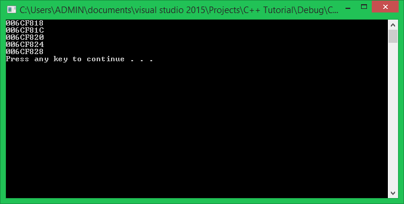

Con trỏ **ptr** đã trỏ đến lần lượt 5 phần tử của mảng **arr**. Nếu các bạn để ý sẽ thấy 5 địa chỉ này liên tiếp nhau trên bộ nhớ ảo. Mình sẽ trình bày vấn đề này trong các bài học sau.

#####Các phép gán không hợp lệ khi sử dụng con trỏ

Phép gán của con trỏ chỉ thực hiện được khi kiểu dữ liệu của con trỏ phù hợp kiểu dữ liệu của biến mà nó sẽ trỏ tới. Do đó, các phép gán dưới đây là không hợp lệ:

	int iValue = 0;
	float fValue = 0.0;

	int *i_ptr = fValue;   //wrong! int pointer cannot point to the address of a double variable
	float *f_ptr = iValue; //wrong! float pointer cannot point to the address of an int variable

Mặc dù giá trị mà con trỏ lưu trữ có kiểu **unsigned int**, nhưng chúng ta không thể gán trực tiếp một giá trị địa chỉ cho con trỏ được.

	int *ptr = 1245052; //wrong!

Giá trị 1245052 không có địa chỉ cụ thể, trong khi đó, con trỏ chỉ nhận giá trị là địa chỉ nên phép gán trên là sai. Mặc dù giá trị được chuyển về dạng cơ số thập lục phân để tương xứng với định dạng giá trị mà con trỏ in ra, điều này cũng không được cho phép.

	int *ptr = 0012FF7C; //wrong!

***Chỉ có giá trị kiểu con trỏ (có được nhờ toán tử address-of, hoặc từ một biến con trỏ cùng kiểu khác) mới có thể gán được cho biến con trỏ.***

#####Truy xuất giá trị bên trong vùng nhớ mà con trỏ trỏ đến

Khi chúng ta có một con trỏ đã được trỏ đến địa chỉ nào đó trong bộ nhớ ảo, chúng ta có thể truy xuất giá trị tại địa chỉ đó bằng **dereference operator**. **Dereference operator** sẽ đánh giá nội dung địa chỉ được trỏ đến.

	int *ptr; //declare an int pointer
	int value = 5;
	
	ptr = &value; //ptr point to value
	
	cout << &value << endl; //print the address of value
	cout << ptr << endl;    //print the address of value which is held in ptr

	cout << value << endl;  //print the content of value
	cout << *(&value) << endl; //print the content of value
	cout << *ptr << endl;	//print the content of value

Kết quả của đoạn chương trình trên như sau:

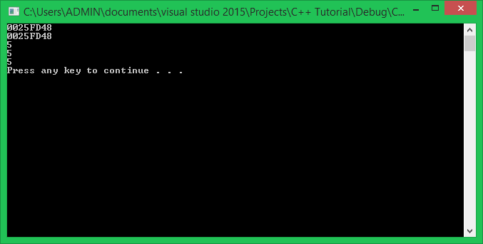

Toán tử trỏ đến (**dereference operator**) được dùng để truy cập trực tiếp vào vùng nhớ có địa chỉ cụ thể trên bộ nhớ ảo (**virtual memory**), vì biến con trỏ **ptr** đang giữ địa chỉ của biến **value** nên khi đặt toán tử trỏ đến (**dereference operator**) trước con trỏ **ptr**, nó sẽ truy xuất giá trị tại địa chỉ mà con trỏ **ptr** đang giữ.

Vì **ptr** có kiểu dữ liệu **con trỏ int** (int *), **ptr** chỉ có thể trỏ đến biến kiểu **int**. Lúc này, **compiler** hiểu rằng cần phân tích **4 bytes** (đúng bằng kích thước kiểu **int**) trên bộ nhớ ảo tại địa chỉ mà **ptr** đang lưu trữ.

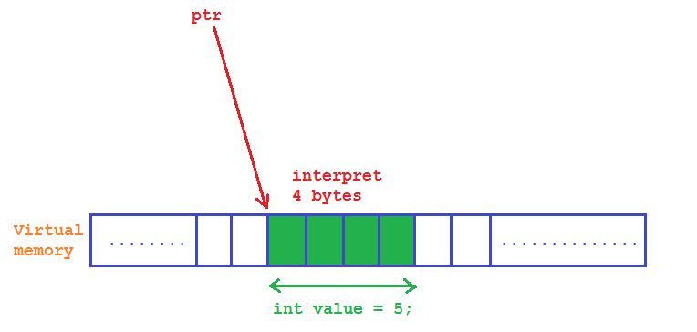

Đây là lý do tại sao chúng ta cần khai báo kiểu dữ liệu của con trỏ. Nếu không khai báo kiểu dữ liệu cho con trỏ, toán tử trỏ đến (**dereference operator**) sẽ không biết phải phân tích bao nhiêu bytes tại địa chỉ con trỏ trỏ đến để tính toán được giá trị của vùng nhớ đó. Không những thế, đây còn là lý do kiểu dữ liệu của biến phải tương xứng với kiểu dữ liệu được khai báo cho con trỏ.

Vì chúng ta có thể gán lại địa chỉ mới cho một con trỏ, nên chúng ta có thể truy xuất được giá trị của nhiều vùng nhớ khác nhau chỉ với một con trỏ:

	int value1 = 1;
	int value2 = 2;

	int *ptr = &value1;
	cout << *ptr << endl;

	ptr = &value2;
	cout << *ptr << endl;

Với khả năng truy cập đến vùng nhớ có địa chỉ cụ thể và thay đổi giá trị bên trong vùng nhớ của toán tử trỏ đến (**dereference operator**), chúng ta có thể sử dụng như sau:

	int value = 5;
	int *ptr = &value;

	*ptr = 10;
	cout << *ptr << endl;

Đoạn chương trình này sẽ in ra giá trị **7**.

Có thể giải thích dòng lệnh ```*ptr = 10;``` như sau:

Biến con trỏ **ptr** sau khi khai báo đã được khởi tạo bằng cách gán địa chỉ của biến **value**. Sử dụng **dereference operator** cho con trỏ **ptr** để truy cập đến địa chỉ ảo mà **ptr** đang nắm giữ, gán giá trị 7 vào vùng nhớ tại vị trí đó.

#####Con trỏ chưa được gán địa chỉ

Con trỏ trong ngôn ngữ C/C++ vốn không an toàn. Nếu sử dụng con trỏ không hợp lý có thể gây crash chương trình.

Khác với tham chiếu (**reference**), biến con trỏ có thể không cần khởi tạo giá trị ngay khi khai báo. Nhưng thực hiện truy xuất giá trị của con trỏ bằng dereference operator khi chưa gán địa chỉ cụ thể cho con trỏ, chương trình có thể bị đóng bởi hệ điều hành. Nguyên nhân là do con trỏ đang nắm giữ một giá trị rác, giá trị rác đó có thể là địa chỉ thuộc một vùng nhớ đang được ứng dụng khác sử dụng.

Trong chế độ **Debug** của Visual studio 2015, trường hợp này sẽ bị cảnh báo và ngăn chặn chương trình thực thi.

Ví dụ:

	int main()
	{
		int *ptr; //declare an int pointer
		cout << *ptr << endl;
	
		system("pause");
		return 0;
	}

Nhấn F5 để Debug chương trình sẽ nhận được thông báo:

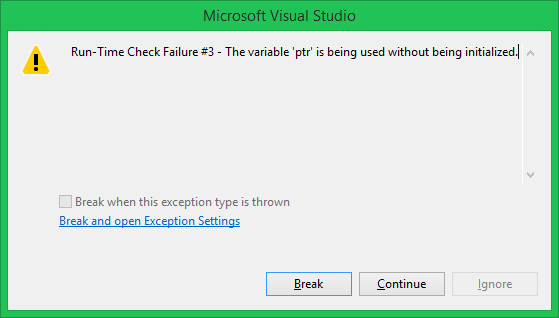

Do đó, khi khai báo con trỏ nhưng chưa có địa chỉ khởi tạo cụ thể, chúng ta nên gán cho con trỏ giá trị **NULL**.

---------------------------------

###NULL

**NULL** là một macro đã được định nghĩa sẵn trong ngôn ngữ C/C++.

	#define NULL 0

Đối với con trỏ, **NULL** là một giá trị đặc biệt, khi gán **NULL** cho con trỏ, điều đó có nghĩa là con trỏ đó chưa trỏ đến địa chỉ nào cả. Con trỏ đang giữ giá trị **NULL** được gọi là con trỏ **NULL** (**NULL pointer**).

	int *ptr = NULL; //ptr is now a NULL pointer

Lúc này, chúng ta có thể kiểm tra xem con trỏ đã được gán địa chỉ cụ thể hay chưa:

	int *ptr = NULL;
	
	if(ptr == NULL)
	{
		cout << "Do nothing" << endl;
	}
	else
	{
		cout << *ptr << endl;
	}

Đoạn chương trình này sẽ giúp chương trình đảm bảo rằng con trỏ **ptr** sẽ không được sử dụng khi chưa được gán địa chỉ cụ thể.

Chuẩn **C++11** cung cấp cho chúng ta từ khóa **nullptr** tương tự như macro **NULL**. Chúng ta có thể sử dụng như sau:

	int *ptr = nullptr;

Bên cạnh đó, **C++11** còn định nghĩa cho chúng ta kiểu dữ liệu ```std::nullptr_t```, ```nullptr_t``` chỉ có thể lưu trữ giá trị **nullptr**. Nhưng chúng ta ít khi sử dụng kiểu dữ liệu này nên các bạn cũng không cần quan tâm lắm.

---------------------------------

###Tổng kết

Con trỏ (**Pointer**) là một công cụ mạnh mẽ đặc trưng của ngôn ngữ C/C++. Con trỏ cho phép chúng ta trực tiếp quản lý dung lượng của chương trình trên bộ nhớ ảo. Nhưng bên cạnh đó, việc sử dụng con trỏ không hợp lý có thể gây lãng phí tài nguyên của hệ thống máy tính. Chúng ta sẽ cùng tìm hiểu các kĩ thuật quản lý bộ nhớ ảo của chương trình trong các bài học tiếp theo.

---------------------------------

**Hẹn gặp lại các bạn trong bài học tiếp theo trong khóa học lập trình C++ hướng thực hành.**

Mọi ý kiến đóng góp hoặc thắc mắc có thể đặt câu hỏi trực tiếp tại diễn đàn.

[www.daynhauhoc.com](www.daynhauhoc.com "DayNhauHoc")